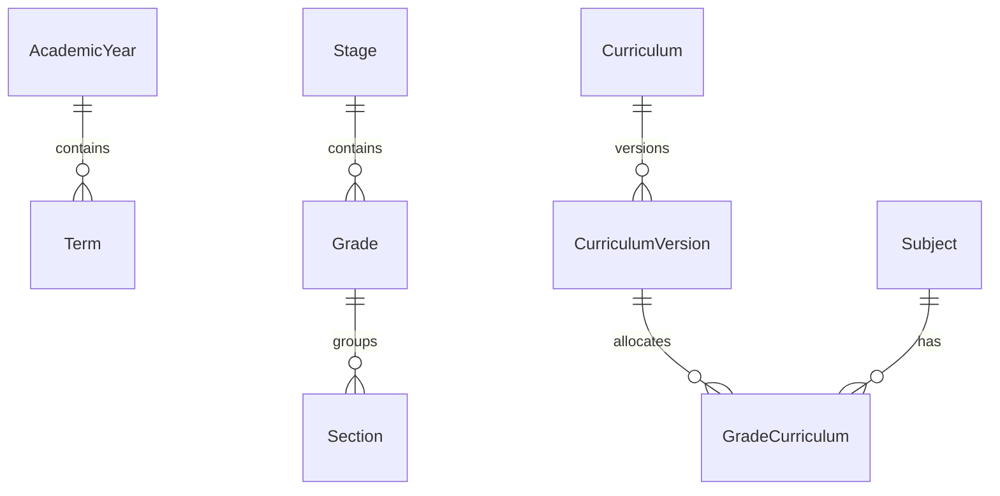

# موديول الهيكل الأكاديمي وإدارة المناهج (Academic Structure & Curriculum Management)

يوفر هذا الموديول العمود الفقري لإدارة الهيكل الأكاديمي والتنظيمي للمدارس داخل منصة Nebras ERP.

## قواعد العمل والتحقق (Business Rules)
1. **السنة الدراسية الحالية**: يسمح بنظام نشط واحد فقط للسنة الدراسية الحالية لكل مستأجر (Tenant).
2. **منع التداخل**: يمنع منعاً باتاً تداخل تواريخ السنوات الدراسية أو الفصول التعليمية لنفس المستأجر.
3. **مطابقة العمر الأكاديمي**: يتم مطابقة عمر الطالب مع الحدود الدنيا والقصوى المسموح بها للمرحلة التعليمية.

## مخطط العلاقات (Mermaid ER Diagram)

## قاموس البيانات (Database Dictionary)

### AcademicYear
- `id` (UUID, Primary Key)
- `tenant_id` (UUID, ForeignKey)
- `name` (CharField) - اسم السنة الدراسية
- `code` (CharField) - رمز السنة الدراسية الفريد
- `start_date` (DateField)
- `end_date` (DateField)
- `current_flag` (BooleanField) - تحديد السنة الأكاديمية النشطة حالياً للمستأجر

### Term
- `id` (UUID)
- `academic_year_id` (UUID) - رابط السنة الدراسية
- `name` (CharField)
- `code` (CharField)
- `start_date` (DateField)
- `end_date` (DateField)
- `order` (IntegerField)

## مصفوفة الصلاحيات (Permissions Matrix)
- `academics.view`
- `academics.create`
- `academics.update`
- `academics.delete`
- `academics.manage_calendar`
- `academics.manage_curriculum`