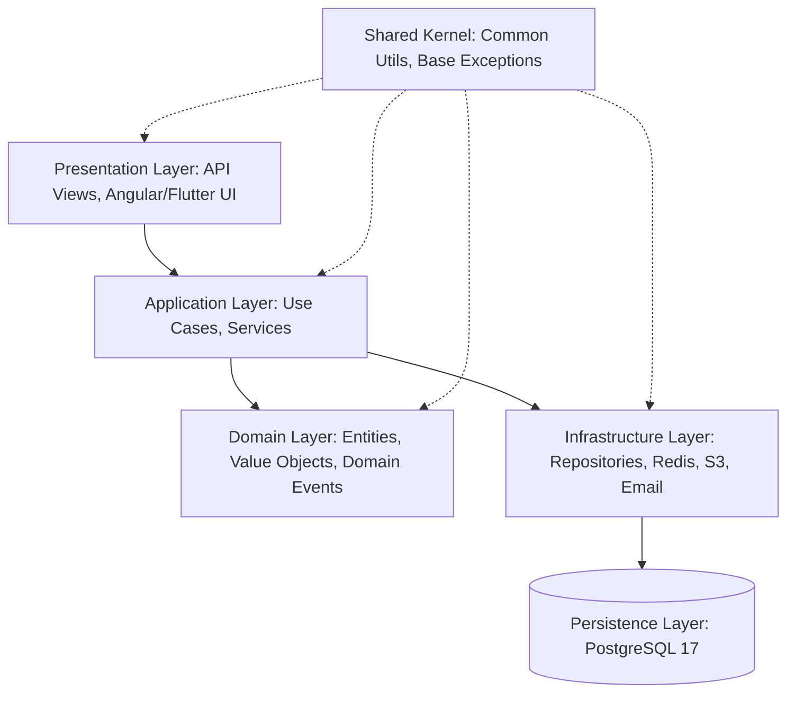
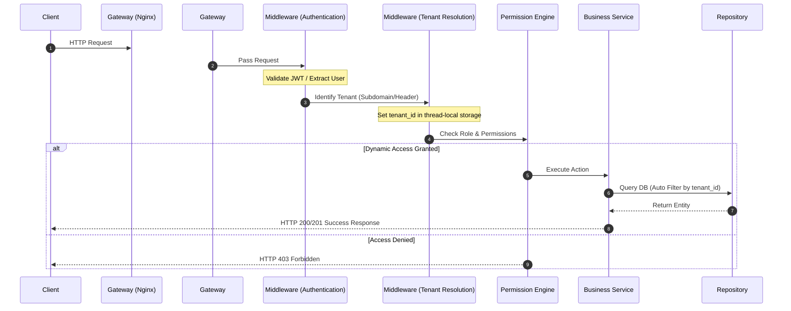
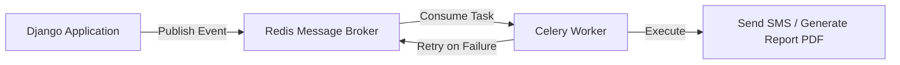

# المخطط المعماري الشامل (Architecture Blueprint) - Nebras ERP

يرسم هذا المستند خارطة الطريق الفنية والمعمارية الشاملة لمنصة **Nebras ERP** لضمان بناء نظام موحد، عالي الأداء، آمن، ومبني وفق أعلى المعايير الهندسية.

---

## 1. طبقات النظام (System Layers)

تتبنى منصة Nebras معماريّة **Clean Architecture** مع **Domain-Driven Design (DDD)** لفصل القواعد الحسابية الأساسية عن العوامل الخارجية (قواعد البيانات، واجهات API، الإشعارات). يتم تنظيم الطبقات بالشكل التالي:



- **طبقة النطاق (Domain Layer):**
  - **المحتويات:** الكيانات (Entities)، كائنات القيمة (Value Objects)، أحداث النطاق (Domain Events)، والواجهات البرمجية للمستودعات (Repository Interfaces).
  - **القواعد:** لا تعتمد على أي مكتبة خارجية أو إطار عمل (مستقلة تماماً عن Django). هي النواة الصلبة لقواعد العمل.
- **طبقة التطبيق (Application Layer):**
  - **المحتويات:** حالات الاستخدام (Use Cases / Command Handlers)، وخدمات التطبيق (Application Services)، والمدققين (Validators).
  - **القواعد:** تنسيق انسياب البيانات، وتنفيذ العمليات الحسابية من خلال استدعاء الكيانات والمستودعات.
- **طبقة الواجهة والاتصال (Presentation Layer):**
  - **المحتويات:** واجهات API (Django REST Framework Views/Serializers)، ومكونات Angular/Flutter.
  - **القواعد:** معالجة ترويسات الطلبات (HTTP Headers)، التحقق المبدئي من صحة المدخلات، وإرجاع الاستجابة بالصيغة الموحدة.
- **طبقة البنية التحتية والاستمرارية (Infrastructure & Persistence):**
  - **المحتويات:** تطبيقات المستودعات (Repository Implementations)، والاتصال بقاعدة بيانات PostgreSQL 17، والتكامل مع Redis و S3 والخدمات الخارجية.
- **النواة المشتركة (Shared Kernel):**
  - المكتبات والأدوات الأساسية التي يمكن لجميع الطبقات استخدامها (مثل معالجة الاستثناءات الأساسية، التوقيت، التحويلات الرياضية العامة).

---

## 2. دورة حياة الطلب (Request Lifecycle)

يمر كل طلب HTTP مرسل إلى النظام بدورة حياة صارمة لضمان عزل البيانات (Tenant Isolation) وحماية المنصة:



---

## 3. الاتصال بين تطبيقات Django (Django App Communication)

لمنع حدوث تشابك واعتماديات دائرية (Circular Dependencies) بين تطبيقات Django الـ 17 المكونة للـ Modular Monolith، يتم تنظيم الاتصال كالتالي:

1. **الخدمات (Services):**
   - تُستخدم للاتصال المباشر المتزامن (Synchronous) عندما يحتاج تطبيق (مثل `finance`) لمعلومات أو حسابات من تطبيق آخر (مثل `academics`).
   - يتم هذا فقط عبر واجهات محددة (API Interface Class) تُعرضها التطبيقات.
2. **الأحداث (Events):**
   - تُستخدم للاتصال غير المتزامن (Asynchronous) لتقليل الاقتران (Decoupling).
   - عند إتمام عملية دفع رسوم دراسية بنجاح في تطبيق `finance`، يتم نشر حدث `FeePaidEvent` ليقوم تطبيق `notifications` بإرسال إشعار وتطبيق `academics` بتفعيل حساب الطالب دون تداخل الأكواد.
3. **المحددات (Selectors):**
   - استعلامات معقدة للقراءة فقط (Read-only Queries) لتجنب كتابة منطق جلب البيانات داخل الـ Views.
4. **المستودعات (Repositories):**
   - لعزل طبقة البيانات (ORM) تماماً عن منطق العمل. لا يتم استدعاء `Model.objects.create()` مباشرة في الـ Services بل يتم استدعاء `Repository.save(entity)`.

---

## 4. قواعد الاعتمادية (Dependency Rules)

لضمان بنية Modular Monolith سليمة، تُطبق القواعد التالية بصرامة:

- **الاعتماديات المسموحة (Allowed):**
  - يمكن للطبقات الخارجية الاعتماد على الطبقات الداخلية (Presentation -> Application -> Domain).
  - يمكن للتطبيقات الفرعية الاعتماد على `common` أو `Shared Kernel`.
- **الاعتماديات الممنوعة (Forbidden):**
  - **يُمنع منعاً باتاً** اعتماد طبقة النطاق (Domain) على أي طبقة أخرى.
  - **يُمنع** حدوث استدعاء دائري بين التطبيقات (مثال: `finance` يعتمد على `students` وفي نفس الوقت `students` يعتمد على `finance`). يتم حل هذا عبر نظام الأحداث (Events) أو وسيط في طبقة التطبيق.

---

## 5. المكونات المشتركة (Shared Components)

تتوفر المكونات المشتركة في تطبيق `common` وتخدم جميع التطبيقات الأخرى:
- **التخزين (Storage):** واجهة موحدة للتكامل مع S3 / Object Storage لدعم تخزين ملفات الطلاب والتقارير.
- **التدقيق (Audit Log):** نظام آلي لتسجيل العمليات الحساسة (إنشاء، تعديل، حذف) مع حفظ هوية المستخدم وعنوان الـ IP والبيانات قبل وبعد التعديل.
- **الإشعارات (Notifications):** نظام لإرسال التنبيهات عبر قنوات متعددة (Push, SMS, Email) بشكل غير متزامن.

---

## 6. نظام المعالجة الخلفية والأحداث (Event System & Background Processing)

يعتمد النظام على **Celery** و **Redis** لإدارة المهام الطويلة والمهام الخلفية:



- **استراتيجية إعادة المحاولة (Retry Strategy):**
  - استخدام Exponential Backoff للمهام التي تعتمد على شبكات خارجية (مثل بوابات الدفع أو إرسال SMS) كالتالي: `default_retry_delay = 5 * 60` (5 دقائق) مع حد أقصى للمحاولات `max_retries = 5`.
- **الجدولة (Scheduling):**
  - استخدام Celery Beat للمهام الدورية مثل احتساب الغياب اليومي التلقائي، وإصدار الفواتير الشهرية للمستأجرين.

---

## 7. معمارية الأمان (Security Architecture)

- **Tenant Isolation (عزل البيانات):**
  - يتم تضمين `tenant_id` كحقل أساسي في الاستعلامات.
  - تطبيق استراتيجية PostgreSQL RLS (Row-Level Security) أو استخدام مدير استعلامات مخصص (Custom Django Manager) يقوم تلقائياً بدمج شرط التصفية للـ Tenant الحالي في كل عملية استعلام.
- **إدارة الهوية والمصادقة (JWT):**
  - استخدام Access Token قصير المدى (15 دقيقة) مع Refresh Token طويل المدى (7 أيام) مخزن بشكل آمن في HttpOnly Cookie لمنع هجمات XSS.
- **محرك الصلاحيات (Permission Engine):**
  - نظام صلاحيات قائم على الأدوار (RBAC - Role-Based Access Control) وصلاحيات دقيقة على مستوى الحقل أو الإجراء (Attribute-Based Access Control).

---

## 8. معمارية Angular (Frontend Architecture)

يتكون هيكل تطبيق Angular من Standalone Components مبنية وفق الهرمية التالية:

```
frontend/src/app/
├── core/                  # Singleton Services, Guards, Interceptors, Auth
├── shared/                # UI Shared Components, Pipes, Directives (RTL-ready)
├── layouts/               # Layout wrappers (Admin, Portal, Auth)
└── features/              # Feature modules loaded via Lazy Loading
    ├── academics/
    ├── finance/
    └── students/
```

- **إدارة الحالة (State Management):** استخدام **Angular Signals** لإدارة الحالة التفاعلية المحلية بمرونة وأداء عالٍ جداً دون الحاجة لتعقيدات NgRx الكلاسيكية إلا للموديولات شديدة التعقيد.
- **تجهيز RTL:** استخدام واجهات Angular Material الداعمة للاتجاهين (LTR/RTL) تلقائياً بناءً على إعداد لغة المستخدم وحقل `dir="rtl"` في وسم `<html>`.

---

## 9. معمارية Flutter (Mobile Architecture)

يتبع تطبيق Flutter للهاتف معمارية طبقية نظيفة لضمان ثبات الأداء ودعم العمل دون اتصال بالإنترنت (Offline Support):

```
mobile/lib/
├── core/                  # Network (Dio Client), Theme (Custom Material 3), Utils
├── shared/                # Custom widgets, global models
└── features/              # Modular features
    └── [feature_name]/
        ├── data/          # Local & Remote Data Sources, Repositories implementations
        ├── domain/        # Entities, Use Cases, Repositories contracts
        └── presentation/  # BLoC / Riverpod State Controllers, Screens
```

- **دعم عدم الاتصال بالإنترنت (Offline Support):**
  - استخدام قاعدة بيانات **Hive** أو **Isar** كطبقة تخزين مؤقت محلي (Local Cache).
  - تعتمد الـ Repositories على استراتيجية (Cache-First then Network) مع مزامنة البيانات تلقائياً عند عودة الاتصال بالإنترنت.