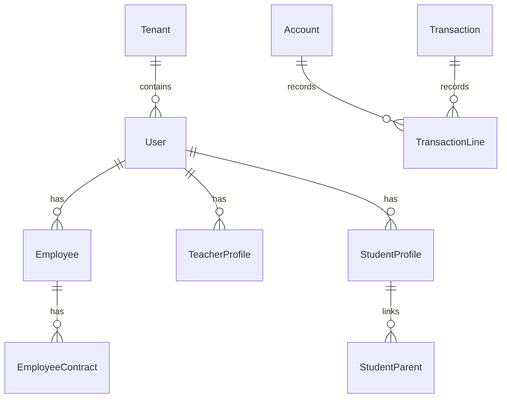

# المخطط الرئيسي الكامل لقاعدة البيانات (Database Master Plan) - Nebras ERP

يوضح هذا المستند التصميم الهيكلي لقاعدة البيانات الشاملة لجميع الأنظمة التشغيلية في منصة **Nebras ERP** التي تم تأسيسها وتطبيقها بنجاح.

---

## 1. الهيكل العام لعلاقات المكونات بـ Mermaid (Full ER Diagram)

---

## 2. جدول المكونات وقواعد التسمية للموديولات التشغيلية المضافة

| الموديول | الجدول في قاعدة البيانات | المفتاح الأساسي | المفاتيح الأجنبية وعلاقات الربط |
| :--- | :--- | :--- | :--- |
| **القبول (`admissions`)** | `admission_applications` | UUID | يربط بـ `applied_grade` لمستوى الصف الدراسي. |
| **الطلاب (`students`)** | `student_profiles` | UUID | علاقة One-to-One مع جدول المستخدمين الموحد `User`. |
| **المعلمون (`teachers`)** | `teacher_profiles` | UUID | علاقة One-to-One مع جدول المستخدمين `User` لتفادي تداخل الحقول. |
| **المالية (`finance`)** | `finance_accounts` | UUID | يربط الحسابات المالية بشجرة الحسابات الكلية للـ ERP (COA). |
| **الموارد البشرية (`hr`)** | `hr_employees` | UUID | يربط الموظفين بجدول الحسابات الموحد وقيم الرواتب والعقود. |

---

## 3. استراتيجية الأرشفة والتجزئة (Partitioning & Archiving Strategy)

- **تجزئة الجداول التاريخية (Table Partitioning):**
  - جدول `audit_logs` وجدول الحضور والانصراف اليومي مرشحة للتجزئة (Partitioning) بناءً على التوقيت `timestamp` أو `created_at` ربع سنوي أو سنوي لضمان بقاء الأداء سريعاً.
- **استراتيجية النسخ الاحتياطي (Backup Strategy):**
  - أخذ نسخ احتياطية يومية تراكمية (Incremental Backups) ونسخة كاملة أسبوعية (Full Backup) تُخزن بشكل آمن في مخازن S3 معزولة مع تشفير كامل.