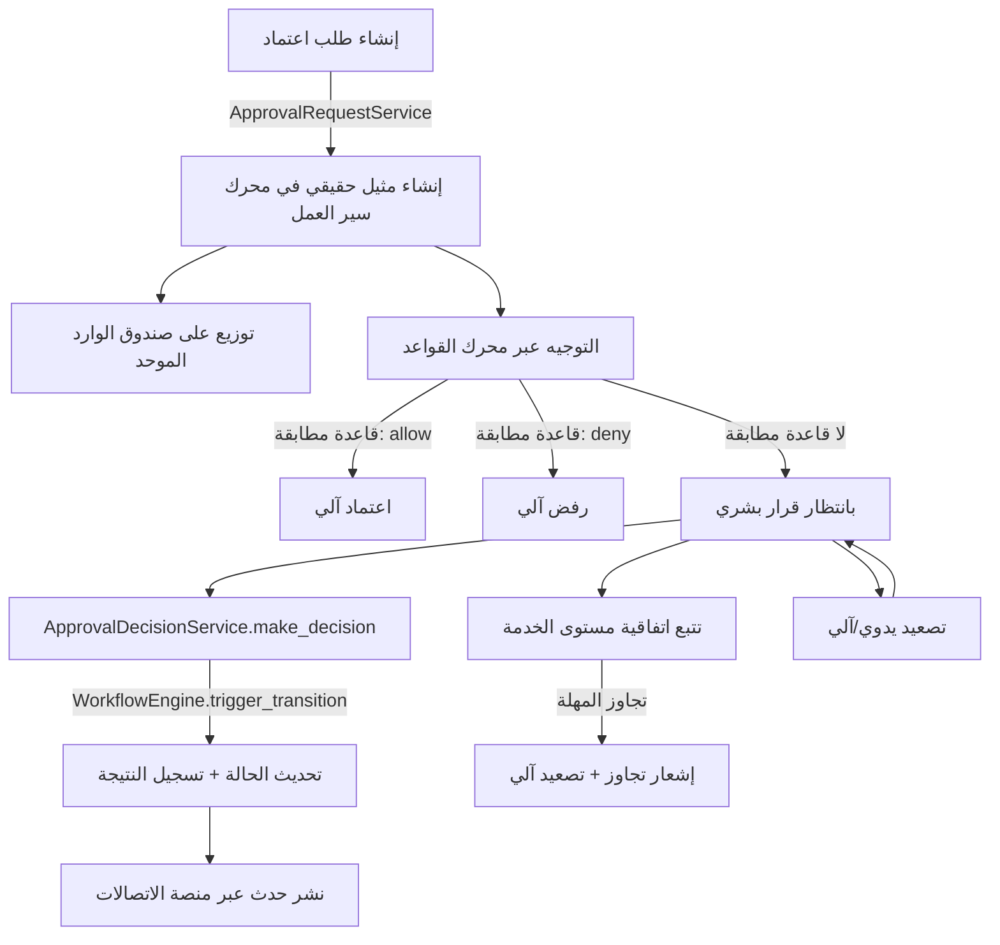

# مركز الموافقات وصندوق الوارد المؤسسي الموحد (Enterprise Approval Center & Inbox)

هذا الموديول هو المُنسِّق المركزي لكل تفاعل بشري مع الموافقات في نبراس ERP: صندوق وارد موحد واحد لكل مستخدم، دورة حياة موافقة واحدة، وتكامل حقيقي مع محرك سير العمل ومحرك القواعد ومنصة الإعدادات ومنصة الاتصالات وإدارة الوثائق ومركز القيادة — بلا أي منطق موافقة مكرر داخل أي موديول آخر. مركز الموافقات لا يعيد تنفيذ منطق سير العمل؛ هو ينسّق تفاعل المستخدم فوق محرك سير العمل الموحد الذي يبقى المصدر الوحيد للحقيقة بخصوص الحالة.

---

## 1. المعمارية الفنية (دورة حياة طلب الاعتماد)

**مبدأ التصميم:** كل طلب اعتماد يملك مثيل `WorkflowInstance` حقيقي في `apps.workflow` — القرار (اعتماد/رفض/إرجاع/تصعيد/إلغاء) يُنفَّذ حصرياً عبر `WorkflowEngine.trigger_transition`، ومركز الموافقات يقرأ الحالة الناتجة ولا يحسبها بنفسه.

---

## 2. النماذج وقاموس البيانات

جميع النماذج الـ28 ترث من `CombinedSharedModel` (معرّف UUID، عزل مستأجرين، حذف لطيف، تدقيق تلقائي)، مقسّمة إلى ست مجموعات:

- **التصنيف والتهيئة:** `ApprovalCategory`، `ApprovalAction`، `ApprovalPriority`، `ApprovalGroup`، `ApprovalQueue`، `ApprovalStep`، `ApprovalRule` (مرتبطة بقاعدة حقيقية في محرك القواعد عبر `rule_id`)، `ApprovalTemplate`، `ApprovalConfiguration`، `SLAConfiguration`.
- **صندوق الوارد الموحد:** `EnterpriseInbox` (حاوية لكل مستخدم)، `InboxItem` (عنصر معلّق، مع `priority_code` مُبسَّط لتفادي استعلامات إضافية في الشبكة).
- **دورة حياة الطلب:** `ApprovalRequest` (يحمل `workflow_instance_id`، `title_ar/en`، `priority`، `current_step`)، `ApprovalDecision`، `ApprovalHistory`، `ApprovalComment`، `ApprovalAttachment` (مرتبط بوثيقة DMS حقيقية)، `ApprovalAssignment`، `ApprovalOutcome` (يسجّل `decided_by`/`decided_at` لأغراض التحليلات).
- **التفويض والتصعيد:** `ApprovalDelegation` (بنطاق فئة/قسم اختياري)، `ApprovalEscalation` (بمستوى تصعيد تصاعدي وحالة حل).
- **اتفاقية مستوى الخدمة:** `SLATracking` (موعد نهائي، تحذير مسبق، علم تجاوز)، `ApprovalDeadline`، `ApprovalReminder`.
- **الإشعارات والتدقيق والتحليلات:** `ApprovalNotification`، `ApprovalAudit` (سجل تدقيق للقراءة فقط عبر API)، `ApprovalStatistics`، `ApprovalDashboard`.

---

## 3. مسارات واجهات REST API

جميع المسارات تحت `/api/v1/approvals/` وتتطلب ترويسة `X-Tenant-ID`. أبرز المسارات:

| المسار | الوصف |
| :--- | :--- |
| `POST requests/` | إنشاء طلب اعتماد جديد (ينشئ مثيل سير عمل حقيقي، يمرّر عبر محرك القواعد). |
| `POST requests/{id}/decision/` | اعتماد/رفض/إرجاع — ينفّذ انتقال حقيقي في محرك سير العمل. |
| `POST requests/bulk-approve/` `bulk-reject/` `bulk-delegate/` | إجراءات جماعية. |
| `GET requests/{id}/timeline/` `sla-status/` | الخط الزمني وحالة اتفاقية مستوى الخدمة للطلب. |
| `GET requests/dashboard-stats/` | إحصاءات اللوحة (معلّق/معتمد/مرفوض/متجاوز المهلة/متوسط وقت القرار). |
| `GET inbox/my-items/` `POST inbox/{id}/toggle-star/` `archive/` `bulk-archive/` | صندوق الوارد الموحد. |
| `POST delegations/` `GET delegations/my-delegations/` `POST delegations/{id}/deactivate/` | التفويض. |
| `POST escalations/` `POST escalations/{id}/resolve/` `GET escalations/active/` | التصعيد. |
| `GET sla-tracking/overdue/` `POST sla-tracking/check-overdue/` | مراقبة اتفاقية مستوى الخدمة. |
| `categories/` `priorities/` `groups/` `queues/` `steps/` `approval-rules/` `templates/` `configurations/` `sla-configurations/` | CRUD كامل لعناصر التصنيف والتهيئة. |

---

## 4. واجهات ومسارات Angular

جميعها مسجّلة تحت `/approvals` (`frontend/src/app/features/approvals/`):

- `/approvals/inbox` — صندوق الوارد الموحد: شبكة العناصر، فلترة بالأولوية والبحث، إجراءات سريعة (اعتماد/رفض/تمييز/أرشفة)، أرشفة جماعية.
- `/approvals/requests/:id` — تفاصيل الطلب: بطاقة الاعتماد، شارة الأولوية وSLA، الإجراءات السريعة، الخط الزمني (`TimelineWidgetComponent` المُعاد استخدامه)، التعليقات (`CommentWidgetComponent`)، المرفقات (`AttachmentViewerComponent`)، حواريّ التفويض والتصعيد.
- `/approvals/dashboard` — لوحة معلومات مركز الموافقات: بطاقات إحصائية وجداول التوزيع حسب الفئة/الأولوية.
- `/approvals/delegation` — مركز التفويض: قائمة تفويضاتي وإنشاء/إلغاء تفويض.
- `/approvals/escalation` — مركز التصعيد: التصعيدات النشطة وطلبات متجاوزة اتفاقية مستوى الخدمة.
- `/approvals/analytics` — تحليلات مركز الموافقات: مؤشرات أداء رئيسية وجداول أداء تفصيلية.

الخدمات الأربع (`ApprovalCoreService`، `ApprovalDelegationService`، `ApprovalEscalationService`، `ApprovalAnalyticsService`) تتبع نمط الإشارات (Signals) المعتمد في المشروع (`stats/loading` كإشارات عامة)، وترويسة `X-Tenant-ID`/`Authorization` تُحقن تلقائياً عبر `auth.interceptor.ts` دون تدخل يدوي.

---

## 5. مصفوفة الصلاحيات

يستخدم مركز الموافقات فئة `HasPermission` الديناميكية من `apps.identity.authorization` (تحقق حسب `UserRole`/`RolePermission` لكل مستأجر)، وليس صلاحيات Django النموذجية الثابتة:

| الدور / الصلاحية | عرض صندوق الوارد | اتخاذ قرار (اعتماد/رفض) | إدارة التصنيف والتهيئة | التصعيد | التفويض |
| :--- | :---: | :---: | :---: | :---: | :---: |
| **مستخدم عادي** | نعم (عناصره فقط) | فقط إن كان المُكلَّف الحالي أو مفوَّضاً عنه | لا (قراءة فقط) | لا | نعم (لاعتماداته الخاصة فقط) |
| **مُكلَّف بالاعتماد** | نعم | نعم | لا (قراءة فقط) | لا | نعم |
| **صاحب صلاحية `approval_center:escalations:manage`** | نعم | نعم | لا (قراءة فقط) | نعم | نعم |
| **مسؤول مركز الموافقات (`approval_center:config:manage`)** | نعم | نعم | نعم | نعم | نعم |
| **مدير النظام العام (Superuser)** | نعم | نعم | نعم | نعم | نعم |

---

## دورة حياة الموافقة (Approval Lifecycle)

`pending` (ابتدائية) → `approved` / `rejected` (نهائية) / `returned` (تعود إلى `pending` بعد `resubmit`) / `escalated` (تعود إلى `pending` بعد `deescalate`، أو تنتقل مباشرة إلى `approved`/`rejected`) / `cancelled` / `expired` (نهائيتان). التفويض **لا** يُمثَّل كانتقال في مسار العمل لأنه يعيد تكليف المُعتمِد دون تغيير حالة الاعتماد نفسها — يُدار بالكامل عبر `ApprovalAssignment`/`ApprovalDelegation`.

## نموذج التفويض

تفويض بنطاق اختياري (فئة اعتماد و/أو قسم)، بفترة زمنية محددة، مع سجل سبب إلزامي للتدقيق. `ApprovalDelegationService.get_active_delegate` يُستخدَم من طبقة الصلاحيات (`CanDecide`) للسماح للمفوَّض إليه باتخاذ القرار نيابة عن المُكلَّف الأصلي دون الحاجة لإعادة تعيين الطلب.

## نموذج التصعيد

تصعيد متعدد المستويات (`escalation_level` تصاعدي لكل طلب)، يدوي أو آلي عند تجاوز اتفاقية مستوى الخدمة (`ApprovalEscalationService.auto_escalate_overdue`، مُجدوَل عبر مهمة Celery `approval_center.auto_escalate_overdue`). لا يوجد تسلسل هرمي للمدراء في نبراس ERP حالياً، لذا يُسجَّل التصعيد الآلي على نفس المُكلَّف مع رفع المستوى، بينما تتولى منصة الاتصالات (عبر حدث `ApprovalEscalated`) توجيه التنبيه الفعلي للمستلمين المهيّئين تنظيمياً حسب إعدادات كل مستأجر.

## نموذج اتفاقية مستوى الخدمة (SLA)

`SLATrackingService.compute_due_at` يحسب الموعد النهائي إما بإضافة ساعات ثابتة أو عبر مشي زمني عبر ساعات العمل الرسمية فقط (9 صباحاً–5 مساءً، أيام الأسبوع من الاثنين للجمعة، بلا تقويم عطلات خارجي). تنبيه تحذيري يُنشأ عند بلوغ 80% من المهلة، ومهمتا Celery (`check_overdue_sla`، `check_sla_warnings`) تفعّلان الفحص الدوري (يتطلب ربط Celery Beat على مستوى المشروع، غير مفعّل حالياً لأي موديول في نبراس ERP).

## التكامل مع المنصات القائمة

| المنصة | نقطة التكامل |
| :--- | :--- |
| محرك سير العمل (`apps.workflow`) | `infrastructure/workflow_config.py::setup_approval_workflow` + `WorkflowEngine.trigger_transition` في كل قرار/تصعيد/إلغاء. |
| محرك القواعد (`apps.rules`) | `ApprovalRoutingService.route_request` يستدعي `RuleEvaluationService.evaluate_rule` للتوجيه والاعتماد الآلي. |
| منصة الإعدادات (`apps.configuration`) | بوابة ميزة `approval_center.delegation_enabled` عبر `FeatureFlagService` — الإعدادات الدقيقة (SLA، الأولويات، القوالب) تبقى محلية في نماذج مركز الموافقات نفسها، اتساقاً مع بقية موديولات نبراس ERP. |
| منصة الاتصالات (`apps.communications`) | `EventBusConsumer.publish` لأحداث `ApprovalRequired`/`ApprovalCompleted`/`ApprovalRejected`/`ApprovalEscalated`/`ApprovalDelegated`/`ApprovalOverdue`. |
| إدارة الوثائق المؤسسية (DMS) | `DmsLinkService.link_document` عند إضافة مرفق لطلب اعتماد (`entity_type='approval_request'`). |
| البحث المؤسسي الموحد | فرع بحث إضافي في `apps.platform.SearchService.search` لطلبات الاعتماد. |
| مركز القيادة | `infrastructure/command_center_config.py::setup_approval_commands` يزرع أوامر فتح صندوق الوارد/الاعتماد/الرفض/التفويض/البحث/اللوحة/التحليلات. |

## التوسعات المستقبلية للذكاء الاصطناعي (غير مُنفَّذة)

الحقول والخدمات الحالية (`ApprovalRequest.payload`، `ApprovalAnalyticsService`) مصمَّمة لتُستهلَك لاحقاً من: توصية الاعتماد الآلي، تسجيل نقاط المخاطرة، توقّع الأولوية، التصنيف التلقائي لفئة الطلب، ومساعد/ملخّص اعتماد ذكي — دون أي تنفيذ فعلي لهذه القدرات في هذا الإصدار.
