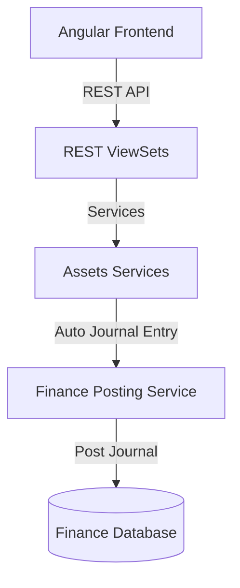

# توثيق منصة إدارة الأصول الثابتة ودورة حياة الأصل (Fixed Assets Module)

يقدم هذا المستند دليلاً شاملاً للنظام المعماري لموديول إدارة الأصول الثابتة ودورة حياة الأصل (`assets`) في نظام **Nebras ERP**، وكيفية ارتباطه بالعمليات المالية وعمليات المشتريات والمستودعات.

---

## 1. الهيكل المعماري (Architecture)

تم تصميم موديول الأصول الثابتة وفق مبادئ التصميم ثلاثي الطبقات (DDD):
* **طبقة النماذج (Domain Models):** تحتوي على 31 نموذجاً بيانياً تغطي تصنيفات الأصول، الرتب، المواقع، سجل الأصول، إهلاك القسط الثابت، الاستبعاد، التحويل، والتأمين والضمان.
* **طبقة الخدمات (Application Services):** تدير عمليات التأصيل (Capitalization)، احتساب وإثبات الإهلاك الدوري (Depreciation)، واستبعاد وشطب الأصول (Disposal).
* **طبقة الواجهات (REST APIs):** توفر واجهات كاملة للبحث والفرز والباركود والتكامل المالي الفوري.

---

## 2. قواعد الأعمال (Business Rules)

* **ثبات الأصول:** بمجرد رسملة الأصل وتأصيله ماليّاً، تصبح بيانات قيمته التاريخية وتاريخ بدء استخدامه غير قابلة للتعديل المباشر، وتخضع فقط لعمليات إعادة التقييم (Revaluation) المعتمدة.
* **الإهلاك التلقائي والترحيل:** يحسب الإهلاك تلقائياً بالاعتماد على طريقة القسط الثابت (Straight Line) ويتم ترحيله دورياً للمالية كقيد يومية معتمد لتخفيض القيمة الدفترية للأصل.
* **إقفال الاستبعاد:** عند شطب أصل أو بيعه، يغلق مجمع الإهلاك المالي المقابل بالكامل، وتثبت الأرباح أو الخسائر الرأسمالية (Gain/Loss) تلقائياً في الأستاذ العام بالمالية.
* **العزل الجغرافي للمستأجرين:** تدعم الجداول بالكامل خاصية `tenant_id` لضمان عزل البيانات الكامل والخصوصية التامة للمؤسسات المشتركة بالنظام.

---

## 3. هيكل قاعدة البيانات وقاموس البيانات (Database Dictionary)

### أهم الكيانات والموديلات:
* **Asset:** الكيان الرئيسي للأصل شاملاً الرقم التعريفي، الاسم، الباركود، تكلفة الاقتناء، القيمة المتبقية، والقيمة الدفترية.
* **AssetCategory:** فئة الأصل (مثل: مباني، أجهزة شبكات، سيارات، أثاث مختبرات).
* **AssetCapitalization:** يوثق تاريخ ومبلغ الرسملة ورابط القيد المالي المنعكس.
* **AssetDepreciation:** يوثق حركات الإهلاك الدوري ومجمع الإهلاك والقيمة بعد الإهلاك.
* **AssetDisposal:** يوثق تصفية الأصل (بيع، شطب، هبة) وصافي الأرباح أو الخسائر الرأسمالية المحققة.
* **AssetTransfer:** يوثق حركة نقل الأصول فيزيائياً وموقعياً مع الموافقات.

---

## 4. واجهات البرمجة والمسارات (REST API & Angular Routes)

### أهم مسارات الـ API (REST Endpoints)
* `POST /api/v1/assets/items/{id}/capitalize/` - رسملة أصل وتوليد قيد إثبات الأصول ماليّاً.
* `POST /api/v1/assets/items/{id}/depreciate/` - احتساب القسط وإصدار قيد الإهلاك الدوري بالمالية.
* `POST /api/v1/assets/disposals/dispose/` - شطب أو بيع أصل وتصفية مجمع الإهلاك.
* `GET /api/v1/assets/items/dashboard-stats/` - إحصائيات لوحة تحكم الأصول الثابتة.

### مسارات التوجيه في الفرونت إند (Angular Routes)
* `/assets/dashboard` - لوحة التحكم الشاملة بسجل الأصول وقيمها الحالية وإهلاك الفترة.

---

## 5. مصفوفة الصلاحيات (Permission Matrix)

| الدور الوظيفي | تسجيل أصل جديد | اعتماد الرسملة (Capitalization) | تشغيل الإهلاك | اعتماد الاستبعاد والشطب |
| :--- | :---: | :---: | :---: | :---: |
| **محاسب أصول (Asset Accountant)** | نعم | لا | نعم | لا |
| **مدير الحسابات (Finance Manager)** | نعم | نعم | نعم | لا |
| **المدير المالي (CFO)** | نعم | نعم | نعم | نعم |

---

## 6. دورة حياة الأصل والتحركات المالية (Asset Financial Lifecycle)

1. **التسجيل (Registration):** يسجل الأصل بقيمته التاريخية مع بقاء حالته `registered`.
2. **الرسملة (Capitalization):**
   * يتولد القيد: **مدين** حساب الأصول الثابتة / **دائن** حساب وسيط اقتناء أصول.
   * تتحول الحالة إلى `capitalized`.
3. **الإهلاك الدوري (Depreciation):**
   * يتولد القيد: **مدين** حساب مصروف الإهلاك / **دائن** حساب مجمع إهلاك الأصول.
4. **الاستبعاد (Disposal):**
   * إغلاق مجمع الإهلاك وشطب التكلفة التاريخية.
   * إثبات المتحصلات النقدية (إن وجدت) وتوليد قيد أرباح أو خسائر رأسمالية.

---

## 7. تطبيقات الذكاء الاصطناعي المستقبلية (AI Extensions)

تمت تهيئة النماذج والواجهات لدعم:
* **التنبؤ بالصيانة الوقائية (Predictive Maintenance):** التنبؤ بأعطال الأصول وطلبات الصيانة بناءً على سجل الفحوصات الفنية.
* **تقدير العمر الإنتاجي الفعلي (Useful Life Prediction):** إعادة احتساب العمر الافتراضي الأمثل بناءً على ظروف تشغيل الأصل.
