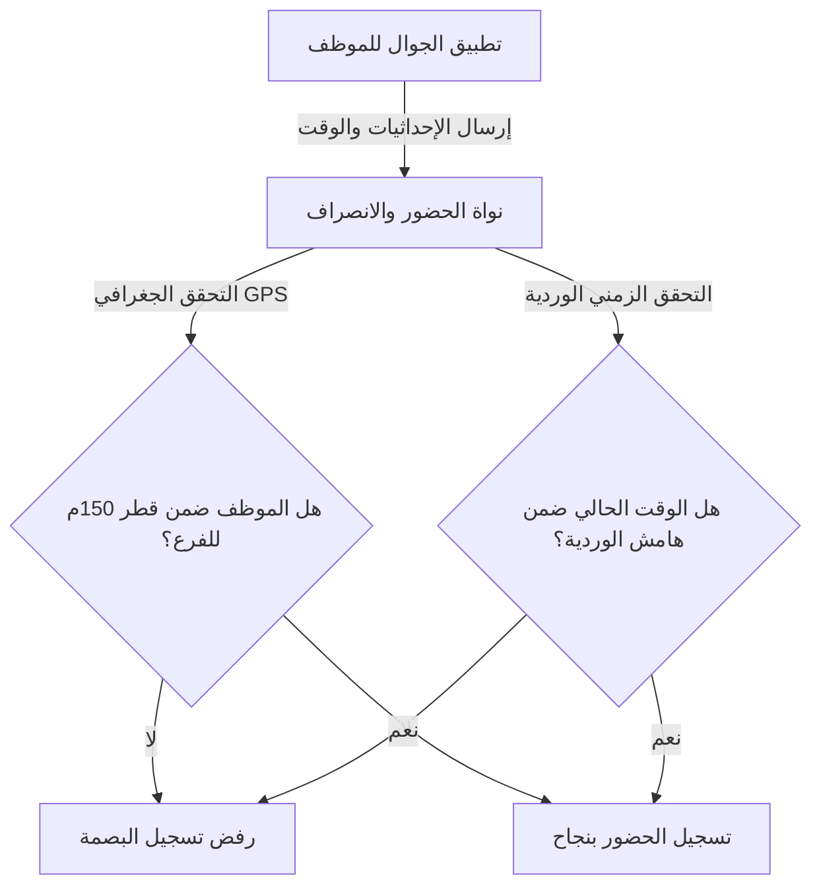

# موديول الحضور والإنصراف الذكي (Attendance Platform)

يوفر هذا المستند توثيقاً كاملاً لموديول **الحضور والإنصراف** المطور لواجهات نبراس ERP، والمصمم بالكامل محاكاةً لنظام **جسر (Jisr)**.

---

## 1. شاشات الواجهة الأمامية (Angular Components)

تم بناء الموديول وتفعيله بالكامل تحت المسار الموحد `/attendance` باستخدام المكونات المستقلة (Standalone Components) وإدارة الحالة القائمة على **Angular Signals**:

1. **[لوحة المتابعة ونظرة عامة](file:///d:/nebras-erp/frontend/src/app/features/attendance/attendance-dashboard.component.ts):**
   - تعرض الكروت الإحصائية الذكية لتتبع التأخير، والغياب، والانصراف المبكر، وحالات الموافقات.
   - تضم جدول المتابعة اليومية الفوري المفلتر بالتاريخ للبحث وعرض بيانات البصمات وتفاصيل الدقائق المتأخرة والوردية المسندة.

2. **[جدولة الدوامات والورديات](file:///d:/nebras-erp/frontend/src/app/features/attendance/attendance-shifts.component.ts):**
   - شبكة أسبوعية (أحد - سبت) لعرض دوامات الموظفين والفروع المسندة إليهم للعمل ومؤشر أيام العطلة.
   - تدمج نافذة الدرج الجانبي (`nb-drawer`) لإسناد وردية مخصصة لأحد الموظفين مع تحديد الفرع والأوقات.

3. **[طلبات تصحيح البصمة](file:///d:/nebras-erp/frontend/src/app/features/attendance/attendance-corrections.component.ts):**
   - مركز إداري لاعتماد أو رفض طلبات تعديل البصمات التي يقدمها الموظفون عند نسيان البصمة مع إبداء الأسباب.

4. **[محاكي البصمة الجوالة](file:///d:/nebras-erp/frontend/src/app/features/attendance/attendance-simulator.component.ts):**
   - شاشة تفاعلية تحاكي تطبيق الهاتف المحمول للموظف لاختبار آلية التحقق الجغرافي والزمني (Geofencing) لتسجيل الحضور، وتوضح الحالات التي يتم فيها قبول أو رفض البصمة.

---

## 2. التكامل المعماري للتحقق الجغرافي والزمني

---

## 3. التكامل مع مسير الرواتب والموظفين (Payroll & Employees Integration)

1. **الربط مع الموظفين:**
   - يرتبط سجل الحضور `AttendanceRecord` بمفتاح خارجي (ForeignKey) مع جدول الموظفين الموحد `Employee` لتسجيل الحالات والورديات بناءً على بياناتهم الأساسية.

2. **التأثير المالي على مسير الرواتب:**
   - عند إغلاق الفترة المالية للرواتب (`PayrollPeriod` & `PayrollRun`)، يقوم موديول الرواتب تلقائياً بجلب إجمالي غيابات الموظف ودقائق التأخير المتراكمة من موديول الحضور والانصراف واحتساب الخصم المالي المباشر في قسيمة الراتب (`Payslip`) بناءً على المعادلة:
   $$\text{خصم التأخير والغياب} = \frac{\text{الراتب الأساسي}}{30 \times 8} \times \text{ساعات التأخير والغياب}$$
   - ينعكس هذا الخصم في صافي الراتب المستحق للموظف بنهاية الشهر تلقائياً.
