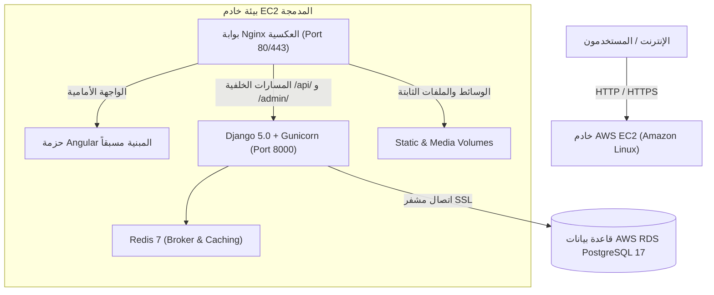

# توثيق نشر المنظومة على سحابة أمازون (AWS Deployment Guide)

يوثق هذا المستند بنية وطريقة نشر منظومة **نبراس ERP (Nebras ERP)** بنجاح على البنية التحتية السحابية لشركة أمازون (AWS).

---

## 1. المعمارية السحابية (Cloud Architecture)

تعتمد المنظومة بنية سحابية مدمجة وعالية الكفاءة تجمع بين الحوسبة الافتراضية وقواعد البيانات المدارة ووسائط المهام المؤقتة:



---

## 2. المكونات والخدمات المفعّلة

1. **الخادم الرئيسي (AWS EC2 Instance)**:
   - نظام التشغيل: Amazon Linux 2023.
   - ذاكرة رام افتراضية مدعومة بذاكرة تبادل (2GB Swap File) لضمان الاستقرار وعدم توقف المعالج.
   - محرك الحاويات: Docker + Docker Compose + Docker Buildx.

2. **قاعدة البيانات المدارة (AWS RDS PostgreSQL 17)**:
   - المحرك: PostgreSQL 17 على مواصفات `db.t4g.micro`.
   - اسم قاعدة البيانات: `nebras_db`.
   - التشفير: اتصال آمن ومشفر عبر `sslmode=require`.
   - تم ترحيل واستيراد كافة بيانات النظام السابقة (الجداول، الطلاب، الحسابات، الإعدادات) بنجاح واكتمال 100%.

3. **الواجهة الأمامية (Angular 20 Frontend)**:
   - مبنية بوضعية الإنتاج التام (`build:prod`) بتقنيات التجزئة والتصغير والتجميع التلقائي.
   - خفيفة وسريعة التقديم عبر Nginx دون استهلاك موارد المعالج في السيرفر.

4. **الواجهة الخلفية (Django Backend & Gunicorn)**:
   - خادم WSGI متعدد العمال (`workers 3`).
   - تنفيذ تلقائي لعمليات `collectstatic` و `migrate` عند الإقلاع.
   - ترقية الإعدادات لدعم IP السيرفر وتفادي تعارضات CORS أو المضيفين المسموح بهم.

---

## 3. الأوامر القياسية للإدارة والتحديث

### إعادة تشغيل المنظومة:
```bash
cd ~/nebras-erp/docker
sudo docker compose restart
```

### متابعة سجلات النظام الحية (Logs):
```bash
sudo docker compose logs -f backend
sudo docker compose logs -f nginx
```

### تحديث المنظومة بعد أي تعديلات جديدة في الكود:
```bash
cd ~/nebras-erp
git pull origin master
cd docker
sudo docker compose up -d --build
```
