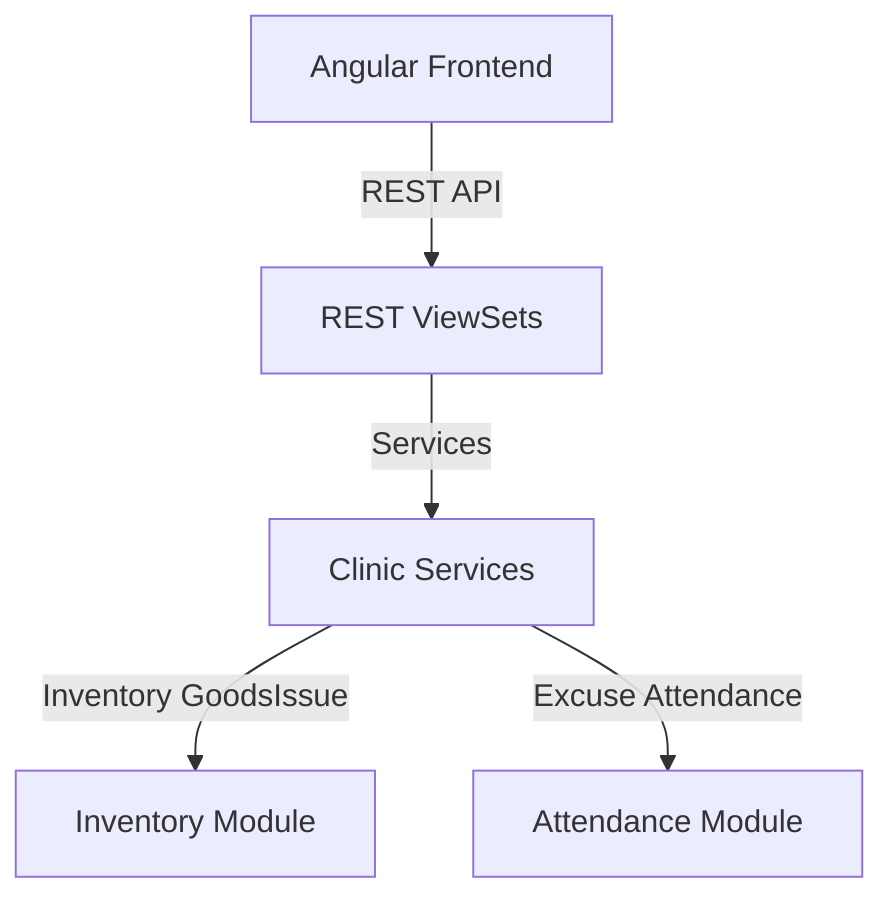

# توثيق نظام العيادة المدرسية والسجلات الصحية (School Health Information System - Clinic)

يقدم هذا المستند دليلاً شاملاً للنظام المعماري لموديول العيادة الصحية والملفات الطبية للطلاب والموظفين (`clinic`) في نظام **Nebras ERP**، وكيفية ربطه بالحضور والغياب والمستودعات والتحركات الطبية المترتبة.

---

## 1. الهيكل المعماري (Architecture)

تم تصميم موديول العيادة الطبية وفق مبادئ التصميم ثلاثي الطبقات (DDD):
* **طبقة النماذج (Domain Models):** تحتوي على 32 نموذجاً بيانياً تغطي غرف العيادة، الكادر الطبي، الملفات الصحية الشاملة، المؤشرات الحيوية، الفحوصات واللقاحات، الإجازات الطبية والتقارير.
* **طبقة الخدمات (Application Services):** تدير عمليات تسجيل الزيارات، المؤشرات، وصرف الأدوية وخصمها من المستودعات، وتبرير غياب الطلاب تلقائياً عند اعتماد الإجازات المرضية.
* **طبقة الواجهات (REST APIs):** توفر واجهات كاملة للبحث والفرز والباركود والتكامل الطبي واللوجستي.

---

## 2. قواعد الأعمال (Business Rules)

* **سرية المعلومات الطبية:** كافة السجلات الصحية وحالات الحساسية والأمراض المزمنة تعتبر سرية ومحمية تماماً ولا يطلع عليها إلا الكوادر الطبية والمشرفون المعتمدون.
* **تكامل صرف الأدوية:** يتم صرف وخصم الأدوية مباشرة من المستودع المخصص للعيادة بالتكامل مع خدمات الصرف المخزني (`GoodsIssueService`) لضمان صحة الأرصدة وتتبع التواريخ والصلاحية.
* **الربط التلقائي بالغياب:** عند اعتماد طلب الإجازة المرضية من طبيب العيادة، يتأثر سجل غياب الطالب/الموظف خلال فترة الإجازة تلقائياً ليصبح "غياب مبرر طبيّاً".
* **عزل بيانات المستأجرين:** تدعم الجداول بالكامل خاصية `tenant_id` لضمان عزل البيانات الكامل والخصوصية التامة للمؤسسات المشتركة بالنظام.

---

## 3. هيكل قاعدة البيانات وقاموس البيانات (Database Dictionary)

### أهم الكيانات والموديلات:
* **MedicalProfile:** الملف الطبي العام (فصائل الدم، الحساسية، والأمراض المزمنة والعجز).
* **ClinicVisit:** زيارات المرضى ونوعها (دوري، طارئ) وحالة خروجهم.
* **VitalSigns:** قياس المؤشرات الحيوية (الحرارة، ضغط الدم، النبض، الأكسجين).
* **MedicationDispense:** تتبع صرف الأدوية للمرضى من مخازن العيادة.
* **MedicalLeave & MedicalCertificate:** إدارة التقارير الطبية وتبرير الغياب.

---

## 4. واجهات البرمجة والمسارات (REST API & Angular Routes)

### أهم مسارات الـ API (REST Endpoints)
* `POST /api/v1/clinic/visits/` - تسجيل زيارة وقياس مؤشرات حيوية.
* `POST /api/v1/clinic/visits/{id}/dispense/` - صرف دواء من مستودع العيادة.
* `POST /api/v1/clinic/leaves/{id}/approve/` - اعتماد إجازة مرضية وتحديث الحضور.
* `GET /api/v1/clinic/visits/dashboard-stats/` - إحصائيات لوحة تحكم العيادة الطبية.

### مسارات التوجيه في الفرونت إند (Angular Routes)
* `/clinic/dashboard` - لوحة التحكم الشاملة بالعيادة وزيارات اليوم والحالات الطارئة.

---

## 5. مصفوفة الصلاحيات (Permission Matrix)

| الدور الوظيفي | الاطلاع على الملفات الطبية | تسجيل زيارة وقياس مؤشرات | صرف أدوية ومستلزمات | اعتماد إجازة مرضية | تعديل الإعدادات والسياسات |
| :--- | :---: | :---: | :---: | :---: | :---: |
| **طالب / معلم** | نعم (ملفه فقط) | لا | لا | لا | لا |
| **طبيب / ممرض عيادة** | نعم | نعم | نعم | نعم | لا |
| **مدير النظام / مشرف طبي** | نعم | نعم | نعم | نعم | نعم |

---

## 6. التحركات اللوجستية والخدمية بالعيادة

1. **الخصم المخزني التلقائي:**
   * عند إدخال صرف أدوية لأحد المرضى، يتم خصم رصيد البند المقابل في موديول المستودعات تلقائياً.
2. **تبرير غياب الطلاب أكاديميّاً:**
   * عند إقرار واعتماد الإجازة الطبية من العيادة، يتعدل حقل الحالة بجدول حضور الطلاب (`StudentDailyAttendance`) إلى `excused_absence` (غياب مبرر).

---

## 7. تطبيقات الذكاء الاصطناعي المستقبلية (AI Extensions)

تمت تهيئة النماذج والواجهات لدعم:
* **التنبؤ بالأوبئة والأمراض (Disease Trend Analysis):** تحليل الزيارات وأعراض المرضى اليومية بالعيادة للتنبؤ ببدء تفشي نزلات البرد أو الإنفلونزا الموسمية أو الأمراض المعدية بالمنشأة وتنبيه الإدارة تلقائياً لاتخاذ تدابير العزل والتعقيم الوقائي.

----

## تحسينات معمارية أوصي بإضافتها داخل هذا الموديول

إذا كنت تستهدف المدارس الدولية أو المجموعات التعليمية الكبيرة، فمن الأفضل أن يشمل النظام أيضًا:

Medical Risk Scoring لتصنيف الطلاب حسب مستوى الخطورة الصحية.
Care Plans للطلاب ذوي الأمراض المزمنة (مثل السكري، الربو، الصرع).
Medication Authorization بحيث لا تُصرف الأدوية إلا بعد موافقة ولي الأمر أو وجود تفويض.
Isolation & Infection Control لإدارة حالات الأمراض المعدية وتتبع المخالطين.
Incident & Accident Management لتوثيق إصابات الملاعب والرحلات والأنشطة مع الإجراءات المتخذة.
Health Compliance Dashboard لمتابعة نسب التطعيمات والفحوصات الإلزامية على مستوى المدرسة أو المجموعة التعليمية.

إضافة هذه القدرات الآن ستجعل موديول العيادة قابلًا للتوسع إلى مستوى المؤسسات التعليمية الكبيرة دون الحاجة إلى إعادة تصميمه لاحقًا.