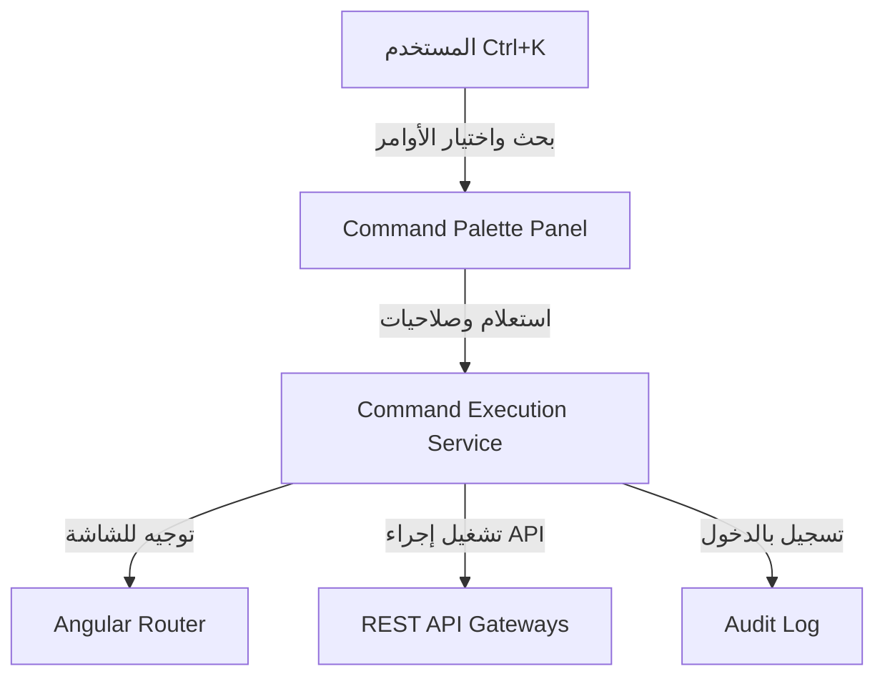

# منصة القيادة والتحكم ولوحة الأوامر العالمية (Enterprise Command Center)

تعتبر لوحة الأوامر (Command Palette) المدخل الشامل والسريع لجميع شاشات وإجراءات ومرفقات وتقارير نظام Nebras ERP عبر محرك بحث فوري موجه بالاختصارات (مثل Ctrl + K).

---

## 1. المعمارية الفنية (Command Lifecycle)

---

## 2. النماذج وقاموس البيانات (Database Dictionary)

وراثة جميع النماذج من `CombinedSharedModel` لضمان عزل المستأجرين:
- **Command:** الكيان الأساسي لحفظ الأوامر ومسارات التوجيه ونوع الإجراء.
- **CommandShortcut:** تسجيل التراكيب واختصارات لوحة المفاتيح لتفعيل التشغيل الفوري.
- **CommandPermission:** تخصيص صلاحيات تشغيل وعرض الأوامر للأدوار والمستخدمين.
- **RecentCommand / FavoriteCommand / PinnedCommand:** تخصيص الأوامر لكل مستخدم لتسهيل العمل اليومي.
- **Workspace:** مساحات العمل المخصصة لكل مسمى وظيفي (HR Workspace, Teacher Workspace, etc.).

---

## 3. مسارات واجهات REST API

- `GET /api/v1/commands/items/search/?q={query}` : البحث الفوري عن الأوامر والكيانات المسموحة للمستخدِم.
- `POST /api/v1/commands/items/{id}/execute/` : تشغيل الأمر وتسجيله بقائمة الأوامر الأخيرة.

---

## 4. واجهات ومسارات Angular

- `/command/palette` : لوحة الأوامر والقيادة الفورية والاختصارات.

---

## 5. مصفوفة الصلاحيات (Permission Matrix)

| الدور (Role) | البحث عن الأوامر العامة | الوصول لأوامر الإدارة الحساسة | تخصيص مساحات العمل |
| :--- | :---: | :---: | :---: |
| **طالب / ولي أمر (Portal User)** | نعم | لا | لا |
| **موظف عادي (Employee)** | نعم | لا | نعم (شخصي) |
| **رئيس قسم (Manager)** | نعم | نعم (ضمن قسمه) | نعم |
| **مدير النظام (Admin)** | نعم | نعم | نعم |
