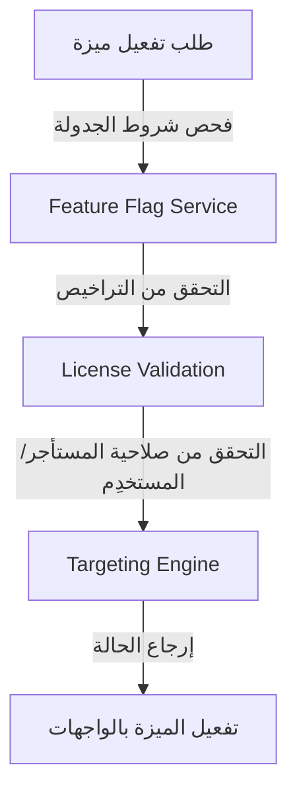

# منصة الإعدادات والميزات الفورية والبيانات الوصفية (Configuration, Feature Flags & Metadata Platform)

تعتبر هذه المنصة العقل المدبر والمحرك الرئيسي لإدارة الميزات الفورية (Feature Flags)، التراخيص، تسجيل الموديولات والمكونات الإضافية (Plugins)، وهندسة البيانات الوصفية (Metadata Engine) في كامل نظام Nebras ERP.

---

## 1. المعمارية الفنية للإعدادات والميزات (Feature Flag Lifecycle)

---

## 2. النماذج وقاموس البيانات (Database Dictionary)

وراثة جميع النماذج من `CombinedSharedModel` لضمان عزل المستأجرين:
- **SystemSetting / SystemCategory:** إدارة وتصنيف إعدادات النظام هرمياً (مستأجر، فرع، سنة أكاديمية).
- **FeatureFlag / FeatureTarget:** الميزات الفورية وشروط استهداف فئات محددة من المستخدمين.
- **ModuleRegistry / ModuleDependency:** مصفوفة الموديولات المنصية النشطة والاعتماديات الفنية بينها.
- **Edition / License:** تحديد باقات الاستخدام المتاحة (Community, Professional, Enterprise) والتحقق من صلاحية المفاتيح وسجل المقاعد المستخدمة.
- **MetadataType / MetadataDefinition:** تتيح البناء اللامحدود للبيانات الوصفية الديناميكية للكيانات المختلفة وتأكيد أشكال الحقول والترجمات.

---

## 3. مسارات واجهات REST API

- `POST /api/v1/config/settings/update-key/` : تحديث وحفظ قيمة إعداد هرمي وتسجيل تدقيق التغيير.
- `GET /api/v1/config/features/evaluate/{code}/` : الفحص الفوري لتفعيل ميزة معينة للمستخدِم والمستأجر الحالي.

---

## 4. واجهات ومسارات Angular

- `/config/features` : لوحة التحكم وإدارة الميزات والتراخيص للمسؤولين.

---

## 5. مصفوفة الصلاحيات (Permission Matrix)

| الدور (Role) | فحص حالة الميزات بالواجهات | تعديل قيم الإعدادات الهرمية | تفعيل الميزات والترخيص والنسخ |
| :--- | :---: | :---: | :---: |
| **مستخدم عادي (User)** | نعم | لا | لا |
| **رئيس قسم (Manager)** | نعم | نعم (ضمن قسمه) | لا |
| **مسؤول إعدادات (Config Admin)** | نعم | نعم | نعم |
| **مدير النظام العام (Super Admin)** | نعم | نعم | نعم |
