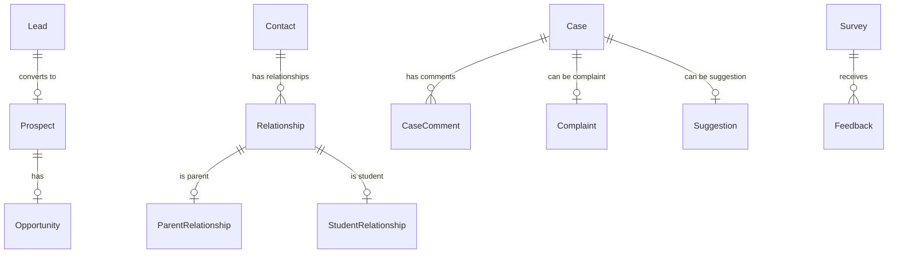

# موديول إدارة علاقات العملاء التعليمي (Education CRM Platform)

يوفر هذا الموديول واجهة لإدارة كافة جهات الاتصال المهتمة بالمنظومة التعليمية، بدءاً من العملاء المحتملين (Leads)، انتقالاً إلى التقديم (Applicants)، والطلاب والخريجين والشركاء الخارجيين.

---

## 1. المعمارية الفنية (Architecture)

مبني بالتوافق مع معايير Nebras DDD:
- **Domain Layers:** يحتوي على 34 نموذج قاعدة بيانات لتغطية قنوات الاتصال والشكاوى والاستبيانات وعلاقات أولياء الأمور والشركاء والخريجين.
- **Application Services:** خدمات تحويل العملاء (`CrmLeadService`)، لوحة تحكم الـ CRM، وإدارة رضا المستفيدين.
- **REST APIs:** واجهات مخصصة للتحكم بالعملاء والحملات والشكاوى.

---

## 2. قواعد الأعمال (Business Rules)

1. **مصدر بيانات المتقدمين:** جميع طلبات التقديم والقبول الحقيقية تنشأ في موديول Admissions، ويقوم الـ CRM فقط بتحويل العميل المحتمل المكتمل البيانات إليها.
2. **اتصالات موحدة:** يتم استهلاك موديول الاتصالات المركزي لإرسال التبليغات وحملات البريد الإلكتروني والرسائل القصيرة لتفادي تكرار المنطق البرمجي.
3. **عزل المستأجرين (Tenant Isolation):** يتم فلترة كافة الكيانات حسب المستأجر النشط أوتوماتيكياً.

---

## 3. مخطط علاقات قاعدة البيانات (ER Diagram / Database Dictionary)

---

## 4. مسارات واجهات REST API

- `GET /api/v1/crm/dashboard/` : إحصاءات ومؤشرات أداء الـ CRM.
- `POST /api/v1/crm/leads/{id}/convert/` : تحويل عميل محتمل إلى فرصة مهتمة (Prospect).
- `POST /api/v1/crm/prospects/{id}/convert_to_applicant/` : تحويل فرصة مهتمة إلى طلب قبول حقيقي.
- `POST /api/v1/crm/cases/{id}/escalate/` : تصعيد قضية أو شكوى دعم فني.

---

## 5. واجهات Angular ومسارات التوجيه (Angular Routes)

- `/crm/dashboard` : لوحة المتابعة وقمع الاستقطاب وقضايا الدعم.

---

## 6. مصفوفة الصلاحيات (Permission Matrix)

| الدور (Role) | تعديل العملاء المحتملين | إدارة الحملات | عرض الشكاوى الحساسة | استعراض تحليلات الـ CRM |
| :--- | :---: | :---: | :---: | :---: |
| **مسؤول القبول (Admission Officer)** | نعم | لا | لا | لا |
| **مدير التسويق (Marketing Manager)** | نعم | نعم | لا | نعم |
| **موظف الدعم (Support Agent)** | لا | لا | نعم | لا |
| **مدير النظام (Admin)** | نعم | نعم | نعم | نعم |
