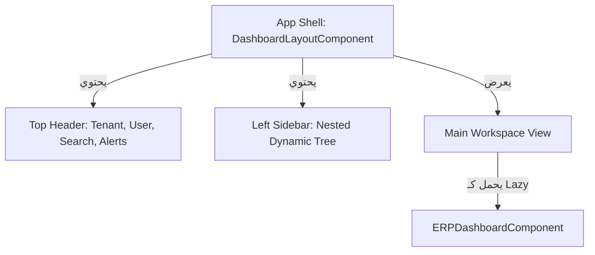

# موديول لوحة التحكم التشغيلية وبيئة عمل الـ ERP (Dashboard & Workspace)

يوثق هذا المستند الهيكل المعماري والروابط وتوزيع الصلاحيات لموديول **لوحة التحكم التشغيلية وقالب بيئة العمل (App Shell)** في منصة Nebras ERP.

---

## 1. الهيكل المعماري (Architecture)

يتكون الموديول من قالب رئيسي خارجي (Layout) يلتف حول كامل صفحات التطبيق ويتحكم بالوصول والتصفية:

---

## 2. شجرة التنقل وتوزيع الصلاحيات (Navigation Tree & RBAC)

يتم تصفية القوائم الجانبية تلقائياً بناءً على أدوار وصلاحيات المستخدم:

| الموديول | الرابط | الصلاحية المطلوبة | الحالة في المنصة |
| :--- | :--- | :--- | :--- |
| **الرئيسية** | `/dashboard` | مسموح للجميع | مفعل (نشط) |
| **القبول والتسجيل** | `/admissions/applicants` | `admissions.view` | مفعل (نشط) |
| **شؤون الطلاب** | `/students/list` | `students.view` | مفعل (نشط) |
| **الهيكل التنظيمي** | `/organization/overview` | `organization.view` | مفعل (نشط) |
| **الهيكل الأكاديمي** | `/academics/years` | `academics.view` | مفعل (نشط) |
| **إدارة المعلمين** | `/teachers/*` | `teachers.view` | * Coming Soon (قريباً)* |
| **الشؤون المالية** | `/finance/*` | `finance.view` | * Coming Soon (قريباً)* |
| **الموارد البشرية** | `/hr/*` | `hr.view` | * Coming Soon (قريباً)* |

## 3. مبدّل الفروع المدرسية والداشبورد التفاعلي (Branch Switcher & Reactive Dashboard)

- **مبدّل الفروع في الشريط العلوي (Top Header Branch Selector)**:
  - يتيح للمدير العام والمستخدم الخارق التبديل السريع بين:
    - `🏫 جميع الفروع والمدارس` (رؤية مجمعة شمولية 360°).
    - `👦 مدرسة البنين`.
    - `👧 مدرسة البنات`.
- **التفاعل الحظي للمؤشرات والرسوم الحية (Dynamic KPIs & Funnel)**:
  - عند تغيير الفرع النشط من المبدّل العلوي أو شريط الأزرار السريعة بالداشبورد، يتم إعادة تصفية وحساب:
    - إجمالي وعدد الطلاب النشطين لكل مدرسة.
    - التحصيلات المالية والمستحقات الخاصة بفرع المدرسة.
    - طلبات القبول والتسجيل ومسار القبول الحقيقي (Admissions Funnel) الخاص بمدرسة البنين أو البنات.

---

## 4. واجهات الـ API المربوطة (API Endpoints)

- **بيانات وإحصائيات لوحة التحكم**: `GET /api/v1/platform/erp-dashboard/`
  - تعود ببيانات حقيقية من قاعدة البيانات حول إجمالي الطلاب والمتقدمين والفروع وآخر العمليات الأمنية والتنبيهات.

