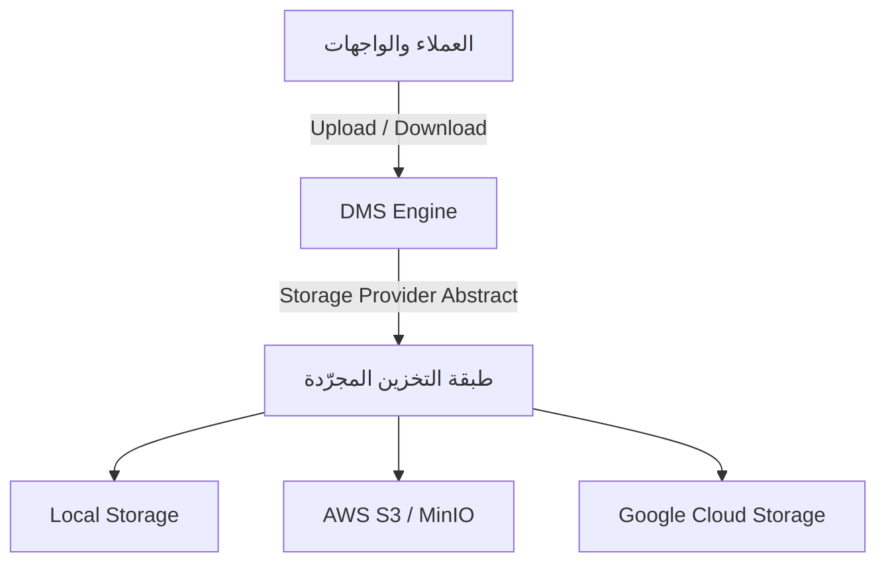
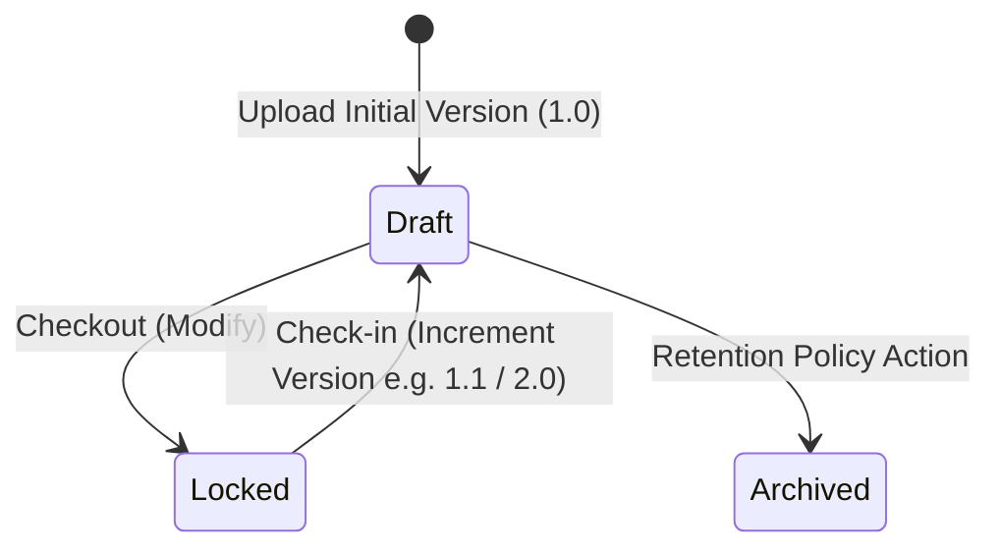

# موديول إدارة المستندات والأرشفة الرقمية (Enterprise Document Management System)

يمثل هذا الموديول المستودع المركزي الآمن لإدارة ورفع وحفظ كافة الوثائق والملفات والمرفقات في كامل نظام Nebras ERP.

---

## 1. المعمارية الفنية (Architecture & Storage)

ينقسم الموديول إلى:
- **DMS Engine:** معالجة تتبع الإصدارات وتاريخ المستندات وعمليات الفحص وقفل الوثائق.
- **Abstract Storage Layer:** واجهة موحدة للتكامل مع أقراص السيرفر المحلية أو خدمات التخزين السحابية دون تعديل منطق الأعمال.
- **Workflow & Rules Integration:** أرشفة المستندات تلقائياً وحفظها حسب سياسات الحفظ (Retention Policies) المحددة في محرك القواعد.

---

## 2. النماذج وقاموس البيانات (Database Dictionary)

وراثة جميع النماذج من `CombinedSharedModel` لضمان عزل المستأجرين وأمان البيانات:
- **Document:** الكيان الرئيسي لحفظ الوثيقة ومجلدها الحالي وحالتها (مغلقة/نشطة).
- **DocumentVersion:** تتبع إصدارات الوثائق التاريخية (مطورين، مؤلفين، وتواريخ الحفظ).
- **DocumentFolder:** المجلدات المتداخلة لتنظيم الملفات.
- **FolderPermission:** تحديد صلاحيات القراءة والكتابة على مستوى المجلدات للمستخدمين أو الأدوار.

---

## 3. دورة حياة إصدارات المستند (Version Lifecycle)

يتم التحكم بالإصدارات عبر:
- **Major Version:** إصدارات أساسية جديدة (1.0 -> 2.0) عند إحداث تغييرات جوهرية.
- **Minor Version:** إصدارات فرعية (1.0 -> 1.1) للتعديلات الطفيفة والمراجعات اليومية.

---

## 4. مسارات واجهات REST API

- `POST /api/v1/documents/files/upload/` : رفع مستند جديد وتأسيس الإصدار 1.0.
- `POST /api/v1/documents/files/{id}/version/` : إضافة إصدار جديد (رئيسي أو فرعي).
- `POST /api/v1/documents/files/{id}/lock/` : قفل الوثيقة لمنع التعديل المتداخل.
- `POST /api/v1/documents/files/{id}/unlock/` : فك قفل الوثيقة.

---

## 5. واجهات Angular ومسارات التوجيه (Angular Routes)

- `/documents/explorer` : متصفح الملفات وعرض المجلدات والمعاينات والخصائص.

---

## 6. مصفوفة الصلاحيات (Permission Matrix)

| الدور (Role) | قراءة المستندات | رفع المستندات | تعديل الأقفال والأذونات | الأرشفة والحذف |
| :--- | :---: | :---: | :---: | :---: |
| **مستخدم عادي (User)** | نعم | نعم (مجلداته) | لا | لا |
| **رئيس قسم (Dept Head)** | نعم | نعم | نعم (قسمه) | لا |
| **أمين الأرشيف (Archivist)** | نعم | نعم | نعم | نعم |
| **مدير النظام (Admin)** | نعم | نعم | نعم | نعم |
