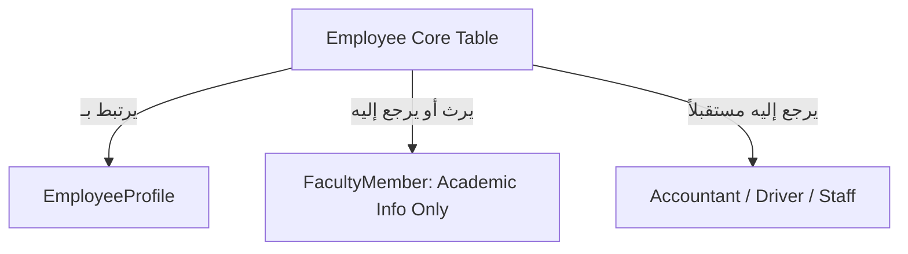

# النواة المعمارية الموحدة للموظفين (Employee Core Platform)

توفر هذه الوثيقة دليلاً معمارياً وتشغيلياً لـ **النواة الموحدة للموظفين (Employee Core)** وكيفية ربطها بجميع موديولات الموارد البشرية والتعيينات والأكاديميين في Nebras ERP.

---

## 1. المعمارية وإعادة الهيكلة (Architecture & Refactoring)

يهدف موديول `employees` لتوحيد سجلات الكادر البشري بالمنظمة:

- **Employee Core:** يضم كافة البيانات الشخصية وبيانات الهوية الوطنية ورقم جواز السفر والاتصال.
- **Faculty Refactoring:** تم سحب الحقول الشخصية المكررة من `FacultyMember` لترتبط كـ ForeignKey بـ `Employee` ليكون المعلم حالة تخصيص أكاديمية للموظف.

---

## 2. قواعد الأعمال والتحقق (Business Rules)

- **رقم الموظف الفريد:** التحقق التلقائي لمنع تكرار الهويات الوطنية، الجوازات، والبريد الإلكتروني للعمل.
- **عزل المستأجرين (Tenant Isolation):** تصفية وعزل الموظفين والملفات المرفقة تلقائياً بـ `tenant_id`.

---

## 3. شاشات الواجهة الأمامية (Angular Components)

- **app-employees-dashboard:** لوحة التحكم الموحدة للموارد البشرية والرواتب، وتضم قائمة الموظفين والحالات الوظيفية، ومفعلة ديناميكياً على الرابط `/hr/dashboard`.