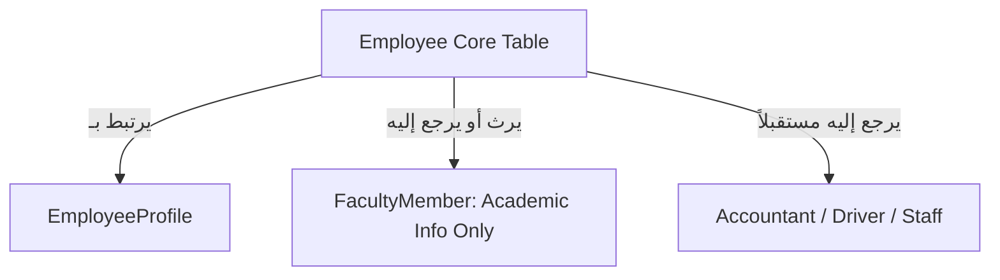

# النواة المعمارية الموحدة للموظفين (Employee Core Platform)

توفر هذه الوثيقة دليلاً معمارياً وتشغيلياً لـ **النواة الموحدة للموظفين (Employee Core)** وكيفية ربطها بجميع موديولات الموارد البشرية والتعيينات والأكاديميين في Nebras ERP.

---

## 1. المعمارية وإعادة الهيكلة (Architecture & Refactoring)

يهدف موديول `employees` لتوحيد سجلات الكادر البشري بالمنظمة:

```mermaid
graph TD
    Employee[Employee Core Table] -->|يرتبط بـ| Profile[EmployeeProfile]
    Employee -->|يرث أو يرجع إليه| FacultyMember[FacultyMember: Academic Info Only]
    Employee -->|يرجع إليه مستقبلاً| Accountant[Accountant / Driver / Staff]
```

- **Employee Core:** يضم كافة البيانات الشخصية وبيانات الهوية الوطنية ورقم جواز السفر والاتصال.
- **Faculty Refactoring:** تم سحب الحقول الشخصية المكررة من `FacultyMember` لترتبط كـ ForeignKey بـ `Employee` ليكون المعلم حالة تخصيص أكاديمية للموظف.

---

## 2. قواعد الأعمال والتحقق (Business Rules)

- **رقم الموظف الفريد:** التحقق التلقائي لمنع تكرار الهويات الوطنية، الجوازات، والبريد الإلكتروني للعمل.
- **عزل المستأجرين (Tenant Isolation):** تصفية وعزل الموظفين والملفات المرفقة تلقائياً بـ `tenant_id`.

---

## 3. شاشات الواجهة الأمامية (Angular Components)

- **app-employees-dashboard:** لوحة التحكم الموحدة للموارد البشرية والرواتب، وتضم قائمة الموظفين والحالات الوظيفية، ومفعلة ديناميكياً على الرابط `/hr/dashboard`.
- **app-employee-bulk-import-modal:** نافذة استيراد كشوفات المعلمين والموظفين دفعة واحدة عبر ملفات الإكسل (.xlsx) متعددة الخطوات (Nebras OS Wizard Modal)، وتوفر:
  1. تحميل نموذج عقد 2026م الرسمي المرمز بالألوان والمجموعات ودليل اللائحة.
  2. رفع الملف مع محرر ذكي لمطابقة خلايا الترويسة (Header Mapping Editor) لتخصيص أو تعديل رؤوس الأعمدة.
  3. المعاينة والتدقيق مع خيار تصفير واستبدال الموظفين التجريبيين الحاليين (Purge Mock Data) لبدء سجل نظيف.
  4. اكتمال الاستيراد وتوليد الأرقام الوظيفية الرسمية (`EMP-2026-XXX`) وحساب صافي الرواتب بالجنيه السوداني (`ج.س`).

---

## 4. خدمة استيراد الكشوفات البرمجية (EmployeeBulkImportService)

- **الموقع:** `backend/apps/employees/application/bulk_import.py`
- **القالب المولد:** مصنف إكسل ثنائي الأسطر للترويسة (المجموعات + الأعمدة التفصيلية) مع 46 حقلاً تغطي المراحل الست لاستمارة وعقد 2026م.
- **تصفير التجريبيين:** تنفيذ حذف آمن ومتسلسل للموظفين وملحقاتهم (أبناء، مراجع، خبرات) عند الحاجة أو بطلب مستقل عبر `POST /api/v1/employees/employees/purge-mock-data/`.