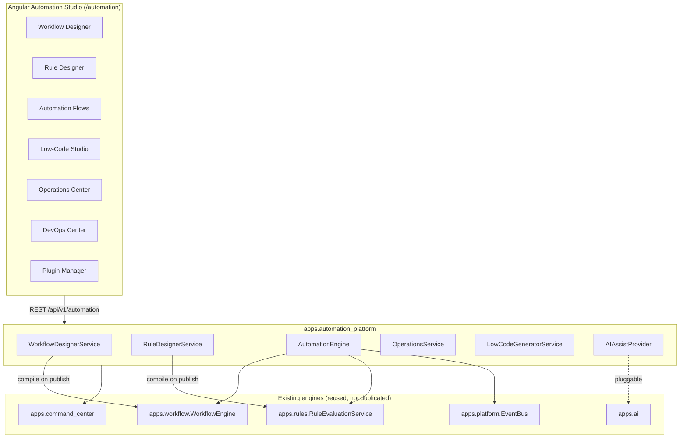
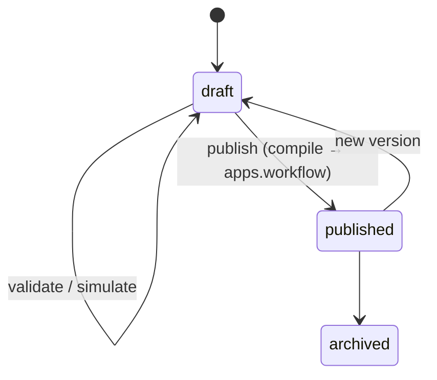
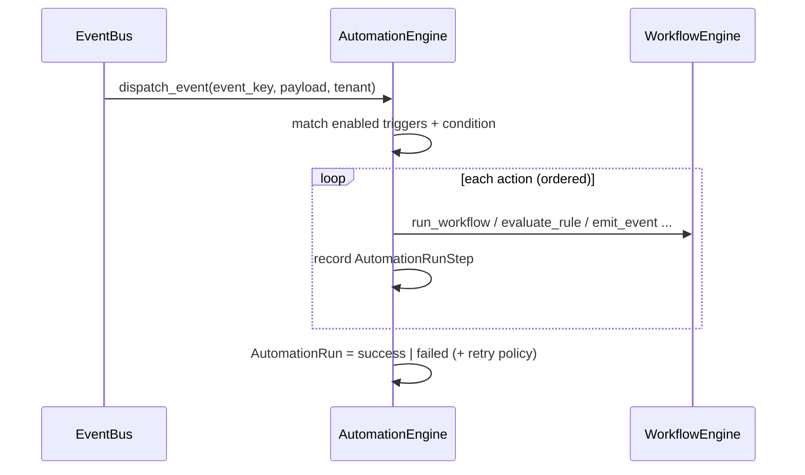
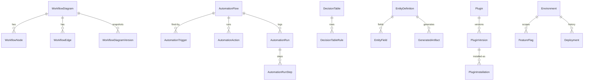

# Enterprise Automation Platform — منصة الأتمتة المؤسسية

> Prompt 32 — Visual Workflow Designer + Low-Code Platform + Enterprise Operations & DevOps
>
> Django app: `apps.automation_platform` · API base: `/api/v1/automation/` · Angular: `/automation/*`

The Enterprise Automation Platform makes Nebras ERP **configurable, extensible and
self-automating**. It unifies three enterprise capabilities into one module:

1. **Visual Workflow Designer** — drag-and-drop authoring on top of the existing Workflow Engine.
2. **Enterprise Low-Code / No-Code Platform** — metadata-driven entity/form/page/API builders.
3. **Enterprise Operations & DevOps Platform** — in-app observability + deployment/DevOps interfaces.

---

## 1. Architecture & Module Boundaries

The platform is an **orchestration layer**. It never re-implements execution — it
**reuses** the engines that already exist in the monorepo:

| Capability | Owner (reused) | This module adds |
| :-- | :-- | :-- |
| Workflow state-machine execution | `apps.workflow` (`WorkflowEngine`) | Visual design, versioning, simulation, **compile-to-engine** on publish |
| Rule/condition evaluation | `apps.rules` (`RuleEvaluationService`) | Decision tables/trees, rule sets, **compile-to-rules** on publish |
| Dynamic forms | `apps.forms` | Low-code form bindings, conditional/calculated fields |
| Event bus | `apps.platform` (`EventBus`) | Event-triggered automation dispatch |
| Notifications | `apps.platform` notifications | `send_notification` action |
| Command palette | `apps.command_center` | Registered automation commands |
| AI | `apps.ai` via `AIAssistProvider` interface | Never hardcoded; pluggable provider |

Layers follow Nebras DDD:

```
apps/automation_platform/
├── domain/models/          # designer, rule_designer, automation, lowcode, plugins, operations, devops
├── application/            # services, automation_engine, operations_service, lowcode_service,
│                           # ai_integration, command_registry, expressions (safe evaluator)
├── interfaces/             # serializers, views (BaseCRUDViewSet + custom actions), urls
├── sdk/                    # python_client, typescript_client, cli
├── migrations/
├── models.py               # re-export surface for Django app-loader discovery
└── tests/                  # 39 tests
```

All models extend `CombinedSharedModel` → **UUID PK, tenant isolation, soft-delete,
audit fields, versioning** out of the box. All viewsets extend `BaseCRUDViewSet` →
tenant filtering + `StandardResponse` + soft-delete on `destroy`.

### High-level component diagram



---

## 2. Visual Workflow Designer

Models: `WorkflowDiagram`, `WorkflowNode`, `WorkflowEdge`, `WorkflowBlock`,
`WorkflowTemplate`, `WorkflowDiagramVersion`, `WorkflowSimulation`,
`WorkflowValidationIssue`.

Supported node types: `start, end, task, condition, approval, timer, event, rule,
subflow, script, notification`. Edges carry a **safe condition expression** and a
trigger action.

Lifecycle:



* **Validate** (`POST /workflow-diagrams/{id}/validate/`) — single start, reachable
  nodes, valid edges, parseable expressions.
* **Simulate** (`/simulate/`) — deterministic path trace over the canvas, no side effects.
* **Publish** (`/publish/`) — compiles nodes→`WorkflowState`, edges→`WorkflowTransition`
  under a `WorkflowDefinition` coded `AP_<diagram.code>`; stores a version snapshot.
  **Runtime remains the existing `WorkflowEngine`.**

---

## 3. Rule Designer

Models: `DecisionTable` + `DecisionTableRule`, `DecisionTree` + `DecisionTreeNode`,
`RuleSet` + `RuleSetMember` (referencing `apps.rules.Rule`), `RuleSimulation`.

* Hit policies: `first, unique, collect, priority`.
* Domains: `general, academic, finance, hr, approval, validation`.
* Evaluate / simulate locally via the safe comparator; **publish compiles a
  `DecisionTable` into an `apps.rules.Rule`** (category `AP_DECISION_TABLES`).

---

## 4. Automation Engine

Models: `AutomationFlow`, `AutomationTrigger`, `AutomationAction`, `RetryPolicy`,
`ScheduledJob`, `WebhookEndpoint`, `AutomationRun`, `AutomationRunStep`.

Trigger types: `event, schedule, webhook, api, database, workflow, rule, manual`.
Action types (each delegates to an existing capability):

| Action | Delegates to |
| :-- | :-- |
| `run_workflow` | `WorkflowEngine.trigger_transition` |
| `evaluate_rule` | `RuleEvaluationService.evaluate_rule` |
| `emit_event` | `EventBus.publish` |
| `send_notification` | platform notification service |
| `call_webhook` / `call_api` | queued (Celery in production) |
| `delay` / `branch` | inline, using the safe expression evaluator |



Runs and steps are persisted for full **execution history**. `RetryPolicy` supports
fixed/linear/exponential backoff (scheduled via Celery in production).

---

## 5. Low-Code Platform

Metadata models: `EntityDefinition` + `EntityField`, `RelationshipDefinition`,
`ValidationDefinition`, `CrudDefinition`, `FormDefinition`, `PageDefinition`,
`WidgetDefinition`, `ApiDefinition`, `ModuleDefinition`, `MetadataRegistry`,
`GeneratedArtifact`.

`LowCodeGeneratorService.generate_entity` emits **DDD-compliant scaffolds**:

* Model extends `CombinedSharedModel` (tenant/soft-delete/audit).
* ViewSet extends `BaseCRUDViewSet`.
* Serializer + router URLs.

Artifacts are stored as `GeneratedArtifact` and are **not written to disk
automatically** (`is_applied=False`) — a human review/apply step preserves DDD
boundaries. Generation never bypasses the architecture.

Dynamic Forms integration reuses `apps.forms` via `FormDefinition.forms_platform_id`
and adds conditional logic, calculated fields, lookup fields, workflow binding and
form versioning at the metadata level.

---

## 6. Plugin Platform

Models: `Plugin`, `PluginVersion`, `PluginDependency`, `PluginInstallation`.

* Registry + semver versioning + dependency constraints.
* **Security validation**: `PluginVersion.security_status` (`pending/passed/failed`);
  an installation can only be enabled if its version **passed** the scan.
* **Tenant-safe**: installation is unique per `(tenant_id, plugin)`.
* Hot-reload is a **placeholder flag only** (no runtime code loading).

---

## 7. Operations Platform

Models: `SystemHealthSnapshot`, `JobMetric`, `QueueMetric`, `WorkerMetric`,
`ResourceMetric`, `TenantUsageMetric`, `OperationsAlert`.

`OperationsService.collect_health` probes DB (real `SELECT 1`), cache (set/get) and
Celery, recording snapshots and raising `OperationsAlert` on degradation.
`GET /operations/overview/` returns the latest status per component + open alert count;
`POST` triggers a fresh collection. Dashboards: system health, jobs, queues, workers,
cache/redis/celery, database, API health, storage, audit, tenants, background tasks.

---

## 8. DevOps Platform (interfaces only — no cloud deployment)

Models: `Environment`, `Secret`, `ConfigItem`, `FeatureFlag`, `Deployment`,
`ReleaseVersion`, `HealthCheck`, `MaintenanceWindow`, `BackupRecord`,
`MigrationRecord`, `LogEntry`, `TraceSpan`, `MetricSample`.

These are **configuration + history records and interface stubs**. Feature flags
toggle, deployments record rollback, maintenance windows and backups are metadata.
**Cloud/Kubernetes deployment is intentionally NOT implemented** — the module only
prepares interfaces for a future integration.

---

## 9. AI Integration

`apps.automation_platform.application.ai_integration` defines `AIAssistProvider`
(abstract) with `generate_workflow / suggest_rules / generate_form /
suggest_automations`. The default `HeuristicAIProvider` is deterministic (works with
no live model). A real provider backed by `apps.ai` is registered via
`set_provider(...)`. **AI is never hardcoded** — the platform always calls the
interface. Exposed at `POST /api/v1/automation/ai/assist/`.

---

## 10. SDK

* **Python** — `sdk/python_client.py` (`NebrasAutomationClient`) — tenant-aware,
  unwraps `StandardResponse`.
* **TypeScript** — `sdk/typescript_client.ts` — framework-agnostic `fetch` client,
  publishable as `@nebras/automation-sdk` for plugins/extensions.
* **CLI** — `sdk/cli.py` — `flows`, `run-flow`, `diagrams`, `publish`, `ops`,
  `scaffold-module` (prints a DDD module skeleton; never writes files).

---

## 11. Security

Every model/endpoint inherits: **RBAC** (`TenantPermission`), **tenant isolation**
(`tenant_id` + filtered querysets), **soft delete**, **audit fields**, **version
history** (diagram/rule versions), and **approval-aware** publish flows. Tenant-authored
expressions run through a **sandboxed AST evaluator** (`application/expressions.py`) —
no `eval`, no builtins, whitelist-only operators.

---

## 12. REST API surface (`/api/v1/automation/`)

| Group | Endpoints (router) | Custom actions |
| :-- | :-- | :-- |
| Workflow Designer | `workflow-diagrams`, `workflow-nodes`, `workflow-edges`, `workflow-blocks`, `workflow-templates`, `workflow-versions`, `workflow-simulations` | `.../validate/`, `.../simulate/`, `.../publish/` |
| Rule Designer | `decision-tables`, `decision-table-rules`, `decision-trees`, `decision-tree-nodes`, `rule-sets`, `rule-set-members` | `.../evaluate/`, `.../simulate/`, `.../publish/` |
| Automation | `flows`, `triggers`, `actions`, `scheduled-jobs`, `webhooks`, `runs` | `flows/.../run/`, `flows/.../toggle/` |
| Low-Code | `entities`, `entity-fields`, `relationships`, `validations`, `crud-definitions`, `form-definitions`, `page-definitions`, `widget-definitions`, `api-definitions`, `module-definitions`, `metadata`, `generated-artifacts` | `entities/.../generate/` |
| Plugins | `plugins`, `plugin-versions`, `plugin-installations` | `plugin-versions/.../security-scan/`, `plugin-installations/.../enable/` |
| Operations | `operations-alerts`, `health-snapshots`, `operations/overview/` (GET+POST) | — |
| DevOps | `environments`, `secrets`, `config-items`, `feature-flags`, `deployments`, `releases`, `health-checks`, `maintenance-windows`, `backups`, `logs` | `feature-flags/.../toggle/`, `deployments/.../rollback/` |
| AI | `ai/assist/` | — |

---

## 13. ER overview (selected)



---

## 14. Angular Workspace (`/automation`)

Standalone, signal-based, RTL, dark-mode, Angular Material components:

`AutomationStudioComponent` (hub) · `WorkflowDesignerComponent` (SVG canvas +
validate/publish) · `OperationsCenterComponent` (health + alerts) ·
`ResourceDashboardComponent` (config-driven list dashboard reused for automation
flows, rule designer, low-code, DevOps, plugins). A single `AutomationService`
consumes the REST API and unwraps `StandardResponse`.

---

## 15. Future Extensions

* Realtime canvas collaboration (WebSocket) for the workflow designer.
* Celery-beat binding for `ScheduledJob` / retry backoff execution.
* Live AI provider wiring `apps.ai` into `AIAssistProvider`.
* Kubernetes/cloud execution behind the DevOps interfaces (currently stubs).
* Applying `GeneratedArtifact`s to disk behind an approval workflow.
* Plugin runtime sandbox + hot-reload (currently a placeholder flag).
