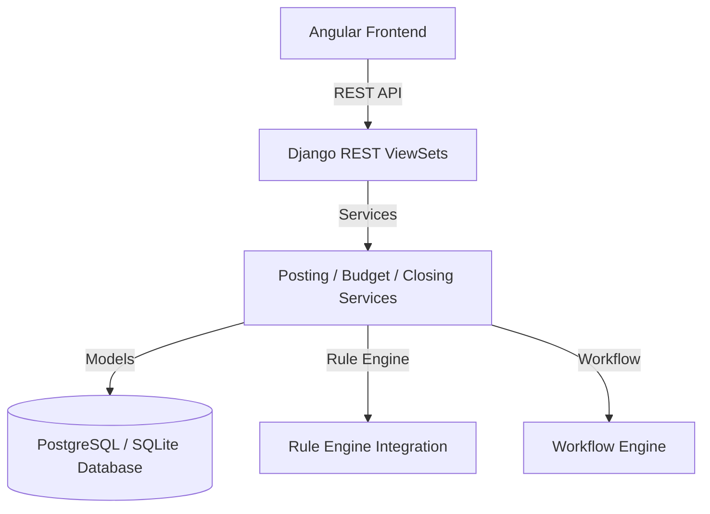

# توثيق نظام إدارة الحسابات والمنصة المالية (Finance & General Ledger Module)

نظام إدارة الحسابات المالية ودفتر الأستاذ العام هو العصب المالي لنظام **Nebras ERP**، وهو مصمم ومبني بالكامل وفق البنية المعمارية ثلاثية الطبقات (DDD) ومعايير عزل المستأجرين (Multi-Tenancy).

---

## 1. الهيكل المعماري (Architecture)

يتكون الموديول المالي من أربع طبقات رئيسية:
1. **الطبقة البرمجية ونماذج البيانات (Domain Models):** تحتوي على 29 نموذجاً محاسبياً تشمل الحسابات، قيود اليومية، الموازنات، العملات، الصناديق والضرائب.
2. **طبقة الخدمات التشغيلية (Application Services):** تعالج منطق الترحيل المزدوج، حساب الضرائب، مطابقة الموازنات، وإجراءات الإغلاق.
3. **طبقة واجهة برمجة التطبيقات (DRF REST APIs):** تعرض الخدمات بطريقة قياسية مع البحث، الترتيب، وعزل المستأجرين تلقائياً.
4. **الواجهة الأمامية (Angular Features):** لوحة تحكم حية وذكية بالكامل مبنية باستخدام Angular Material و Signals.

---

## 2. قواعد الأعمال (Business Rules)

* **التوازن المطلق:** لا يمكن حفظ أو ترحيل أي قيد يومية لا يتساوى فيه إجمالي المدين (Debit) مع إجمالي الدائن (Credit).
* **حرمة البيانات بعد الترحيل:** بمجرد ترحيل القيد، يتم توليد سجلات دفتر الأستاذ العام وتصبح غير قابلة للتعديل أو الحذف نهائياً. يتم التصحيح فقط عبر قيود عكسية (Reversals).
* **قفل الفترات والسنوات:** بمجرد إغلاق فترة محاسبية أو سنة مالية، يُحظر على كافة المستخدمين إدراج أو تعديل أي مستندات مالية تنتمي لتلك الفترة.
* **الالتزام بالموازنة:** يتم التحقق تلقائياً من الموازنات المعتمدة لكل مركز تكلفة عند محاولة إدراج أي مصروفات، ويتم المنع أو إرسال التحذيرات بناءً على قواعد محرك الأعمال.

---

## 3. هيكل قاعدة البيانات وقاموس البيانات (Database Dictionary)

### الكيانات الرئيسية (Core Entities)
* **FiscalYear (السنة المالية):** تخزن السنوات المالية وحالاتها (open, closed, locked).
* **AccountingPeriod (الفترة المحاسبية):** الفترات الشهرية أو الربع سنوية التابعة لكل سنة مالية.
* **ChartOfAccount (شجرة الحسابات COA):** شجرة الحسابات كاملة تدعم التداخل غير المحدود وتصنيف الحسابات (أصول، خصوم، ملكية، إيرادات، مصروفات).
* **JournalEntry (قيود اليومية) & JournalEntryLine (السطور):** تسجل البيانات الأساسية للمعاملات وتفاصيل الحسابات والمدين والدائن.
* **LedgerEntry (قيود دفتر الأستاذ):** الحركات المرحلة والمسجلة فعلياً في الحسابات وهي غير قابلة للتغيير.
* **Budget (الموازنات) & BudgetItem (البنود):** تخزن المبالغ المعتمدة والمستهلكة لكل حساب ومركز تكلفة.

---

## 4. واجهات البرمجة والمسارات (REST API & Angular Routes)

### مسارات الـ API (REST URL Endpoints)
* `GET /api/v1/finance/fiscal-years/` - قائمة السنوات المالية.
* `POST /api/v1/finance/fiscal-years/{id}/close-year/` - إغلاق السنة المالية وتدوير الأرصدة.
* `POST /api/v1/finance/periods/{id}/close-period/` - إغلاق وقفل فترة محاسبية.
* `POST /api/v1/finance/journals/{id}/post/` - ترحيل قيد يومية لدفتر الأستاذ.
* `POST /api/v1/finance/journals/{id}/reverse/` - توليد ترحيل عكسي لتصحيح الأخطاء.
* `GET /api/v1/finance/statistics/dashboard/` - بيانات ومؤشرات لوحة التحكم المالية.

### مسارات الفرونت إند (Angular Routes)

بنية متعددة الصفحات مستوحاة من **Odoo Accounting** و **Microsoft Dynamics 365 Finance**، بلغة تصميم نبراس (مكوّنات `nb-*`، بدون `mat-tabs`). تمثل لوحة التحكم مساحة العمل (Workspace) وتتفرع منها صفحات مستقلة:

* `/finance/dashboard` - مساحة العمل المالية: مؤشرات المعادلة المحاسبية + بطاقات تنقل لكل عملية.
* `/finance/coa` - شجرة الحسابات (دليل الحسابات) مع فلاتر وإضافة.
* `/finance/journals` - محرر القيد المزدوج مع دورة الاعتماد والترحيل والعكس.
* `/finance/ledger` - دفتر الأستاذ العام والأرصدة التراكمية.
* `/finance/vouchers` - سندات الصرف والقبض وترحيلها.
* `/finance/banking` - البنوك، الحسابات البنكية، والخزائن النقدية.
* `/finance/cost-centers` - مراكز التكلفة والأبعاد المالية.
* `/finance/budgets` - الموازنات التقديرية ومتابعة الاستهلاك.
* `/finance/taxes` - الضرائب (VAT/WHT/رسوم).
* `/finance/currencies` - العملات وأسعار الصرف.
* `/finance/fiscal` - السنوات والفترات المالية وعمليات الإغلاق.

---

## 5. مصفوفة الصلاحيات (Permission Matrix)

| الدور المالي | إنشاء قيد مسودة | اعتماد القيد (Approve) | ترحيل القيد (Post) | إغلاق الفترة/السنة |
| :--- | :---: | :---: | :---: | :---: |
| **محاسب (Accountant)** | نعم | لا | لا | لا |
| **رئيس حسابات (Senior Accountant)** | نعم | نعم | نعم | لا |
| **مدير مالي (CFO)** | نعم | نعم | نعم | نعم |

---

## 6. الجاهزية للذكاء الاصطناعي والتكاملات المستقبلية (Future Extensions)

تم تصميم واجهات طبقة الخدمات والـ APIs لتكون مهيأة بالكامل للاندماج الفوري مع الموديلات المساعدة والذكاء الاصطناعي:
* **التنبؤ بالتدفقات النقدية (Cash Flow Forecasting):** واجهة تستقرئ حركات قيود الأستاذ للتنبؤ بحجم السيولة المتوقع للأشهر الستة القادمة.
* **اكتشاف الاحتيال والأخطاء (Fraud & Anomaly Detection):** فحص القيود المدخلة ومقارنتها بالأنماط التاريخية باستخدام محرك القواعد ونماذج التصنيف للتنبيه بالمعاملات المشبوهة.
* **التكامل المالي مع شؤون الطلاب (Student Billing Integration):** واجهة مجهزة لتلقي إشعارات سداد الرسوم الأكاديمية وتوليد سندات قبض وقيود يومية تلقائية لها في الصندوق المالي الرئيسي.
