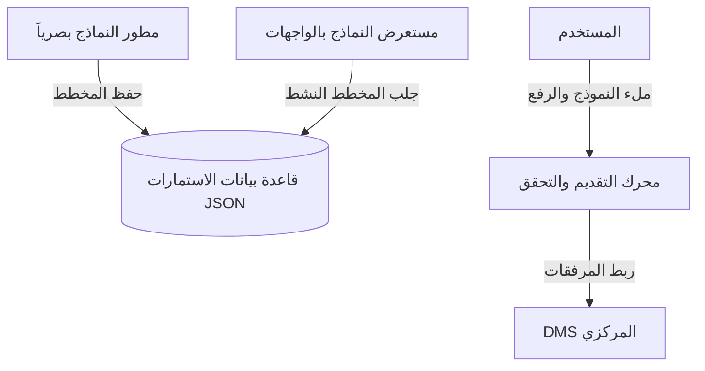

# منصة النماذج الإلكترونية ومطور الاستمارات (Digital Forms & Low-Code Builder)

تتيح هذه المنصة بناء وتخصيص استمارات ونماذج العمل الإدارية والتعليمية وتعبئتها رقمياً بالكامل دون تعديل الكود البرمجي (Metadata-driven).

---

## 1. المعمارية الفنية للنماذج (Rendering Flow)

---

## 2. النماذج وقاموس البيانات (Database Dictionary)

وراثة جميع النماذج من `CombinedSharedModel` لضمان عزل المستأجرين:
- **FormDefinition:** الكيان الرئيسي لتعريف النموذج ورمزه الفريد.
- **FormVersion:** حفظ إصدارات النماذج وتصميم الحقول بهيئة JSON Schema.
- **FormSection / FormField:** المقاطع والحقول المتنوعة للنموذج (نصوص، تواريخ، خيارات).
- **FormSubmission / FormResponse:** إجابات ومشاركات المستخدمين المسجلة.
- **FormAttachment:** ربط المرفقات المرفوعة مع المستندات في DMS المركزي عبر معرف المستند.

---

## 3. مسارات واجهات REST API

- `GET /api/v1/forms/definitions/render/{code}/` : جلب المخطط النشط للنموذج لبنائه وعرضه ديناميكياً.
- `POST /api/v1/forms/submissions/submit/` : تقديم إجابات النموذج والتحقق منها وربط المرفقات.

---

## 4. واجهات ومسارات Angular

- `/forms/builder` : لوحة مطور النماذج (Form Canvas, Palette, Properties).

---

## 5. مصفوفة الصلاحيات (Permission Matrix)

| الدور (Role) | بناء وتعديل النماذج | تعبئة وإرسال الاستمارات | مراجعة واعتماد التقديمات |
| :--- | :---: | :---: | :---: |
| **طالب / ولي أمر (Portal User)** | لا | نعم | لا |
| **موظف عادي (Employee)** | لا | نعم | لا |
| **منشئ الاستمارات (Form Creator)** | نعم | نعم | نعم |
| **مدير النظام (Admin)** | نعم | نعم | نعم |
