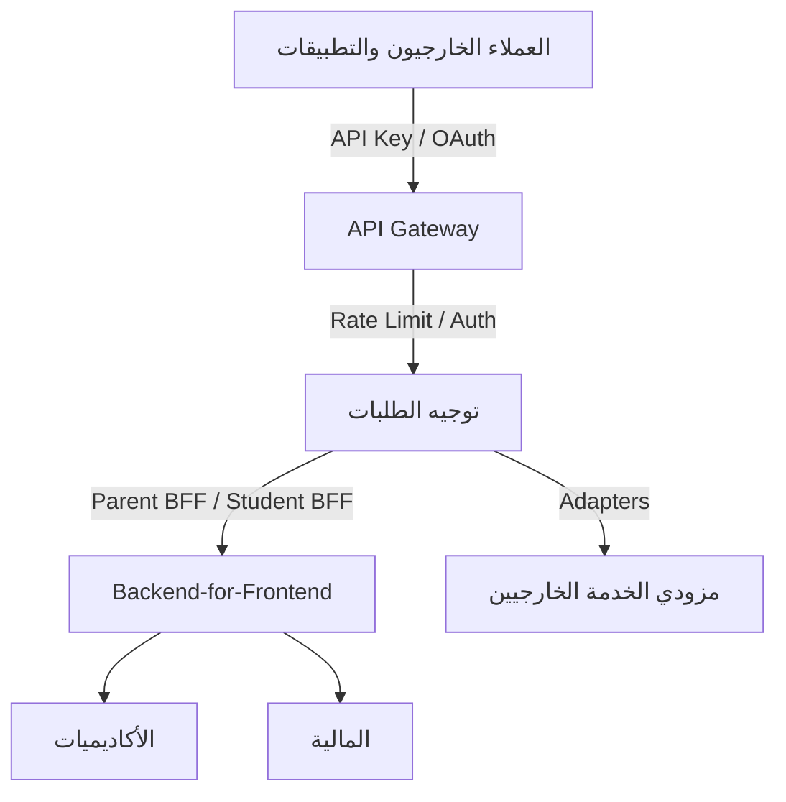
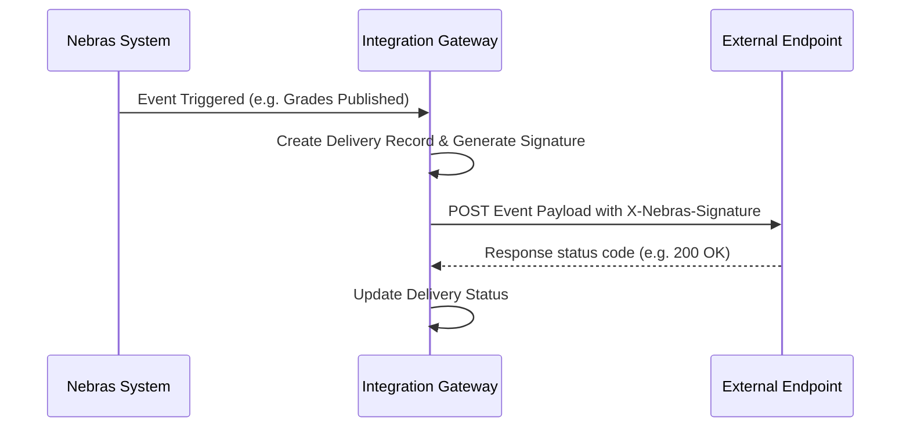

# موديول بوابة التكامل والربط المؤسسي (Enterprise Integration Platform)

يمثل هذا الموديول نقطة الدخول والمخرج الموحدة لكافة أطراف وتكاملات نظام Nebras ERP مع العالم الخارجي والمنصات الرقمية وقنوات الجوال.

---

## 1. المعمارية الفنية (Architecture & Gateway Design)

تنقسم المعمارية إلى:
- **API Gateway:** بوابة التحكم بالمرور، حماية الطلبات، عزل المستأجرين، وتوجيه النداءات.
- **Backend-for-Frontend (BFF):** طبقة التجميع لتسهيل وتسريع تحميل بيانات الواجهات للبوابات الرقمية وتطبيقات الجوال.
- **Adapters Layer:** محولات مستقلة تماماً لعزل كود المنصة عن واجهات الأنظمة الخارجية (مثل Moodle أو WhatsApp).

---

## 2. النماذج وقاموس البيانات (Database Dictionary)

وراثة جميع النماذج من `CombinedSharedModel` لضمان التدقيق الأمني وعزل المستأجرين:
- **ApiClient:** لتسجيل وتفويض عملاء بوابة الربط.
- **ApiKey:** توليد مفاتيح الوصول الآمن ومتابعة تاريخ انتهائها.
- **Webhook & WebhookSubscription:** إدارة طوابير الأحداث والاشتراكات الخارجية لإرسال التحديثات.
- **IntegrationLog & IntegrationStatistics:** قياس كفاءة البوابة، أزمنة الاستجابة، وتتبع الأخطاء.

---

## 3. تدفق الويب هوكس (Webhook Flow)

تتميز بوابة الويب هوكس بـ:
- **التوقيع الرقمي (Signature):** حماية الهوية والتأكد من عدم التلاعب بالبيانات المرسلة عبر HMAC SHA256.
- **إعادة المحاولة (Retries):** محرك جدولة لإعادة إرسال المهام الفاشلة بأسلوب التراجع الأسي.

---

## 4. أمان المنصة والـ Gateway

1. **التحقق وتصفية العناوين:** دعم إعداد القوائم البيضاء والسوداء للعناوين الرقمية (IP Whitelist/Blacklist).
2. **التحقق من الحدود (Rate Limiting):** تحديد معدلات نداء قصوى للعملاء لحماية المنصة من هجمات الإغراق (DoS).
3. **تتبع المعاملات (Correlation IDs):** توليد معرف موحد لكل طلب لتتبع الرحلة بالكامل عبر الميكروسيرفيسز والأنظمة الداخلية.

---

## 5. البوابات والذكاء الاصطناعي المستقبلي (Future AI Gateway)

تم تجهيز البنية التحتية لتضم لاحقاً:
- **AI Provider Routing:** تحويل ذكي للطلبات بين نماذج الذكاء الاصطناعي (مثل Gemini أو OpenAI) بناءً على التكلفة والسرعة.
- **LLM Gateway:** واجهة آمنة موحدة للتحكم بحدود الاستهلاك لعمليات الاستعلام اللغوية الكبيرة.
- **Prompt Registry:** إدارة مركزية ومخزن للنماذج والتوجيهات (Prompts).
