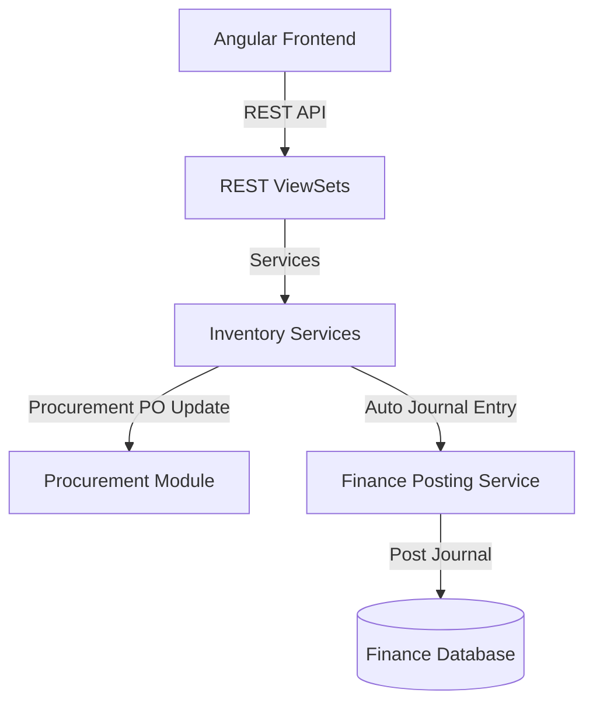

# توثيق منصة إدارة المستودعات والتحكم في المخزون (Inventory & Warehouse Module)

يقدم هذا المستند دليلاً شاملاً للنظام المعماري لموديول إدارة المستودعات والتحكم في المخزون (`inventory`) في نظام **Nebras ERP**، وكيفية ارتباطه بالعمليات المالية وعمليات المشتريات.

---

## 1. الهيكل المعماري (Architecture)

تم تصميم موديول المخازن وفق مبادئ التصميم ثلاثي الطبقات (DDD):
* **طبقة النماذج (Domain Models):** تحتوي على 27 نموذجاً بيانياً تغطي المستودعات، الرفوف (Bins)، البنود المخزنية، أرقام التشغيلات واللوط، سندات الاستلام والصرف، ومحاضر الجرد والتسويات.
* **طبقة الخدمات (Application Services):** تدير منطق حركات الصرف والاستلام، وتعديل الأرصدة والتحكم بالصلاحية، وتوليد القيود المالية المقابلة تلقائياً.
* **طبقة الواجهات (REST APIs):** تعرض كافة الموارد لعمليات التصفية والبحث والباركود.

---

## 2. قواعد الأعمال (Business Rules)

* **منع الصرف بالسالب:** لا يسمح النظام بصرف أي كميات تفوق الرصيد الفعلي المتاح بالمستودع إلا في حال تفعيل السماح بالسالب في الإعدادات العامة.
* **استلام المشتريات الحصري:** يتم إنشاء سند استلام البضائع (Goods Receipt) فقط عند وجود أمر شراء (PO) معتمد صادر من موديول المشتريات (`procurement`).
* **التكامل المالي الآلي:** كل عملية استلام أو صرف أو تسوية مخزنية يجب أن تولد تلقائياً قيداً مالياً في موديول الحسابات العامة (`finance`) وتعمل على ترحيله لتحديث القيمة الدفترية للأصول المخزنية والمصروفات.
* **الاعتمادات ومسارات العمل:** تعتمد التحويلات المخزنية الكبيرة والتسويات اليدوية ومحاضر الجرد على محرك مسارات العمل (`WorkflowEngine`) للحصول على الموافقات الإدارية قبل التأثير على الأرصدة.

---

## 3. هيكل قاعدة البيانات وقاموس البيانات (Database Dictionary)

### أهم الكيانات والموديلات:
* **Warehouse & BinLocation:** هيكل المستودعات الفعلي والرفوف ومستودعات الترانزيت العابرة.
* **InventoryItem:** بيانات الأصناف شاملة الـ SKU والباركود والنوع والوحدة.
* **InventoryBalance:** الكميات المتوفرة والمحجوزة حالياً لكل صنف في كل رف ومستودع.
* **GoodsReceipt & GoodsReceiptItem:** مستندات استلام الشحنات والكميات المقبولة والمرفوضة والأسعار.
* **GoodsIssue & GoodsIssueItem:** مستندات صرف واستهلاك البنود المخزنية للأقسام والطلاب والعيادات.
* **InventoryAdjustment:** تسويات الفروق المخزنية بالزيادة أو النقصان.
* **StockMovement:** التتبع التاريخي واللحظي لحركة كارت الصنف (Stock Card).

---

## 4. واجهات البرمجة والمسارات (REST API & Angular Routes)

### أهم مسارات الـ API (REST Endpoints)
* `POST /api/v1/inventory/receipts/receive-po/` - استلام بضائع أمر شراء وتوليد قيد الاستحقاق.
* `POST /api/v1/inventory/issues/issue-stock/` - صرف واستهلاك كميات مخزنية لقسم وتوليد قيد الاستهلاك.
* `POST /api/v1/inventory/adjustments/adjust-stock/` - إثبات فروق تسوية وعجز بالزيادة أو النقص ماليّاً.
* `GET /api/v1/inventory/items/dashboard-stats/` - إحصائيات لوحة التحكم للمستودعات.

### مسارات التوجيه في الفرونت إند (Angular Routes)
* `/inventory/dashboard` - لوحة التحكم الشاملة بالأرصدة والقيمة والتنبيهات.

---

## 5. مصفوفة الصلاحيات (Permission Matrix)

| الدور الوظيفي | إنشاء سند استلام (GR) | صرف مخزني (GI) | عمل تسوية وأمر جرد | موافقة التحويلات |
| :--- | :---: | :---: | :---: | :---: |
| **أمين المستودع (Storekeeper)** | نعم | نعم | لا | لا |
| **مراقب المخزون (Stock Controller)** | نعم | نعم | نعم | لا |
| **مدير العمليات / CFO** | نعم | نعم | نعم | نعم |

---

## 6. دورة التكامل والتحركات المالية (Valuation & Financial Integration)

1. **الاستلام (Receiving):**
   * عند إدخال الاستلام، يتأثر رصيد `InventoryBalance` بالزيادة.
   * يتولد قيد تلقائي: **مدين** حساب المخزن (الأصول المتداولة) / **دائن** حساب الموردين (الالتزامات).
2. **الصرف والاستهلاك (Issuing):**
   * يقل رصيد الصنف بمقدار الكمية المصروفة.
   * يتولد قيد تلقائي: **مدين** حساب مصروف الاستهلاك للقسم المعني / **دائن** حساب المخزن.
3. **التسوية (Adjustment):**
   * في حال العجز: **مدين** حساب خسائر التسوية المخزنية / **دائن** حساب المخزن.
   * في حال الزيادة: **مدين** حساب المخزن / **دائن** حساب إيرادات تسويات متنوعة.

---

## 7. تجهيز تطبيقات الذكاء الاصطناعي المستقبلية (AI Extensions)

تم توفير واجهات معيارية وحقول مهيأة لدعم:
* **التنبؤ بالطلب (Demand Forecasting):** التنبؤ بمعدلات الاستهلاك بناءً على حركات الصرف التاريخية.
* **إعادة التموين الآلي (Auto-Reordering):** تقديم اقتراحات شراء ذكية بناءً على معدل التوريد وحالة التخزين.
* **كشف الأصناف الراكدة (Dead Stock Detection):** تحليل الأصناف التي لم تسجل حركات صرف خلال فترة زمنية محددة لتجنب تراكم المخزون.
