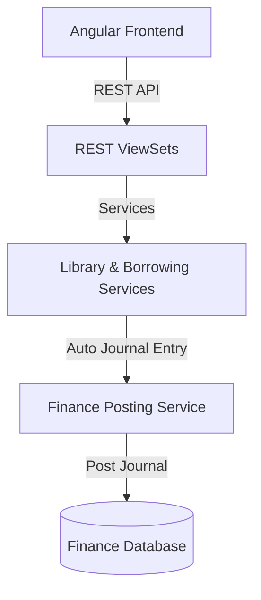

# توثيق منصة إدارة المكتبات ومصادر التعلم (Library & Learning Resources Platform)

يقدم هذا المستند دليلاً شاملاً للنظام المعماري لموديول المكتبة (`library`) في نظام **Nebras ERP**، وكيفية ربطها وإتاحتها للطلاب والمعلمين، والتحركات المالية واللوجستية التابعة.

---

## 1. الهيكل المعماري (Architecture)

تم تصميم موديول المكتبة وفق مبادئ التصميم ثلاثي الطبقات (DDD):
* **طبقة النماذج (Domain Models):** تحتوي على 28 نموذجاً بيانياً تغطي فروع المكتبة، الأقسام، الرفوف، الكتب والنسخ، الاستعارات والحجوزات والموارد الرقمية.
* **طبقة الخدمات (Application Services):** تدير عمليات الاستعارة والإرجاع الذكية وحساب غرامات التأخير التلقائي وتكاملها المالي.
* **طبقة الواجهات (REST APIs):** توفر واجهات كاملة للبحث والفرز والباركود والتكامل المالي الفوري.

---

## 2. قواعد الأعمال (Business Rules)

* **إلزامية الربط:** كل كتاب مستعار يجب أن يرتبط بنسخة فزيائية فريدة بباركود مميز ومستعير نشط (طالب/معلم/موظف).
* **حساب الغرامات:** يتم حساب غرامات التأخير تلقائياً بمجرد إرجاع الكتاب بعد تاريخ الاستحقاق، استناداً إلى تعرفة الغرامة اليومية المحددة بالإعدادات.
* **الترحيل المالي للغرامات:** ترحل الغرامات تلقائياً للمالية لإنشاء قيد إيرادات مستحقة.
* **العزل الجغرافي للمستأجرين:** تدعم الجداول بالكامل خاصية `tenant_id` لضمان عزل البيانات الكامل والخصوصية التامة للمؤسسات المشتركة بالنظام.

---

## 3. هيكل قاعدة البيانات وقاموس البيانات (Database Dictionary)

### أهم الكيانات والموديلات:
* **Book:** الكتب والمصنفات وعناوينها ومواضيعها.
* **BookCopy:** النسخ الفزيائية والباركود الخاص بها وحالتها (متاحة، مستعارة، مفقودة، تالفة).
* **BorrowTransaction:** عمليات الاستعارة والتواريخ المستحقة والفعلية والربط بالمستعير.
* **Fine:** غرامات التأخير المسجلة ورقم قيد التسوية بالمالية.
* **DigitalResource:** ملفات وروابط الكتب الإلكترونية والمصادر الرقمية المتاحة للتنزيل والتصفح.

---

## 4. واجهات البرمجة والمسارات (REST API & Angular Routes)

### أهم مسارات الـ API (REST Endpoints)
* `POST /api/v1/library/copies/{id}/borrow/` - إجراء استعارة نسخة كتاب.
* `POST /api/v1/library/borrow/{id}/return/` - إرجاع نسخة مستعارة وحساب غرامتها.
* `GET /api/v1/library/items/dashboard-stats/` - إحصائيات لوحة تحكم المكتبة الرقمية والورقية.

### مسارات التوجيه في الفرونت إند (Angular Routes)
* `/library/dashboard` - لوحة التحكم الشاملة بفهرس المكتبة والإحصائيات الحيوية.

---

## 5. مصفوفة الصلاحيات (Permission Matrix)

| الدور الوظيفي | البحث والمطالعة الرقمية | طلب استعارة ورقية | إرجاع وتسوية الكتب | إعفاء الغرامات المكتبية | تعديل الإعدادات والسياسات |
| :--- | :---: | :---: | :---: | :---: | :---: |
| **طالب / معلم** | نعم | نعم | لا | لا | لا |
| **أمين مكتبة (Librarian)** | نعم | نعم | نعم | لا | نعم |
| **مشرف مكتبات / مالي** | نعم | نعم | نعم | نعم | نعم |

---

## 6. التحركات المالية واللوجستية

1. **تسجيل الغرامة وتوليد القيد المالي:**
   * عند إرجاع كتاب متأخر، يتم توليد قيد اليومية تلقائياً:
     * **مدين:** حساب ذمم استعارات الطلاب (العملاء/المدينين).
     * **دائن:** حساب إيرادات غرامات المكتبة.
2. **سداد الغرامة:**
   * يتم السداد عبر موديول حسابات الطلاب أو الصناديق وتسوية الذمة المالية للطالب.

---

## 7. تطبيقات الذكاء الاصطناعي المستقبلية (AI Extensions)

تمت تهيئة النماذج والواجهات لدعم:
* **التوصيات القرائية الذكية (Reading Recommendation):** ترشيح الكتب والمصادر الرقمية للطلاب بناءً على سجل القراءة ومقارنتها بالتقدم الدراسي والمرحلة العمرية.
* **التنبؤ بالطلب (Demand Forecasting):** التنبؤ بحجم الطلب المستقبلي على كتب ومراجع محددة لتوفير نسخ إضافية قبل بداية الفصول الدراسية.

---

## 8. ملاحظة معمارية مهمة

أقترح إضافة مكون لم يكن ضمن الخطة الأصلية لكنه سيضيف قيمة كبيرة للنظام:

Learning Resources Platform لا يقتصر على المكتبة، بل يشمل:

بنوك الأسئلة (Question Banks) المرتبطة بالمناهج.
خطط الدروس (Lesson Plans).
ملفات المعلمين التعليمية.
الوسائط التعليمية.
الموارد المشتركة بين المعلمين.
قوالب الأنشطة.
الروبركس (Rubrics).
مستودع المحتوى (Content Repository).

يمكن دمج هذه الإمكانيات داخل موديول المكتبة أو تخصيصها لاحقًا في موديول مستقل مثل Learning Content Management (LCMS) إذا كان الهدف أن ينافس Nebras ERP منصات تعليمية متقدمة وليس فقط أن يكون ERP إداريًا. هذا سيكون خيارًا مناسبًا إذا كنت تستهدف المدارس الكبرى أو الجامعات مستقبلًا.