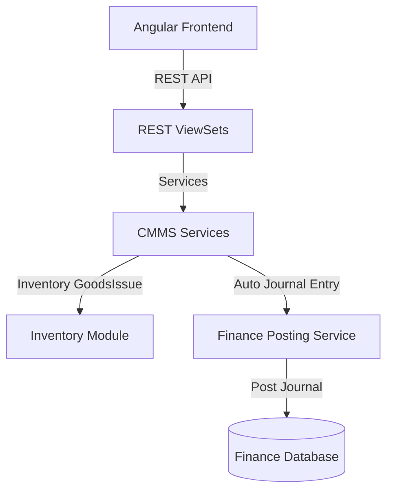

# توثيق منصة إدارة الصيانة وأوامر العمل (CMMS Module)

يقدم هذا المستند دليلاً شاملاً للنظام المعماري لموديول إدارة الصيانة وأوامر العمل (`maintenance`) في نظام **Nebras ERP**، وكيفية ارتباطه بالعمليات المالية وعمليات المشتريات والمستودعات والأصول الثابتة.

---

## 1. الهيكل المعماري (Architecture)

تم تصميم موديول الصيانة وأوامر العمل وفق مبادئ التصميم ثلاثي الطبقات (DDD):
* **طبقة النماذج (Domain Models):** تحتوي على 29 نموذجاً بيانياً تغطي تصنيفات الصيانة، الطلبات، أوامر العمل، الخطط الوقائية، المهندسين والفرق، المعاينات، التكاليف واستهلاك المواد.
* **طبقة الخدمات (Application Services):** تدير دورة حياة أوامر العمل (إسناد، تنفيذ، إكمال)، والصرف المخزني التلقائي للمواد، وجدولة الصيانة الوقائية، والترحيل المالي لمصروفات الصيانة.
* **طبقة الواجهات (REST APIs):** توفر واجهات كاملة للبحث والفرز والباركود والتكامل المالي الفوري.

---

## 2. قواعد الأعمال (Business Rules)

* **إلزامية الربط:** كل أمر عمل فني يجب أن يرتبط بطلب صيانة معتمد مقدم من مستخدم، أو بخطة صيانة وقائية دورية للأصل.
* **تكامل صرف قطع الغيار:** تصرف قطع الغيار المستهلكة في عمليات الصيانة بالاستعانة بخدمات الصرف المخزني (`GoodsIssueService`) في موديول المخازن مباشرة لتخفيض الأرصدة وتوليد قيد إهلاك المواد.
* **ترحيل التكاليف للمالية:** تسجل وتجمع تكاليف الصيانة (العمالة، المواد، الموردين الخارجيين) وتُرحل للمالية لإنشاء قيد مصروفات صيانة معتمد.
* **العزل الجغرافي للمستأجرين:** تدعم الجداول بالكامل خاصية `tenant_id` لضمان عزل البيانات الكامل والخصوصية التامة للمؤسسات المشتركة بالنظام.

---

## 3. هيكل قاعدة البيانات وقاموس البيانات (Database Dictionary)

### أهم الكيانات والموديلات:
* **MaintenanceRequest:** بلاغات الأعطال والطلبات الطارئة والوقائية المرفوعة من المستخدمين.
* **WorkOrder:** أوامر العمل المسندة للمهندسين شاملة أوقات العمل وحالة الإنجاز.
* **PreventiveSchedule:** جدولة الصيانة الوقائية المتكررة للأصول وتواريخ الاستحقاق القادمة.
* **Inspection:** الفحوصات ومعاينات الجودة الفنية لتأكيد نجاح أعمال الصيانة أو فشلها.
* **MaintenanceCost & MaterialConsumption:** توثيق تكاليف الصيانة الإجمالية وتفاصيل المواد المستهلكة ورابط القيد المالي المنعكس.

---

## 4. واجهات البرمجة والمسارات (REST API & Angular Routes)

### أهم مسارات الـ API (REST Endpoints)
* `POST /api/v1/maintenance/work-orders/{id}/complete/` - إكمال أمر عمل وتوثيق سجل الصيانة التاريخي.
* `POST /api/v1/maintenance/work-orders/{id}/consume-parts/` - صرف واستهلاك مواد وقطع غيار لأمر عمل من المخازن.
* `POST /api/v1/maintenance/work-orders/{id}/post-costs/` - ترحيل تكاليف الصيانة ماليّاً وتوليد القيد.
* `GET /api/v1/maintenance/requests/dashboard-stats/` - إحصائيات لوحة تحكم CMMS.

### مسارات التوجيه في الفرونت إند (Angular Routes)
* `/maintenance/dashboard` - لوحة التحكم الشاملة بطلبات الصيانة المفتوحة، أوامر العمل الفعالة، والوقائية.

---

## 5. مصفوفة الصلاحيات (Permission Matrix)

| الدور الوظيفي | تقديم بلاغ عطل | إسناد أمر عمل | إكمال أمر عمل فنيّاً | اعتماد الفحص الفني | ترحيل التكاليف للمالية |
| :--- | :---: | :---: | :---: | :---: | :---: |
| **موظف عادي (User)** | نعم | لا | لا | لا | لا |
| **مهندس/فني (Technician)** | نعم | لا | نعم | نعم | لا |
| **مشرف صيانة (Supervisor)** | نعم | نعم | نعم | نعم | نعم |

---

## 6. دورة الصيانة والتحركات المالية واللوجستية

1. **الاستهلاك المخزني (Parts Consumption):**
   * عند إدخال صرف قطع الغيار لأمر عمل، يتأثر رصيد المخزن بالنظام بالانخفاض.
   * يتولد القيد: **مدين** حساب مصروف الصيانة / **دائن** حساب المخزن.
2. **شغل العمالة والترحيل المالي (Financial Posting):**
   * عند ترحيل تكاليف صيانة أمر عمل المنجز.
   * يتولد القيد: **مدين** حساب مصروفات الصيانة والإصلاح / **دائن** حساب وسيط صيانة.

---

## 7. تطبيقات الذكاء الاصطناعي المستقبلية (AI Extensions)

تمت تهيئة النماذج والواجهات لدعم:
* **الصيانة التنبؤية (Predictive Maintenance):** التنبؤ بمواعيد الأعطال المستقبلية للأجهزة الحرجة بناءً على بيانات التشغيل والتحركات والاهتزازات.
* **التخصيص التلقائي للمهام (Auto Assignment):** اختيار الفني الأنسب للمهمة فنيّاً وجغرافيّاً ومراعاة توازن أحمال العمل الفورية.
