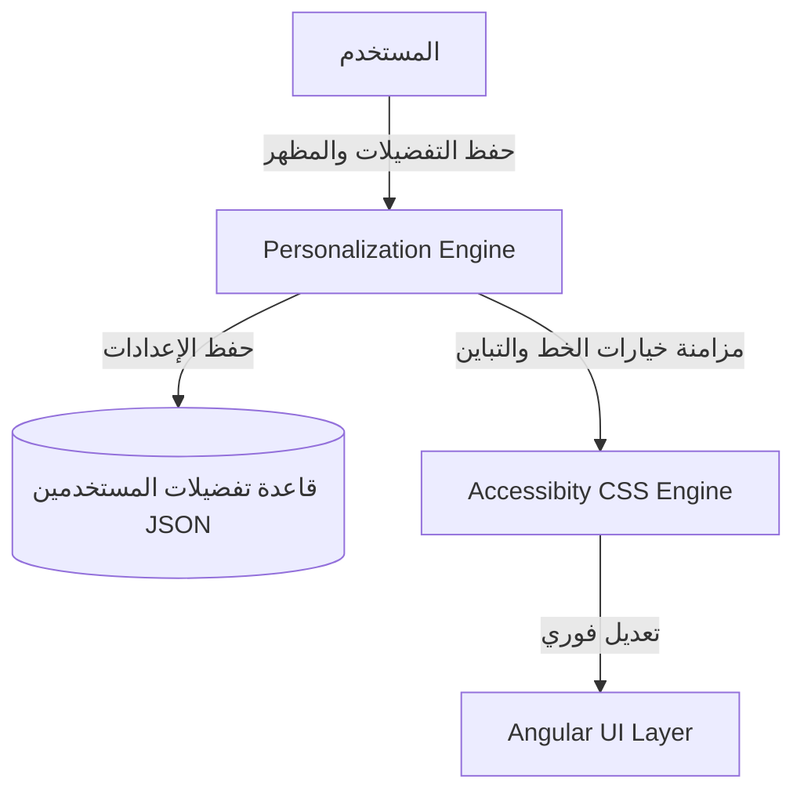

# منصة التخصيص وتجربة المستخدم (Personalization & UX Platform)

تتيح هذه المنصة لكافة المستخدمين والمؤسسات تخصيص وتعديل واجهات ومساحات العمل والودجات بشكل مرن بالكامل ودون الحاجة لكتابة كود برمي (No-Code Personalization).

---

## 1. المعمارية الفنية ومحرك التخصيص

---

## 2. النماذج وقاموس البيانات (Database Dictionary)

وراثة جميع النماذج من `CombinedSharedModel` لضمان عزل المستأجرين:
- **Workspace / WorkspaceLayout:** مساحات العمل والقوالب المحددة وتخطيطها الجغرافي.
- **WidgetDefinition / WorkspaceWidget:** تعريف الودجات الفنية ومواقعها وإحداثياتها داخل اللوحة.
- **UserPreference:** التفضيلات العامة للمستخدم مثل الفرع والسنة الأكاديمية واللوحة الافتراضية.
- **AccessibilityProfile:** خيارات الوصول الميسر وتكبير الخط والتباين العالي (التي لها الأولوية المعمارية القصوى).
- **Theme / ThemeProfile:** تخصيص الهوية واللوجو والألوان الخاصة بالمستأجر أو تفضيل المستخدم.

---

## 3. مسارات واجهات REST API

- `GET /api/v1/personalization/accessibility/profile/` : استرجاع خيارات التباين والخط الخاصة بالمستخدِم الفعلي.
- `POST /api/v1/personalization/accessibility/profile/` : تحديث وحفظ تفضيلات الوصول الميسر.
- `GET /api/v1/personalization/preferences/user/` : جلب الإعدادات والتوطين والمنطقة الزمنية المفضلة.

---

## 4. واجهات ومسارات Angular

- `/personalization/preferences` : مركز إعداد وتخصيص تفضيلات الواجهة والمظهر.

---

## 5. مصفوفة الصلاحيات (Permission Matrix)

| الدور (Role) | تعديل التفضيلات الشخصية | نشر قوالب مساحات العمل العامة | تعديل الهوية البصرية للمستأجر |
| :--- | :---: | :---: | :---: |
| **طالب / ولي أمر (Portal User)** | نعم | لا | لا |
| **موظف عادي (Employee)** | نعم | لا | لا |
| **رئيس قسم (Dept Manager)** | نعم | نعم (لقسمه) | لا |
| **مدير النظام (Admin)** | نعم | نعم | نعم |
