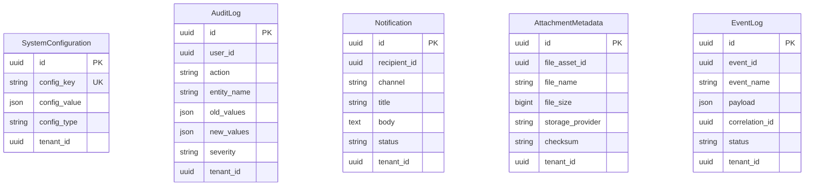
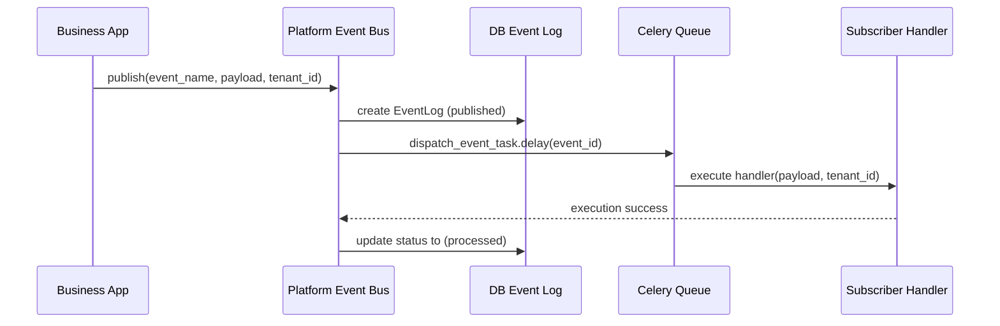

# موديول نواة المنصة والبنية التحتية المشتركة (Platform Kernel)

يوثق هذا الملف الهيكل المعماري والمسؤوليات الفنية والربط لموديول **نواة المنصة (Platform Kernel)** في منصة Nebras ERP.

---

## 1. المعمارية الفنية (Architecture)
يُعد موديول `platform` المشترك هو بمثابة نواة البنية التحتية (Infrastructure Shared Kernel) لجميع موديولات النظام، ويوفر الطبقات الخدمية التالية:
- **Event Bus (ناقل الأحداث)**: التوزيع المتزامن واللامتزامن لأحداث النطاق والتطبيق مع تسجيلها التاريخي.
- **Notification Center (مركز التنبيهات)**: بوابة موحدة لإرسال الإشعارات (البريد الإلكتروني، واتساب، التنبيهات الفورية).
- **Audit Engine (محرك التدقيق)**: لتسجيل العمليات التشغيلية وتتبع التغيرات في السجلات.
- **File Storage Service (تخزين الملفات)**: للرفع الآمن للملفات والتحقق من الـ SHA256 Checksum وصيغة الملفات.

---

## 2. مخطط الكيانات والعلاقات (ER Diagram)

---

## 3. مسار وتدفق الأحداث (Event Flow Sequence Diagram)

---

## 4. واجهات البرمجة (API Documentation)

- **فحص صحة النظام**: `GET /api/v1/platform/health/`
  - يعود بتقرير صحة قاعدة البيانات، الكاش، والتخزين.
- **البحث الموحد**: `GET /api/v1/platform/search/?q={query}`
  - يبحث في الكيانات الرئيسية (الطلاب، المتقدمين).
- **رفع الملفات**: `POST /api/v1/platform/storage/upload/`
  - يرفع الملف ويحسب الـ Checksum ويعيد المعرف الفريد للتخزين.
- **تحديث الإعدادات**: `POST /api/v1/platform/configurations/set-value/`
  - يحفظ أو يعدل الإعدادات الخاصة بالنظام أو المستأجرين.

