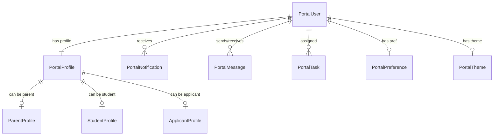

# موديول البوابات الرقمية (Digital Experience Platform)

يقدم هذا الموديول واجهة موحدة وتجربة رقمية غنية لكل من أولياء الأمور والطلاب والمتقدمين لإدارة ومتابعة كافة العمليات التعليمية والمالية والإدارية.

---

## 1. المعمارية الفنية (Architecture)

ينقسم الموديول إلى طبقات حسب معايير Nebras ERP DDD:
- **نواة النماذج (Domain Models):** تحتوي على 19 نموذج بيانات تمثّل إعدادات المستخدم وتفضيلاته وإحصاءاته وتكامل البوابات.
- **طبقة منطق الأعمال (Application Services):** تتضمن خدمات لوحة التحكم (`PortalDashboardService`) وخدمات الأمان وقواعد التحقق الفوري (`PortalAccessRuleService`).
- **طبقة الواجهات (Interfaces):** توفر منافذ REST API للاتصال المباشر بين لوحة تحكم Angular والمكون الخلفي.

---

## 2. قواعد الأعمال (Business Rules)

1. **التحقق من الكفالة الأبوية:** لا يمكن لولي الأمر الوصول إلى تفاصيل أي طالب إلا إذا كان مسجلاً في قائمة الأبناء المرتبطين به (`linked_students`).
2. **عزل الطلاب:** لا يستطيع الطالب الاطلاع إلا على سجلاته الخاصة وعلاماته وجدوله الدراسي فقط.
3. **تكامل الخدمات والأمان:** يتم فرض عزل المستأجرين (Tenant Isolation) على كافة الجداول أوتوماتيكياً عبر حقل `tenant_id` المشترك.

---

## 3. مخطط علاقات قاعدة البيانات (ER Diagram / Database Dictionary)

### قاموس قاعدة البيانات (Database Dictionary)

- **nebras_portal_users:** يحفظ المستخدم الأساسي للبوابة ونوعه (`parent`, `student`, `applicant`, `employee`).
- **nebras_portal_profiles:** يحمل الاسم المعروض، البريد الإلكتروني، رقم الهاتف، والصورة الشخصية.
- **nebras_portal_parent_profiles:** تفاصيل ولي الأمر وقائمة معرفات الطلاب المرتبطين (`linked_students` كـ JSON).
- **nebras_portal_student_profiles:** ربط برقم الطالب في موديول الطلاب والصف الدراسي والشعبة.
- **nebras_portal_applicant_profiles:** ربط بطلب التقديم في القبول والتسجيل وحالة المعاملة.

---

## 4. مسارات واجهات REST API

- `GET /api/v1/portal/parent/dashboard/` : لوحة تحكم ولي الأمر.
- `GET /api/v1/portal/student/dashboard/` : لوحة تحكم الطالب.
- `GET /api/v1/portal/applicant/dashboard/` : لوحة تحكم المتقدمين الجدد.
- `GET/PUT /api/v1/portal/profile/` : إدارة الملف الشخصي والتفضيلات والسمات.
- `GET /api/v1/portal/analytics/` : تقارير الاستخدام ونشاط البوابة.

---

## 5. واجهات Angular ومسارات التوجيه (Angular Routes)

تم تعريف المسارات في الموديول كالتالي:
- `/portal/parent/dashboard` : لوحة تحكم ولي الأمر ومتابعة الأبناء.
- `/portal/student/dashboard` : جدول الطالب ومواده ونشاطاته اليومية.
- `/portal/applicant/dashboard` : حالة التقديم وجدول الاختبارات والمقابلات.

---

## 6. مصفوفة الصلاحيات (Permission Matrix)

| الدور (Role) | بوابة الطالب | بوابة ولي الأمر | بوابة المتقدم | لوحة تحكم الإدارة والتحليلات |
| :--- | :---: | :---: | :---: | :---: |
| **طالب (Student)** | نعم | لا | لا | لا |
| **ولي أمر (Parent)** | لا | نعم | لا | لا |
| **متقدم (Applicant)** | لا | لا | نعم | لا |
| **مسؤول النظام (Admin)** | نعم | نعم | نعم | نعم |

---

## 7. الدعم المستقبلي للهواتف الذكية والخدمات الخارجية

تم تحضير الواجهات لتسهيل الربط مع:
- تطبيقات الهواتف الذكية (iOS & Android).
- نظام الإشعارات الفورية (Push Notifications).
- التكامل مع قنوات WhatsApp و SMS والبريد الإلكتروني للتبليغات المباشرة.
- محافظ Apple Wallet & Google Wallet للبطاقات التعريفية الرقمية للطلاب.
