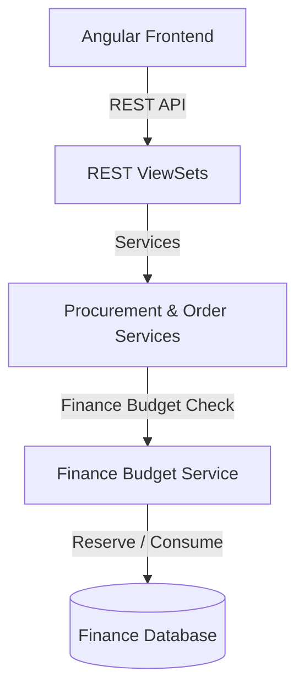

# توثيق منصة المشتريات والتعاقدات (Procurement & Purchasing Module)

يقدم هذا المستند دليلاً شاملاً للنظام المعماري لموديول إدارة المشتريات والتعاقدات (`procurement`) في نظام **Nebras ERP**، وكيفية ارتباطه بالموازنات المالية ومصفوفات الاعتمادات المتقدمة.

---

## 1. الهيكل المعماري (Architecture)

تم تصميم موديول المشتريات وفق مبادئ التصميم ثلاثي الطبقات (DDD):
* **طبقة النماذج (Domain Models):** تحتوي على 28 نموذجاً بيانياً تغطي الموردين، طلبات الشراء، طلبات عروض الأسعار (RFQ)، الترسية، أوامر الشراء (PO)، والعقود.
* **طبقة الخدمات (Application Services):** تدير منطق التحقق التقديري وحجز الموازنة ومطابقة عروض الموردين آلياً، واستهلاك الموازنة الفعلي عند إصدار أوامر الشراء.
* **طبقة الواجهات (REST APIs):** تعرض كافة الموارد لعمليات التحرير القياسية وإحصائيات لوحة التحكم والتحميل الدفعي.

---

## 2. قواعد الأعمال (Business Rules)

* **المورد المعتمد أولاً:** لا يمكن إصدار أي أمر شراء لمورد غير معتمد أو مدرج في القائمة السوداء.
* **إلزامية التحقق من الموازنة:** أي بند شراء يتم طلبه يجب التحقق من توافر موازنته لمركز التكلفة المعني في موديول المالية، ويتم استهلاك الموازنة فوراً عند إصدار أمر الشراء المعتمد.
* **طلبات الشراء والـ PO:** يتطلب إنشاء أمر الشراء وجود طلب شراء (PR) معتمد أو ترسية سابقة لعروض الأسعار.
* **الاعتمادات ومسارات العمل:** تعتمد دورات اعتماد طلبات الشراء وعقود الشراء بالكامل على محرك مسارات العمل (`WorkflowEngine`) ومحرك القواعد لتحديد الموافقين بناءً على سقف المبالغ المالية.

---

## 3. هيكل قاعدة البيانات وقاموس البيانات (Database Dictionary)

### أهم الكيانات والموديلات:
* **Vendor & VendorPerformance:** تخزين الموردين ومستنداتهم ومؤشرات الأداء (الالتزام بالمواعيد والجودة).
* **PurchaseRequest & PurchaseRequestItem:** طلبات الشراء الواردة من الأقسام مع تفاصيل البنود والأسعار التقديرية.
* **RFQ & RFQItem:** طلب عروض الأسعار المرسل لعدة موردين بشكل موحد.
* **Quotation & QuotationItem:** عروض الأسعار الواردة من الموردين شاملة الأسعار والضمانات.
* **VendorAward:** ترسية المشتريات على العرض الأفضل.
* **PurchaseOrder & PurchaseOrderItem:** أوامر الشراء الصادرة والمعتمدة للشحن المالي.
* **PurchaseContract:** العقود طويلة الأجل والاتفاقيات الإطارية مع الموردين.

---

## 4. واجهات البرمجة والمسارات (REST API & Angular Routes)

### أهم مسارات الـ API (REST Endpoints)
* `POST /api/v1/procurement/requests/create-request/` - إنشاء طلب شراء مع التحقق المبدئي من الموازنة.
* `POST /api/v1/procurement/requests/{id}/approve/` - تسجيل اعتماد لطلب شراء.
* `POST /api/v1/procurement/rfqs/create-rfq/` - توليد RFQ من طلب شراء معتمد.
* `POST /api/v1/procurement/rfqs/compare-and-award/` - إجراء الترسية وتوليد أمر شراء مسودة.
* `POST /api/v1/procurement/orders/{id}/issue/` - اعتماد أمر الشراء واستهلاك موازنة المالية.
* `GET /api/v1/procurement/requests/dashboard-stats/` - إحصائيات لوحة التحكم للمشتريات.

### مسارات التوجيه في الفرونت إند (Angular Routes)
* `/procurement/dashboard` - لوحة التحكم الشاملة للمشتريات ومؤشرات الإنفاق.

---

## 5. مصفوفة الصلاحيات (Permission Matrix)

| الدور الوظيفي | إنشاء طلب شراء | مراجعة واعتماد الطلبات | ترسية عروض الأسعار | إصدار أمر شراء (PO) |
| :--- | :---: | :---: | :---: | :---: |
| **موظف القسم (Requester)** | نعم | لا | لا | لا |
| **أخصائي مشتريات (Purchaser)** | نعم | نعم | نعم | لا |
| **مدير المشتريات / CFO** | نعم | نعم | نعم | نعم |

---

## 6. دورة حياة المشتريات والتكامل المالي (Source-to-Pay Lifecycle)

1. **الطلب والاستكشاف (Request):** ينشئ القسم طلب شراء (PR)، ويقوم النظام بالتحقق المبدئي من رصيد موازنة الحساب ومركز التكلفة بالمالية.
2. **الاعتماد (Approval):** يمر الطلب عبر محرك مسارات العمل للحصول على الاعتمادات المطلوبة.
3. **التسعير (Sourcing):** يولد النظام طلب عروض أسعار (RFQ) ويرسله للموردين، ثم يستقبل العروض (Quotations).
4. **الترسية وأمر الشراء (PO):** يقارن النظام العروض ويرسي على العرض الأفضل، مولداً أمر شراء (PO) مسودة.
5. **الالتزام المالي والتحقق (Integration):** عند إصدار أمر الشراء، يستدعي النظام موديول المالية (`finance`) لحجز واستهلاك الموازنة الحقيقية بشكل قطعي وتعديل الأرصدة المتاحة للإنفاق.
6. **الربط مع المخازن والأصول (Future Integrations):** تم تهيئة واجهات الموديول لاستقبال إشعارات الاستلام المطابقة لاحقاً لتوليد فواتير الموردين والقيود الحسابية تلقائياً دون تكرار.

---

## 7. البيانات المرجعية وربط الوحدات (Reference Data)

طلب الشراء يعتمد على بيانات من وحدات أخرى، وتُجمَّع عبر نقطة واحدة بصلاحية المشتريات
لتفادي اشتراط صلاحيات وحدة المالية على موظف المشتريات:

* `GET /api/v1/procurement/requests/reference-data/` — يُعيد:
  * **الأقسام** (`departments`) — مصدرها وحدة التنظيم (`organization.Department`).
    تُدار من شاشة **الهيكل التنظيمي ← الأقسام** (`/organization/departments`).
  * **حسابات الموازنة** (`accounts`) — من شجرة حسابات المالية (`finance.ChartOfAccount`).
  * **مراكز التكلفة** (`cost_centers`) — من المالية (`finance.CostCenter`).

> ملاحظة: القسم إلزامي في طلب الشراء (الجهة الطالبة). إن كانت قائمة الأقسام فارغة
> فالسبب عدم تعريف أقسام في الهيكل المؤسسي — تُضاف من شاشة الأقسام وليس من المشتريات.
