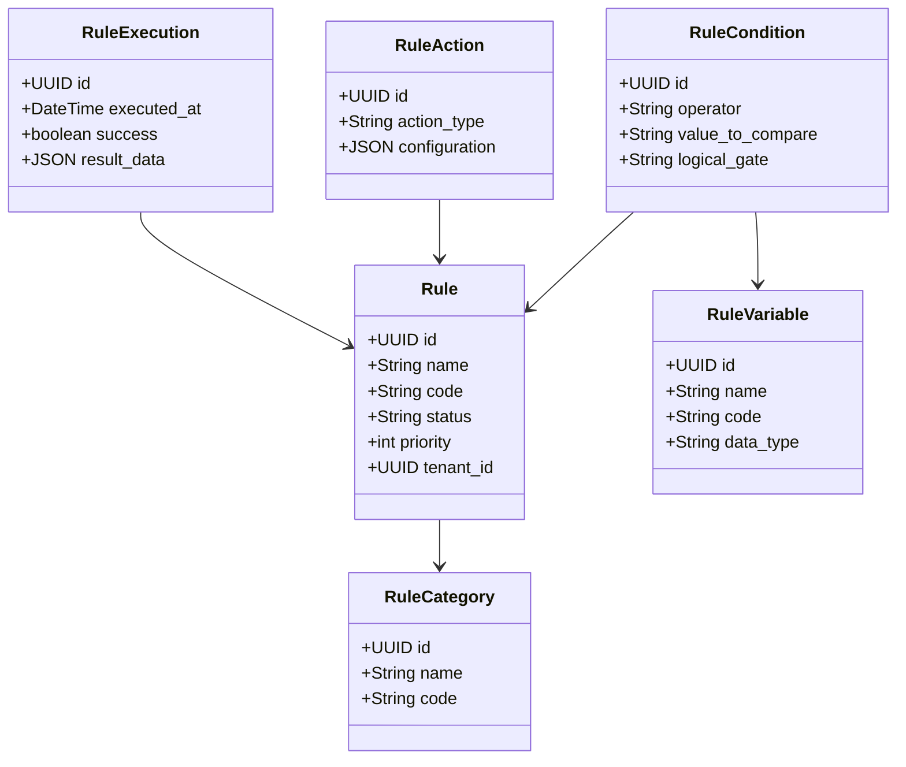

# توثيق منصة ومحرك قواعد الأعمال الموحد (Rule Engine Platform)
## Nebras ERP — Rule Engine Module

---

## 1. نظرة عامة
تمثل منصة ومحرك القواعد الموحد النواة المركزية لاتخاذ القرارات وتقييم شروط الأعمال ديناميكياً في **نبراس ERP**.  
صُممت هذه المنصة لتجنب ترميز شروط الأعمال يدوياً داخل الوحدات البرمجية (Hardcoding)، مما يتيح للإدارة والمطورين تعديل شروط القبول، حسابات الرواتب، خصومات التأخير، ونقاط الترقية مباشرة من لوحة التحكم.

---

## 2. هيكلية البيانات ونماذج الكيانات (ER Diagram Model)
تتكون المنصة من 16 كياناً رئيسياً مترابطاً:

---

## 3. محرك تقييم التعابير والمحاكاة (Expression & Sandbox Engine)
- **RuleEvaluationService:** معالجة شجرة الشروط المنطقية (`AND`/`OR`) وحساب ومقارنة الأرقام والنصوص ديناميكياً.
- **RuleSandboxService:** محاكاة تقييم القواعد واختبار المدخلات والمخرجات الافتراضية مع تتبع خطوات التنفيذ (Execution Trace) لضمان سلامة القواعد قبل تفعيلها رسمياً.

---

## 4. واجهات الـ REST API

| المسار | الطريقة | الوصف |
|--------|---------|-------|
| `/api/v1/rules/categories/` | GET, POST | استعراض وإدارة تصنيفات القواعد |
| `/api/v1/rules/rules/` | GET, POST | إدارة القواعد الأساسية وتحديثها |
| `/api/v1/rules/rules/{id}/evaluate/` | POST | تقييم القاعدة مع معطيات و context فعلي |
| `/api/v1/rules/rules/{id}/simulate/` | POST | محاكاة القاعدة وتتبع خطوات التقييم بدقة |
| `/api/v1/rules/executions/` | GET | سجل وتاريخ عمليات التنفيذ والمحاكاة |

---

## 5. نقاط التوسع المستقبلية للذكاء الاصطناعي (AI Rule Integration)
- **توليد القواعد التلقائي (Automatic Rule Generation):** إمكانية إدخال جمل نصية وتوليد شروط القواعد آلياً بواسطة المساعد الذكي.
- **كشف تناقض القواعد (Conflict & Anomaly Detection):** رصد أي شروط متعارضة قد تؤدي إلى نتائج غير منطقية أو تداخل بالقرارات.

---

## 6. الاختبارات البرمجية
تم تغطية جميع الوظائف البرمجية باختبارات وحدة وتكامل متقدمة:
- `test_engine.py`: اختبار حالات مطابقة الشروط، عدم المطابقة، والمحاكاة المعزولة بنجاح.
- `test_api.py`: اختبار واجهات REST API والمحاكاة التفاعلية عبر الطلبات البرمجية.