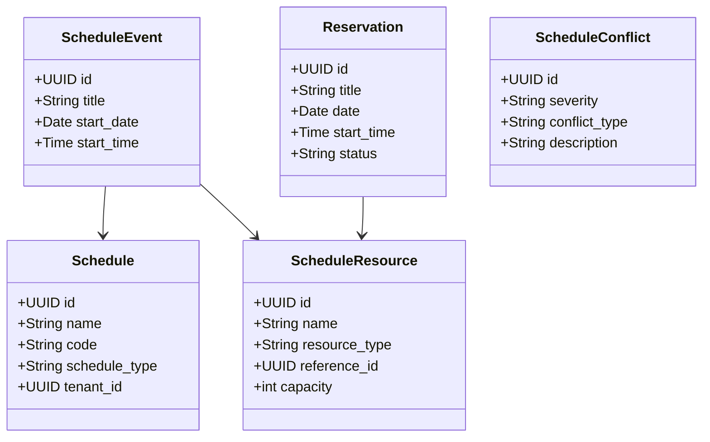

# توثيق محرك الجدولة الموحد (Scheduling Engine Foundation)
## Nebras ERP — Scheduling Engine Module

---

## 1. نظرة عامة
محرك الجدولة الموحد هو عصب عمليات الجدولة وإدارة الموارد في نظام **نبراس ERP**.  
يتم استخدام هذا المحرك كنواة مركزية لجدولة الفعاليات، الحجوزات، كشف التعارضات، وإدارة الإتاحة لجميع الكيانات في النظام دون الحاجة لإعادة كتابة منطق الجدولة في كل موديول.

---

## 2. بنية الكيانات البرمجية (ER Diagram Model)
يحتوي موديول الجدولة على النماذج التالية المرتبطة ديناميكياً:

---

## 3. محرك كشف التعارضات (Conflict Engine)
يتيح المحرك التحقق الفوري والآلي من أي تداخلات أو تعارضات عبر `ConflictDetectionService`:
- **تعارض الحجز المزدوج (Double Booking):** التحقق من خلو المورد المطلوب (معلم، قاعة، حافلة) في الفترة الزمنية المحددة.
- **تعارض الإجازات الرسمية (Holiday Conflict):** منع جدولة أي حدث أو حجز يقع ضمن فترة عطلة رسمية مسجلة في `ScheduleHoliday`.
- **تعارض السعة الاستيعابية:** إمكانية ربط الحجز بالقدرة الاستيعابية للمورد لمنع التجاوز.

---

## 4. واجهات الـ REST API

| المسار | الطريقة | الوصف |
|--------|---------|-------|
| `/api/v1/scheduling/schedules/` | GET, POST | استعراض وإنشاء الجداول وقوالبها |
| `/api/v1/scheduling/resources/` | GET, POST | إدارة موارد الجدولة العامة |
| `/api/v1/scheduling/reservations/` | GET, POST | تقديم وإدارة طلبات الحجز |
| `/api/v1/scheduling/reservations/check-conflicts/` | POST | فحص فوري ومسبق للتعارضات |
| `/api/v1/scheduling/conflicts/` | GET | استعراض سجل التعارضات والمشاكل النشطة |

---

## 5. نقاط التوسع المستقبلية للأتمتة والذكاء الاصطناعي (AI Extensions)
المحرك مهيأ بالكامل لاستقبال خوارزميات التوزيع التلقائي في المستقبل:
- **موازنة العبء الأكاديمي (Load Balancing):** توزيع حصص المعلمين بشكل متزن وتجنب الإرهاق.
- **تحسين استغلال القاعات (Room Optimization):** توزيع الفصول الذكي بناءً على السعة القصوى وأقرب الفصول الدراسية.

---

## 6. الاختبارات البرمجية
تمت تغطية محرك كشف التعارضات وواجهات الاستخدام بالاختبارات الشاملة:
- `test_conflict.py`: اختبار كشف التعارضات والتداخلات بنجاح.
- `test_api.py`: اختبار واجهات REST API والتحقق من صلاحية العمليات.