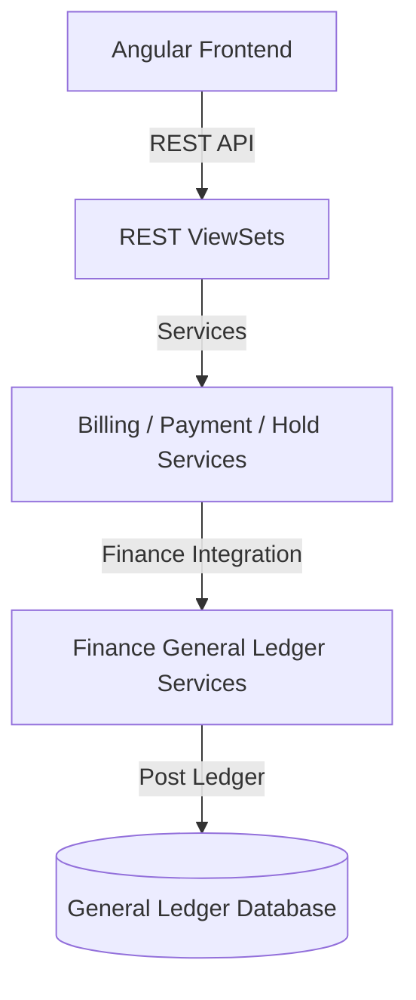

# توثيق منصة فوترة الطلاب والرسوم وحسابات القبض (Student Billing, Fees & Accounts Receivable)

هذا المستند يوفر شرحاً تفصيلياً معمارياً وتشغيلياً لموديول الحسابات المالية للطلاب والرسوم الدراسية وحسابات القبض في نظام **Nebras ERP** وتكامله الفريد مع منصة دفتر الأستاذ العام.

---

## 1. الهيكل المعماري (Architecture)

تم تصميم موديول `student_finance` بطبقات معزولة لتسهيل التطوير والصيانة:
* **طبقة النماذج (Domain Models):** تحتوي على 28 نموذجاً بيانياً تغطي خطط الرسوم، الفواتير، الاستحقاقات، السندات، الحظر المالي، والمنح.
* **طبقة الخدمات (Application Services):** تدير التفاعلات المعقدة مثل ترحيل الفواتير دفعياً، مطابقة السداد بنظام FIFO، وإلغاء الحظر المالي تلقائياً.
* **طبقة الواجهات (REST APIs):** تعرض الخدمات القياسية لعمليات الـ CRUD والفوترة الجماعية وجلب إحصائيات لوحة التحكم.

---

## 2. قواعد الأعمال (Business Rules)

* **منع التعديل بعد النشر:** لا يمكن تعديل الفواتير بعد ترحيلها؛ يتم التصحيح باستخدام الإشعارات الدائنة أو المدينة (Credit/Debit Notes).
* **تخصيص التحصيل بنظام FIFO:** يتم توزيع مدفوعات الطلاب تلقائياً على فواتير الرسوم المستحقة الأقدم فالأحدث.
* **الحظر المالي التلقائي:** يتم فرض حظر مالي (مثل حجب الامتحانات أو الشهادات) تلقائياً عندما يتجاوز إجمالي المستحقات المعلقة للطلاب الحد المسموح به في الإعدادات، ويُرفع الحظر تلقائياً فور السداد.
* **التكامل المالي الصارم:** لا يتم شحن أي مبالغ أو تحصيلات إلا من خلال تكوين قيود يومية (Journal Entries) وسندات قبض (Vouchers) وترحيلها مباشرة في موديول المالية العام (`finance`).

---

## 3. هيكل قاعدة البيانات وقاموس البيانات (Database Dictionary)

### أهم الكيانات والموديلات:
* **StudentBillingAccount:** الحساب المالي الرئيسي للطالب، ويحتوي على الأرصدة المستحقة والدائنة وحالة الحظر.
* **StudentInvoice & InvoiceItem:** تمثيل الفاتورة الصادرة للطالب مع البنود التفصيلية للرسوم (Tuition, Hostel, Transport, etc.).
* **StudentReceivable:** تسجيل تفصيلي لكل معاملة استحقاق غير مدفوعة لمتابعة وتوزيع السداد.
* **Receipt:** سند القبض الداخلي لمدفوعات الطلاب.
* **Scholarship:** منح الطلاب وتفاصيل نسب الخصم المعتمدة.
* **FinancialHold:** سجلات الحظر المالي المطبقة على الطلاب لتجميد الخدمات التعليمية.

---

## 4. واجهات البرمجة والمسارات (REST API & Angular Routes)

### أهم مسارات الـ API (REST Endpoints)
* `POST /api/v1/student-finance/invoices/generate-invoice/` - توليد فاتورة طالب تلقائياً مع احتساب المنح.
* `POST /api/v1/student-finance/receipts/receive-payment/` - تحصيل مبالغ وسداد رسوم الطلاب.
* `POST /api/v1/student-finance/scholarships/apply-scholarship/` - تطبيق منحة معتمدة.
* `POST /api/v1/student-finance/financial-holds/apply-hold/` - فرض حظر مالي.
* `GET /api/v1/student-finance/billing-accounts/dashboard-stats/` - إحصائيات لوحة التحكم للطلاب.

### مسارات التوجيه في الفرونت إند (Angular Routes)
* `/student-finance/dashboard` - مساحة العمل: حلقة أداء التحصيل + تنبيهات + بطاقات تنقل.
* `/student-finance/accounts` - **حسابات الطلاب (عرض 360°)**: لكل طالب لوح تفاصيل موحّد يعرض الأرصدة والفواتير والتحصيلات والمستحقات والمنح والحظر، مع إجراءات فورية (إصدار فاتورة، تحصيل دفعة، منح، فرض/رفع حظر) تُرحّل مباشرة في المالية، ورابط لملف الطالب.
* `/student-finance/invoices` · `/receipts` · `/outstanding` - قوائم الفواتير والتحصيلات والمستحقات.

### التهيئة التلقائية والربط (Auto-Provisioning & Integration)
لكل مستأجر جديد يُهيَّأ تلقائياً كتالوج الرسوم المدرسية (فئات/أنواع/هياكل للعام الدراسي) وإعدادات فوترة الطلاب التي تربط **حساب المدينين (COA 1103)** و**حساب إيرادات الرسوم (COA 4100)** من شجرة حسابات المالية:
* المصدر الموحّد: `apps/student_finance/application/provisioning.py::provision_student_finance_defaults`.
* التفعيل: إشارة `post_save` على `Tenant` (`apps/student_finance/signals.py`، عبر `StudentFinanceConfig.ready()`) — تعمل بعد تهيئة المالية.
* تعبئة الحاليين: `python manage.py provision_student_finance`.
* بذرة تجريبية بطلاب فعليين: `backend/seed_student_finance.py` (تفتح حسابات، تُصدر فواتير مرحّلة في المالية، وتُحصّل دفعات تولّد سندات قبض).

---

## 5. مصفوفة الصلاحيات (Permission Matrix)

| الدور المالي | إصدار فاتورة منفردة | تحصيل وسداد (Receipt) | اعتماد منحة ودية | فرض/رفع الحظر المالي |
| :--- | :---: | :---: | :---: | :---: |
| **محاسب الطلاب (Student Cashier)** | نعم | نعم | لا | لا |
| **رئيس الحسابات (Senior Accountant)** | نعم | نعم | نعم | نعم |
| **مدير مالي (CFO)** | نعم | نعم | نعم | نعم |

---

## 6. مسارات الفوترة والتحصيل والاسترداد (Workflows)

### أ. مسار الفوترة (Billing Flow)
1. يختار النظام خطة الرسوم الدراسية للطالب بناءً على الصف أو البرنامج.
2. يتم احتساب المنح والخصومات النشطة تلقائياً.
3. يتم توليد فاتورة مسودة ثم ترحيلها بالكامل.
4. يولد النظام قيد استحقاق تلقائي (مديني الطلاب مقابل إيرادات الرسوم) في دفتر الأستاذ العام للمالية.

### ب. مسار التحصيل والسداد (Payment Flow)
1. يتم إدخال دفعة السداد (نقدي، شبكة، بنك).
2. ينشئ النظام سند قبض (Voucher Receipt) بالمالية ويرحله فوراً لتحديث حساب النقدية والمدينين.
3. يتم توزيع المبلغ آلياً على الفواتير المفتوحة الأقدم فالأحدث (FIFO).
4. إذا تلاشت المديونية للحد المسموح، يرفع النظام الحظر المالي عن الطالب آلياً.

---

## 7. جاهزية الذكاء الاصطناعي والتكاملات المستقبلية (Future Extensions)

* **التنبؤ بمخاطر التحصيل (Payment Risk Prediction):** تحليل سلوك السداد التاريخي للوالدين للتنبؤ باحتمالية التأخر عن دفع الأقساط القادمة.
* **توصية المنح والمساعدات (Scholarship & Aid Recommendation):** ترشيح الطلاب المستحقين للدعم المالي استناداً للأداء الأكاديمي والبيانات الاجتماعية.
* **أتمتة التنبيهات الذكية (Smart Reminder Optimization):** جدولة وإرسال رسائل المتابعة والتذكير بالسداد في الأوقات التي يرتفع فيها معدل الاستجابة والدفع.
