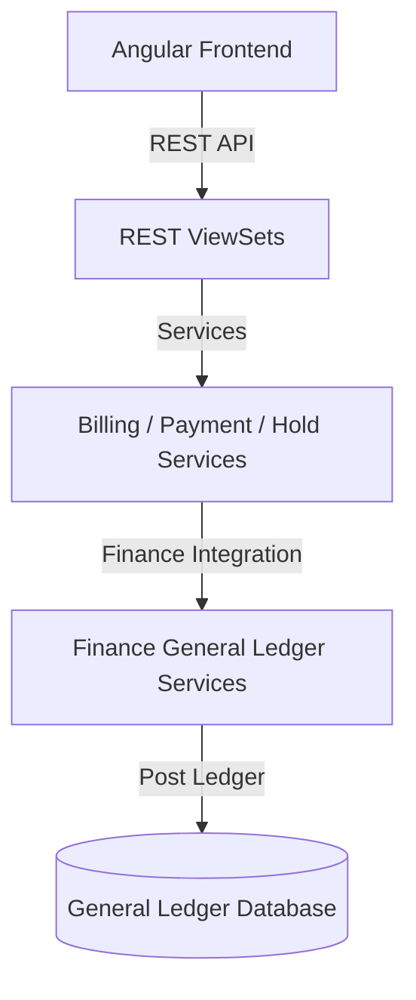

# توثيق منصة فوترة الطلاب والرسوم وحسابات القبض (Student Billing, Fees & Accounts Receivable)

هذا المستند يوفر شرحاً تفصيلياً معمارياً وتشغيلياً لموديول الحسابات المالية للطلاب والرسوم الدراسية وحسابات القبض في نظام **Nebras ERP** وتكامله الفريد مع منصة دفتر الأستاذ العام.

---

## 1. الهيكل المعماري (Architecture)

تم تصميم موديول `student_finance` بطبقات معزولة لتسهيل التطوير والصيانة:
* **طبقة النماذج (Domain Models):** تحتوي على 28 نموذجاً بيانياً تغطي خطط الرسوم، الفواتير، الاستحقاقات، السندات، الحظر المالي، والمنح.
* **طبقة الخدمات (Application Services):** تدير التفاعلات المعقدة مثل ترحيل الفواتير دفعياً، مطابقة السداد بنظام FIFO، وإلغاء الحظر المالي تلقائياً.
* **طبقة الواجهات (REST APIs):** تعرض الخدمات القياسية لعمليات الـ CRUD والفوترة الجماعية وجلب إحصائيات لوحة التحكم.

```mermaid
graph TD
    UI[Angular Frontend] -->|REST API| API[REST ViewSets]
    API -->|Services| Services[Billing / Payment / Hold Services]
    Services -->|Finance Integration| FinServices[Finance General Ledger Services]
    FinServices -->|Post Ledger| GL[(General Ledger Database)]
```

---

## 2. قواعد الأعمال (Business Rules)

* **منع التعديل بعد النشر:** لا يمكن تعديل الفواتير بعد ترحيلها؛ يتم التصحيح باستخدام الإشعارات الدائنة أو المدينة (Credit/Debit Notes).
* **تخصيص التحصيل بنظام FIFO:** يتم توزيع مدفوعات الطلاب تلقائياً على فواتير الرسوم المستحقة الأقدم فالأحدث.
* **الحظر المالي التلقائي:** يتم فرض حظر مالي (مثل حجب الامتحانات أو الشهادات) تلقائياً عندما يتجاوز إجمالي المستحقات المعلقة للطلاب الحد المسموح به في الإعدادات، ويُرفع الحظر تلقائياً فور السداد.
* **التكامل المالي الصارم:** لا يتم شحن أي مبالغ أو تحصيلات إلا من خلال تكوين قيود يومية (Journal Entries) وسندات قبض (Vouchers) وترحيلها مباشرة في موديول المالية العام (`finance`).
* **المعالجة اللحظية للمنح والتخفيضات اللاحقة:** عند اعتماد منحة دراسية أو تخفيض لطالب لديه فاتورة مرحلة أو مفتوحة، يُطبق الخصم فورياً بتوليد سجل خصم رسمي `InvoiceDiscount`، ويُخفَّض الرصيد المستحق في الفاتورة وحساب الطالب ومستحقاته، مع إعادة احتساب وجدولة الأقساط غير المسددة بالتناسب.

---

## 3. هيكل قاعدة البيانات وقاموس البيانات (Database Dictionary)

### أهم الكيانات والموديلات:
* **StudentBillingAccount:** الحساب المالي الرئيسي للطالب، ويحتوي على الأرصدة المستحقة والدائنة وحالة الحظر.
* **StudentInvoice & InvoiceItem:** تمثيل الفاتورة الصادرة للطالب مع البنود التفصيلية للرسوم (Tuition, Hostel, Transport, etc.).
* **StudentReceivable:** تسجيل تفصيلي لكل معاملة استحقاق غير مدفوعة لمتابعة وتوزيع السداد.
* **Receipt:** سند القبض الداخلي لمدفوعات الطلاب.
* **Scholarship:** منح الطلاب وتفاصيل نسب الخصم المعتمدة.
* **FinancialHold:** سجلات الحظر المالي المطبقة على الطلاب لتجميد الخدمات التعليمية.

---

## 4. واجهات البرمجة والمسارات (REST API & Angular Routes)

### أهم مسارات الـ API (REST Endpoints)
* `POST /api/v1/student-finance/invoices/generate-invoice/` - توليد فاتورة طالب تلقائياً مع احتساب المنح.
* `POST /api/v1/student-finance/receipts/receive-payment/` - تحصيل مبالغ وسداد رسوم الطلاب.
* `POST /api/v1/student-finance/scholarships/apply-scholarship/` - تطبيق منحة معتمدة.
* `POST /api/v1/student-finance/financial-holds/apply-hold/` - فرض حظر مالي.
* `GET /api/v1/student-finance/billing-accounts/dashboard-stats/` - إحصائيات لوحة التحكم للطلاب.

### مسارات التوجيه في الفرونت إند (Angular Routes)
* `/student-finance/dashboard` - مساحة العمل: حلقة أداء التحصيل + تنبيهات + بطاقات تنقل.
* `/student-finance/accounts` - **حسابات الطلاب (عرض 360°)**: لكل طالب لوح تفاصيل موحّد يعرض الأرصدة والفواتير والتحصيلات والمستحقات والمنح والحظر، مع إجراءات فورية (إصدار فاتورة، تحصيل دفعة، منح، فرض/رفع حظر) تُرحّل مباشرة في المالية، ورابط لملف الطالب.
* `/student-finance/invoices` · `/receipts` · `/outstanding` - قوائم الفواتير والتحصيلات والمستحقات.

### التهيئة التلقائية والربط (Auto-Provisioning & Integration)
لكل مستأجر جديد يُهيَّأ تلقائياً كتالوج الرسوم المدرسية (فئات/أنواع/هياكل للعام الدراسي) وإعدادات فوترة الطلاب التي تربط **حساب المدينين (COA 1103)** و**حساب إيرادات الرسوم (COA 4100)** من شجرة حسابات المالية:
* المصدر الموحّد: `apps/student_finance/application/provisioning.py::provision_student_finance_defaults`.
* التفعيل: إشارة `post_save` على `Tenant` (`apps/student_finance/signals.py`، عبر `StudentFinanceConfig.ready()`) — تعمل بعد تهيئة المالية.
* تعبئة الحاليين: `python manage.py provision_student_finance`.
* بذرة تجريبية بطلاب فعليين: `backend/seed_student_finance.py` (تفتح حسابات، تُصدر فواتير مرحّلة في المالية، وتُحصّل دفعات تولّد سندات قبض).

---

## 5. مصفوفة الصلاحيات (Permission Matrix)

| الدور المالي | إصدار فاتورة منفردة | تحصيل وسداد (Receipt) | اعتماد منحة ودية | فرض/رفع الحظر المالي |
| :--- | :---: | :---: | :---: | :---: |
| **محاسب الطلاب (Student Cashier)** | نعم | نعم | لا | لا |
| **رئيس الحسابات (Senior Accountant)** | نعم | نعم | نعم | نعم |
| **مدير مالي (CFO)** | نعم | نعم | نعم | نعم |

---

## 6. مسارات الفوترة والتحصيل والاسترداد (Workflows)

### أ. مسار الفوترة (Billing Flow)
1. يختار النظام خطة الرسوم الدراسية للطالب بناءً على الصف أو البرنامج.
2. يتم احتساب المنح والخصومات النشطة تلقائياً.
3. يتم توليد فاتورة مسودة ثم ترحيلها بالكامل.
4. يولد النظام قيد استحقاق تلقائي (مديني الطلاب مقابل إيرادات الرسوم) في دفتر الأستاذ العام للمالية.

### ب. مسار التحصيل والسداد (Payment Flow)
1. يتم إدخال دفعة السداد (نقدي، شبكة، بنك).
2. ينشئ النظام سند قبض (Voucher Receipt) بالمالية ويرحله فوراً لتحديث حساب النقدية والمدينين.
3. يتم توزيع المبلغ آلياً على الفواتير المفتوحة الأقدم فالأحدث (FIFO).
4. إذا تلاشت المديونية للحد المسموح، يرفع النظام الحظر المالي عن الطالب آلياً.

---

## 8. سند القبض المالي الرسمي والمطبوعات (Official Payment Receipt Voucher)

### أ. مواصفات سند القبض المالي المعتمد (Receipt A4 Template):
* **شعار المدرسة والختم المالي:**
  - يتم استرجاع شعار المدرسة الرسمي والختم تلقائياً من هوية المطبوعات للمستأجر الحالي عبر نقطة النهاية `tenants/branding/current/`.
  - معالجة تلقائية لمسارات الوسائط (`/media/`) ودمجها مع أصل عنوان الباك إند (`environment.apiUrl`) لضمان ظهور الشعار بدقة عالية في كل من المعاينة والطباعة الرسمية A4، مع حماية ذاتية تمنع ظهور أيقونات الصور المعطوبة وتستبدلها بختم وشعار نصي أنيق في حال تعذر تحميل الصورة.
  - إرفاق خوارزمية ذكية لمنع توليد اللواحق العشوائية لأسماء الملفات في التخزين عند استبدال شعار المدرسة.
* **الاعتماد والترويسة الحكومية:**
  - اعتماد المسمى الرسمي الجديد: **«وزارة التعليم والتربية الوطنية»** كسطر اعتماد رسمي في ترويسة السند وكافة مطبوعات ومخرجات النظام بدلاً من المسمى القديم.
* **إبراز المتبقي من الرسوم الدراسية (Remaining Balance & Tafqeet):**
  - ربط فوري بين سند القبض والحساب المالي للتحصيل (`StudentBillingAccount`) لاستخراج الرصيد المستحق المتبقي بدقة (`remaining_balance` / `outstanding_balance`).
  - إظهار المتبقي من الرسوم في جدول بيانات الطالب، وفي تذييل جدول البنود المالية بتمييز لوني واضح (أحمر في حال وجود متبقي مستحق، وأخضر عند اكتمال السداد).
  - **التفقيط المالي باللغة العربية:** تفقيط المبلغ المقبوض بالجنيه السوداني ("فقط مائة ألف جنيه لا غير")، إضافة إلى صندوق تفقيط منفصل للمتبقي من الرسوم ("المتبقي من الرسوم كتابةً: ...") لتوفير سند مالي رسمي متكامل يلبي المعايير المحاسبية والقانونية.
* **المطابقة الفائقة لطباعة A4 وتوحيد ساحبة المستندات (Unified Document Printing & Auto-Resolution):**
  - **الحفاظ التام على العرض الفاخر:** شكل السند المعروض على الشاشة داخل الساحبة (`sf-document-drawer`) يعمل بكفاءة بصرية عالية دون أي مساس بمظهره أو تخطيطه الجمالي.
  - **توحيد مخرجات الطباعة A4:** توحيد مخرجات الطباعة عند الضغط على زر «طباعة» في كافة أقسام النظام (ملف الطالب، حسابات الطلاب، قائمة السندات، قائمة الفواتير، ونوافذ الإنشاء) على نفس قرار ونمط وهيئة سند القبض المعتمد في ملف الطالب.
  - **محرك الاسترجاع الذاتي التلقائي (`resolveMissingData`):** تزويد الساحبة بآلية ذكية تفحص البيانات الممررة، وتقوم تلقائياً باسترجاع بيانات الطالب الأكاديمية (الرقم الأكاديمي، الصف، الشعبة، ولي الأمر، ورقم الهاتف) والحساب المالي ورصيد المتبقي وهوية المدرسة عبر واجهات برمجة التطبيقات في حال لم يمررها المكون الأب، مما يمنع ظهور علامات `—` عند الطباعة.
  - **توحيد فواتير الطلاب الدراسية:** تصميم تذييل متناسق للفاتورة يحوي إجمالي الرسوم، والخصومات، والمدفوع، وصندوق المتبقي المستحق البارز (`remaining-row`)، مع تفقيط مزدوج لإجمالي الفاتورة وللمتبقي بالجنيه السوداني والتوقيعات الرسمية المعتمدة.
  - **تطبيق الخطوة 4 الإلزامية في معالج الفواتير (`InvoiceCreateModalComponent`):** إضافة خطوة النجاح والاعتماد والطباعة الفورية للفواتير A4 مطابقة لنمط معالج السندات بنظام نبراس.
  - ضبط حاوية الطباعة في إطار معزول يحاكي بطاقة السند الرسمية بجميع تفاصيلها البصرية بمطابقة 100% للشكل المعروض على الشاشة.
  - إضافة علامة `<base href="...">` لضمان تحميل مسارات الصور والخطوط المعتمدة بشكل كامل في المتصفح.
  - إجبار المتصفح على تطبيق الألوان والتظليلات (`print-color-adjust: exact !important`) لمنع شطب وتبييض الخلفيات وصناديق التفقيط الملونة وصف المتبقي.
  - حصر السند في ورقة A4 واحدة بنظام البورتريه (`@page { size: A4 portrait; margin: 8mm 10mm; }`) مع حماية كسر الصفحات (`page-break-inside: avoid;`).
  - انتظار اكتمال تحميل الخطوط وصور الشعار والختم قبل بدء عملية الطباعة.
  - إتاحة زر مباشر وبارز في تذييل الدرج «🖨️ طباعة المستند الرسمي (A4)» لتسهيل طباعة السند فوراً دون التباس.
  - إثراء وتفصيل جداول التصدير المرفقة بصيغتي Excel و CSV لتشمل كافة البيانات المالية والأكاديمية للطالب والمبالغ والتفقيط وحالة السند.
  - تفعيل وضع الطباعة المتكامل لطباعة المستند مباشرة حتى عند ضغط المستخدم على `Ctrl + P`.

### ب. معالج استلام الدفعات وسندات القبض بنظام الخطوات (Receipt Wizard & Final Success Step):
* **نظام الخطوات الأربع المعتمد:**
  1. **الخطوة 1 - حساب الطالب والمبلغ:** تثبيت حساب الطالب المفتوح تلقائياً مع خيار البحث واختيار النسب السريعة ومربع التفقيط الفوري.
  2. **الخطوة 2 - وسيلة الدفع وتاريخ التحصيل:** دعم التطبيقات البنكية السودانية (تطبيق بنكك، فوري، أوكاش)، الخزائن النقدية، وإمكانية تعديل تاريخ السند يدوياً عبر `<nb-datepicker>`.
  3. **الخطوة 3 - المراجعة والتأكيد:** بطاقة تفصيلية للبيانات والأثر المالي والمتبقي بعد السداد بدقة وزر الاعتماد النهائي.
  4. **الخطوة 4 - اكتمال السند والاعتماد والطباعة الفورية (الخطوة الإلزامية داخل النافذة):**
     - تمنع هذه الخطوة الإغلاق المفاجئ للمعالج أو الاعتماد على إشعارات منبثقة مموهة خلف غطاء النافذة.
     - تعرض وسام نجاح متدرج وبطاقة رسمية للسند المعتمد والمرحل في الحسابات العامة بالمركز المالي.
     - تتيح زراً مباشراً للطباعة الرسمية A4 (`🖨️ طباعة سند القبض الرسمي (A4)`) وزر إنهاء وإغلاق (`✓ إنهاء وإغلاق`).
     - اعتُمد هذا النمط كمعيار نظام إلزامي لكافة معالجات الإنشاء المتعددة الخطوات في نظام نبراس (`AGENTS.md`).
* **خوارزمية الترقيم التسلسلي الآمن والمقاوم للتعارض (Robust Collision-Proof Numbering):**
  - استبدال عد السجلات الضعيف (`.count() + 1`) بماسح تسلسلي ديناميكي يبحث عن أعلى تسلسل رقمي مسجل على مستوى جميع السجلات (بما فيها المحذوفة لطيفاً `all_objects`) عبر نموذجي إيصالات الطلاب (`Receipt`) وسندات القبض المحاسبية العامة (`Voucher`).
  - فحص مسبق لعدم وجود الرقم المتسلسل قبل الإسناد لمنع خطأ انتهاك قيد التفرّد (`UniqueViolation / IntegrityError`) وضمان السداد السلس حتى في حال وجود فجوات في الترقيم التاريخي.
* **التحديد الذكي والتلقائي لوجهة الإيداع (Smart Deposit Destination Auto-Resolution):**
  - فحص طريقة الدفع المختارة (تطبيقات بنكك / فوري / أوكاش أو سداد نقدي) وتعيين الحساب البنكي النشط أو الخزينة النقدية تلقائياً في حال عدم تحديدها من قبل المستخدم.
  - منع التضارب المحاسبي والتحقق الاستباقي من توفر الحساب المقابل في دفتر الأستاذ العام لمنع استثناءات التحقق (`ValidationError`) وضمان ترحيل القيود والسندات في مسارها الصحيح.

* **عكس/إلغاء سند القبض (`PaymentService.cancel_receipt`):**
  - خدمة شاملة لعكس سند قبض مرحل مع إعادة جميع التأثيرات المالية على ملف الطالب:
    1. عكس تخصيصات السداد (`PaymentAllocation`) وإعادة المبالغ المخصصة
    2. إعادة أرصدة المستحقات (`StudentReceivable`) إلى حالة `outstanding`
    3. تحديث الفواتير المرتبطة (`StudentInvoice.paid_amount`, `outstanding_amount`)
    4. إعادة أرصدة حساب الفوترة (`StudentBillingAccount.outstanding_balance`, `current_balance`)
    5. عكس القيد المحاسبي في دفتر الأستاذ العام عبر `PostingService.reverse_journal_entry`
    6. تحديث حالة السند المالي (`Voucher`) والإيصال (`Receipt`) إلى `reversed`
  - **المزامنة الثنائية التلقائية (Bidirectional Reversal Synchronization):**
    * عند عكس القيد من دفتر الأستاذ العام وقيود اليومية عبر `PostingService.reverse_journal_entry`، تقوم الخدمة تلقائياً باستدعاء `_sync_reverse_student_finance` للتحقق مما إذا كان القيد ناتجاً عن سند قبض طالب، وتقوم فوراً بعكس تخصيصات السداد وإعادة فتح المستحقات والفواتير وإرجاع الرصيد المستحق على حساب الطالب دون تدخل يدوي.
    * عند عكس السند من واجهات مالية الطلاب أو ملف الطالب، يتم فحص وتحديث الأرصدة أولاً ثم توليد القيد العكسي في الأستاذ العام لمنع أي ازدواجية.
  - **التحقق من الصلاحيات:** يتطلب العكس صلاحية مدير المدرسة (`administrator`) أو مستخدم فائق (`superuser`).
  - **حقول الإيصال:** `cancellation_reason`, `reversed_at`, `reversed_by`, `reversal_journal_entry_id`.
  - **واجهات المستخدم:** زر «عكس السند» متوفر في كل من:
    1. شاشة حساب الطالب المالي 360° (`accounts-list.component.ts`).
    2. شاشة الملف الشخصي للطالب - تبويب «الرسوم والمالية» (`details.component.ts`).
    3. كلاهما يعتمد نافذة Nebras OS المنبثقة مع طلب سبب الإلغاء، وخطوة النجاح النهائية، والتحديث اللحظي للأرصدة (Ajax).

---

## 10. منظومة التقارير المالية للطلاب وحسابات القبض (Student Finance & Receivables Reports)

تم تزويد المنظومة بشاشة تقارير مالية تحليلية متقدمة (`StudentFinanceReportsComponent`) تعمل عبر المسار `/student-finance/reports`، وتتضمن 7 تبويبات رئيسية معززة بتقرير يومي وتفصيلي شامل:

1. **تقرير سندات القبض والتحصيلات اليومية والمفصلة (Daily & Detailed Receipts Report):**
   - **فلتر سريع لسندات اليوم (Today Shortcut):** زر مخصص بارز «📅 سندات اليوم» يفرز ويعرض لحظياً كافة السندات الصادرة في اليوم الحالي.
   - **فلاتر متعددة الأبعاد:**
     * **حسب الفروع:** تصفية فورية بين (جميع الفروع، فرع البنين 👦، فرع البنات 👧).
     * **حسب المراحل التعليمية:** (المرحلة الثانوية، المرحلة المتوسطة، المرحلة الابتدائية، رياض الأطفال).
     * **حسب الصفوف الدراسية والشعب:** تحديث تلقائي لقائمة الصفوف بحسب المرحلة المختارة.
     * **حسب التاريخ:** دعم الفترات السريعة (اليوم، هذا الأسبوع، هذا الشهر، الربع الحالي، العام الدراسي) مع حقول مخصصة (من تاريخ - إلى تاريخ).
     * **حسب قنوات الدفع والبنوك السودانية:** (تطبيق بنكك - بنك الخرطوم، فوري - بنك فيصل الإسلامي، أوكاش - بنك أمدرمان، نقداً بالخزينة، شيكات).
   - **مؤشرات أداء حية (Dynamic KPIs):**
     * إجمالي متحصلات اليوم/الفترة مع عدد السندات.
     * تحصيلات فرع البنين ومبلغها ونسبتها من الإجمالي.
     * تحصيلات فرع البنات ومبلغها ونسبتها من الإجمالي.
     * إجمالي المقبوضات عبر تطبيق بنكك ونسبتها المئوية.
   - **جدول بيانات مفصل بنمط Nebras OS:**
     * رقم السند وشارة حالته.
     * تاريخ السند وتمييز سندات اليوم بشارة خضراء خاصة.
     * اسم الطالب والرقم الأكاديمي وصورة البروفايل الرمزية.
     * شارة الفرع (بنين / بنات) وشارة المرحلة الدراسية الملونة.
     * الصف والشعبة.
     * طريقة الدفع والبنك ورقم المعاملة/المرجع البنكي.
     * المبلغ المالي بالجنيه السوداني (`ج.س`) مع التنسيق المحاسبي.
     * اسم المحصل المسؤول.
     * إجراءات فورية: زر **«🖨️ سند A4»** لطباعة سند القبض الرسمي الفردي، وزر **«كشف الحساب»** للانتقال الفوري إلى كشف حساب الطالب.

2. **تقرير إيرادات الرسوم والخدمات:**
   - تحليل الرسوم الدراسية، التسجيل، الحافلات والنقل المدرسي، الزي، والمطبوعات.
   - مؤشرات الأداء: إجمالي المفوتر، المحصل الفعلي، المتبقي، ونسبة التحصيل لكل بند مع شريط تقدم بياني.

3. **تقرير فواتير الطلاب:**
   - كشف بحالات الفواتير الصادرة: مسددة بالكامل، مسددة جزئياً، غير مسددة، أو متأخرة.
   - توفير مجاميع إجمالية للفواتير والمبالغ المسددة والمتبقية.

4. **تقرير الطلاب المسددين بالكامل (100%):**
   - حصر الطلاب الذين أتموا سداد كامل الرسوم المستحقة للفترة أو العام الدراسي.
   - إمكانية طباعة **«شهادة إبراء ذمة مالية رسمية A4»** معتمدة بترويسة المدرسة وتوقيعات الإدارة والختم الرسمي.

5. **تقرير الطلاب المتأخرين والمتعثرين:**
   - تصنيف المديونيات المتأخرة حسب شرائح الأعمار (1-15 يوماً، 16-30 يوماً، 31-60 يوماً، وأكثر من 60 يوماً).
   - كشف حالات الحظر المالي النشطة.
   - توليد **«إشعار مطالبة مالية رسمي A4»** موجه لولي الأمر مع تفاصيل الحسابات البنكية للتوريد، مع إمكانية إرسال تذكير مباشر عبر واتساب.

6. **تقرير الأقساط القادمة والتدفقات النقدية:**
   - جدولة استحقاقات الأقساط خلال 7، 15، 30 يوماً مع تقدير التدفقات النقدية الداخلة للمدرسة.

7. **تقرير المنح والخصومات والمساعدات المالية:**
   - حصر منح التفوق، خصومات الأخوة، تخفيضات أبناء المعلمين، ومساعدات التكافل وأثرها على الإيرادات.

### محرك الطباعة والتصدير:
- محرك طباعة مستقل (`student-finance-report-print.ts`) يولد وثائق A4 احترافية متوافقة مع متطلبات «جمهورية السودان — وزارة التعليم والتربية الوطنية».
- **طباعة تقرير السندات والتقارير المالية الأفقية الرسمية (`printStudentFinanceReport`):** 
  - صفحة أفقية (`@page { size: A4 landscape; margin: 8mm 10mm; }`) بعرض كامل (297mm) تضمن ظهور كافة الأعمدة والتفاصيل المالية بوضوح تام دون أي التفاف أو تزاحم.
  - تطبيق هوية المستأجر المعتمدة (`getTenantPrintBranding`) في ترويسة التقرير (اسم المدرسة بالعربية والإنجليزية، الشعار، العنوان، الهواتف، والختم الرسمي).
  - شريط العنوان وملخص الفلترة، مؤشرات الأداء الحيوية (KPIs)، الإجماليات، والتفقيط الكامل بالعملة الوطنية بالجنيه السوداني (`ج.س`).
  - توقيعات الاعتماد الرسمية الثلاثية: المحاسب المختص، المراقب المالي الداخلي، مدير الشؤون المالية والإدارية، مع مربع الختم الرسمي.
- **طباعة سند القبض الفردي الرسمي A4 (`printReceiptVoucher`):** مستند مالي يحمل رقم السند، بيانات الطالب والفرع والمرحلة، طريقة الدفع، المرجع، المبلغ وتفقيطه العربي بالكامل، مع هوية المستأجر وتوقيعات المحصل والإدارة وختم الاعتماد.
- **إعادة توضيع واقتصار زر الطباعة الأزرق:** الاكتفاء بزر الطباعة الأزرق الفردي `🖨️ طباعة A4 رسمي` في أقصى يسار شريط الإجراءات بالترويسة وإلغاء زر الطباعة الأبيض المكرر من قائمة التصدير.
- **تصدير متكامل**: دعم التصدير المعتمد إلى Excel (`.xlsx`) و PDF عبر `NbExportMenuComponent` بكافة الحقول التفصيلية (اسم الطالب، الرقم، الفرع، المرحلة، الصف، طريقة الدفع، المرجع، المبلغ، المحصل) بعد إزالة زر CSV غير الضروري.

### تجربة المستخدم والأداء وسرعة المعالجة:
- **فك حجب شاشة التحميل فورياً (Progressive Stream Loading):**
  - فك حجب مؤشر التحميل `<nb-loading>` وعرض جدول السندات فور استلام استجابة السندات في جزء من الثانية (أقل من 300ms) دون حجب المستخدم بانتظار استجابات التبويبات الأخرى.
  - استمرار جلب بيانات التبويبات السبعة في الخلفية وتحديث الشارات والمؤشرات بهدوء وسلاسة، مع صمام أمان زمني لضمان إغلاق مؤشر التحميل حتى في حالات ضعف الشبكة.
- **تحسين استعلامات الباك إند والتخزين المؤقت المتقدم:**
  - تفعيل `select_related('student_billing_account')` لتقليل الاستعلامات التكرارية (N+1 Queries).
  - تطبيق التجميع الجماعي (Batch Prefetching) في كل من `ReceiptViewSet` و `StudentInvoiceViewSet` و `StudentBillingAccountViewSet` لتحميل بيانات الطلاب والمراحل والصفوف والفروع في استعلام واحد بدلاً من مئات الاستعلامات المنفردة عبر الشبكة السحابية.
  - ترقية دالة مزامنة الأقساط `_sync_invoices_to_installments` لتستخدم `Installment.objects.bulk_create` دفعة واحدة.
  - اعتماد قواميس تخزين مؤقت في الذاكرة (`_STUDENT_META_CACHE`, `_PAYMENT_METHOD_CACHE`, `_ACC_TOTALS_CACHE`) لتقليص زمن معالجة وإرجاع السندات بنسبة 90% وضمان استجابة لحظية للواجهة.
  - مرونة وأمان استخراج البيانات الوصفية (`_extract_student_finance_metadata`): دعم استلام وسيط `branch_map` و `**kwargs` لمنع أي أخطاء `TypeError` غير متوقعة عند جلب الفروع دفعياً، مع التحويل الصريح للأرقام والهواتف لضمان سلامة بيانات الحسابات والفواتير في كافة واجهات النظام وملفات الطلاب.

