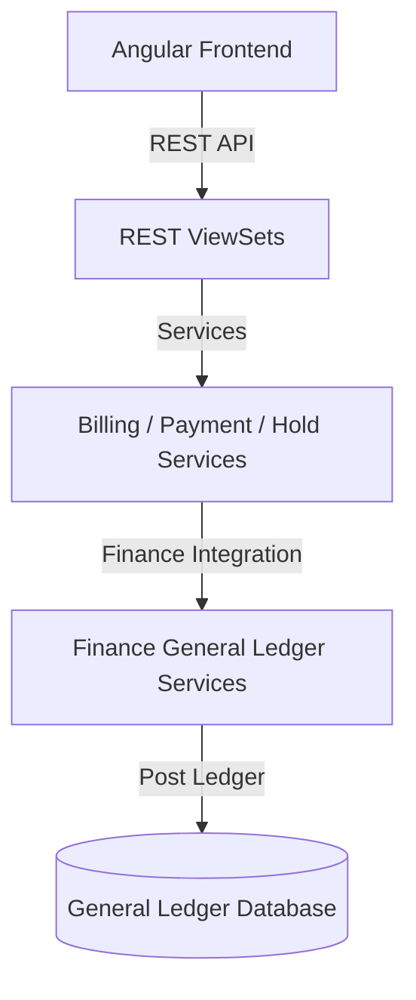

# توثيق منصة فوترة الطلاب والرسوم وحسابات القبض (Student Billing, Fees & Accounts Receivable)

هذا المستند يوفر شرحاً تفصيلياً معمارياً وتشغيلياً لموديول الحسابات المالية للطلاب والرسوم الدراسية وحسابات القبض في نظام **Nebras ERP** وتكامله الفريد مع منصة دفتر الأستاذ العام.

---

## 1. الهيكل المعماري (Architecture)

تم تصميم موديول `student_finance` بطبقات معزولة لتسهيل التطوير والصيانة:
* **طبقة النماذج (Domain Models):** تحتوي على 28 نموذجاً بيانياً تغطي خطط الرسوم، الفواتير، الاستحقاقات، السندات، الحظر المالي، والمنح.
* **طبقة الخدمات (Application Services):** تدير التفاعلات المعقدة مثل ترحيل الفواتير دفعياً، مطابقة السداد بنظام FIFO، وإلغاء الحظر المالي تلقائياً.
* **طبقة الواجهات (REST APIs):** تعرض الخدمات القياسية لعمليات الـ CRUD والفوترة الجماعية وجلب إحصائيات لوحة التحكم.

```mermaid
graph TD
    UI[Angular Frontend] -->|REST API| API[REST ViewSets]
    API -->|Services| Services[Billing / Payment / Hold Services]
    Services -->|Finance Integration| FinServices[Finance General Ledger Services]
    FinServices -->|Post Ledger| GL[(General Ledger Database)]
```

---

## 2. قواعد الأعمال (Business Rules)

* **منع التعديل بعد النشر:** لا يمكن تعديل الفواتير بعد ترحيلها؛ يتم التصحيح باستخدام الإشعارات الدائنة أو المدينة (Credit/Debit Notes).
* **تخصيص التحصيل بنظام FIFO:** يتم توزيع مدفوعات الطلاب تلقائياً على فواتير الرسوم المستحقة الأقدم فالأحدث.
* **الحظر المالي التلقائي:** يتم فرض حظر مالي (مثل حجب الامتحانات أو الشهادات) تلقائياً عندما يتجاوز إجمالي المستحقات المعلقة للطلاب الحد المسموح به في الإعدادات، ويُرفع الحظر تلقائياً فور السداد.
* **التكامل المالي الصارم:** لا يتم شحن أي مبالغ أو تحصيلات إلا من خلال تكوين قيود يومية (Journal Entries) وسندات قبض (Vouchers) وترحيلها مباشرة في موديول المالية العام (`finance`).

---

## 3. هيكل قاعدة البيانات وقاموس البيانات (Database Dictionary)

### أهم الكيانات والموديلات:
* **StudentBillingAccount:** الحساب المالي الرئيسي للطالب، ويحتوي على الأرصدة المستحقة والدائنة وحالة الحظر.
* **StudentInvoice & InvoiceItem:** تمثيل الفاتورة الصادرة للطالب مع البنود التفصيلية للرسوم (Tuition, Hostel, Transport, etc.).
* **StudentReceivable:** تسجيل تفصيلي لكل معاملة استحقاق غير مدفوعة لمتابعة وتوزيع السداد.
* **Receipt:** سند القبض الداخلي لمدفوعات الطلاب.
* **Scholarship:** منح الطلاب وتفاصيل نسب الخصم المعتمدة.
* **FinancialHold:** سجلات الحظر المالي المطبقة على الطلاب لتجميد الخدمات التعليمية.

---

## 4. واجهات البرمجة والمسارات (REST API & Angular Routes)

### أهم مسارات الـ API (REST Endpoints)
* `POST /api/v1/student-finance/invoices/generate-invoice/` - توليد فاتورة طالب تلقائياً مع احتساب المنح.
* `POST /api/v1/student-finance/receipts/receive-payment/` - تحصيل مبالغ وسداد رسوم الطلاب.
* `POST /api/v1/student-finance/scholarships/apply-scholarship/` - تطبيق منحة معتمدة.
* `POST /api/v1/student-finance/financial-holds/apply-hold/` - فرض حظر مالي.
* `GET /api/v1/student-finance/billing-accounts/dashboard-stats/` - إحصائيات لوحة التحكم للطلاب.

### مسارات التوجيه في الفرونت إند (Angular Routes)
* `/student-finance/dashboard` - مساحة العمل: حلقة أداء التحصيل + تنبيهات + بطاقات تنقل.
* `/student-finance/accounts` - **حسابات الطلاب (عرض 360°)**: لكل طالب لوح تفاصيل موحّد يعرض الأرصدة والفواتير والتحصيلات والمستحقات والمنح والحظر، مع إجراءات فورية (إصدار فاتورة، تحصيل دفعة، منح، فرض/رفع حظر) تُرحّل مباشرة في المالية، ورابط لملف الطالب.
* `/student-finance/invoices` · `/receipts` · `/outstanding` - قوائم الفواتير والتحصيلات والمستحقات.

### التهيئة التلقائية والربط (Auto-Provisioning & Integration)
لكل مستأجر جديد يُهيَّأ تلقائياً كتالوج الرسوم المدرسية (فئات/أنواع/هياكل للعام الدراسي) وإعدادات فوترة الطلاب التي تربط **حساب المدينين (COA 1103)** و**حساب إيرادات الرسوم (COA 4100)** من شجرة حسابات المالية:
* المصدر الموحّد: `apps/student_finance/application/provisioning.py::provision_student_finance_defaults`.
* التفعيل: إشارة `post_save` على `Tenant` (`apps/student_finance/signals.py`، عبر `StudentFinanceConfig.ready()`) — تعمل بعد تهيئة المالية.
* تعبئة الحاليين: `python manage.py provision_student_finance`.
* بذرة تجريبية بطلاب فعليين: `backend/seed_student_finance.py` (تفتح حسابات، تُصدر فواتير مرحّلة في المالية، وتُحصّل دفعات تولّد سندات قبض).

---

## 5. مصفوفة الصلاحيات (Permission Matrix)

| الدور المالي | إصدار فاتورة منفردة | تحصيل وسداد (Receipt) | اعتماد منحة ودية | فرض/رفع الحظر المالي |
| :--- | :---: | :---: | :---: | :---: |
| **محاسب الطلاب (Student Cashier)** | نعم | نعم | لا | لا |
| **رئيس الحسابات (Senior Accountant)** | نعم | نعم | نعم | نعم |
| **مدير مالي (CFO)** | نعم | نعم | نعم | نعم |

---

## 6. مسارات الفوترة والتحصيل والاسترداد (Workflows)

### أ. مسار الفوترة (Billing Flow)
1. يختار النظام خطة الرسوم الدراسية للطالب بناءً على الصف أو البرنامج.
2. يتم احتساب المنح والخصومات النشطة تلقائياً.
3. يتم توليد فاتورة مسودة ثم ترحيلها بالكامل.
4. يولد النظام قيد استحقاق تلقائي (مديني الطلاب مقابل إيرادات الرسوم) في دفتر الأستاذ العام للمالية.

### ب. مسار التحصيل والسداد (Payment Flow)
1. يتم إدخال دفعة السداد (نقدي، شبكة، بنك).
2. ينشئ النظام سند قبض (Voucher Receipt) بالمالية ويرحله فوراً لتحديث حساب النقدية والمدينين.
3. يتم توزيع المبلغ آلياً على الفواتير المفتوحة الأقدم فالأحدث (FIFO).
4. إذا تلاشت المديونية للحد المسموح، يرفع النظام الحظر المالي عن الطالب آلياً.

---

## 8. سند القبض المالي الرسمي والمطبوعات (Official Payment Receipt Voucher)

### أ. مواصفات سند القبض المالي المعتمد (Receipt A4 Template):
* **شعار المدرسة والختم المالي:**
  - يتم استرجاع شعار المدرسة الرسمي والختم تلقائياً من هوية المطبوعات للمستأجر الحالي عبر نقطة النهاية `tenants/branding/current/`.
  - معالجة تلقائية لمسارات الوسائط (`/media/`) ودمجها مع أصل عنوان الباك إند (`environment.apiUrl`) لضمان ظهور الشعار بدقة عالية في كل من المعاينة والطباعة الرسمية A4، مع حماية ذاتية تمنع ظهور أيقونات الصور المعطوبة وتستبدلها بختم وشعار نصي أنيق في حال تعذر تحميل الصورة.
  - إرفاق خوارزمية ذكية لمنع توليد اللواحق العشوائية لأسماء الملفات في التخزين عند استبدال شعار المدرسة.
* **الاعتماد والترويسة الحكومية:**
  - اعتماد المسمى الرسمي الجديد: **«وزارة التعليم والتربية الوطنية»** كسطر اعتماد رسمي في ترويسة السند وكافة مطبوعات ومخرجات النظام بدلاً من المسمى القديم.
* **إبراز المتبقي من الرسوم الدراسية (Remaining Balance & Tafqeet):**
  - ربط فوري بين سند القبض والحساب المالي للتحصيل (`StudentBillingAccount`) لاستخراج الرصيد المستحق المتبقي بدقة (`remaining_balance` / `outstanding_balance`).
  - إظهار المتبقي من الرسوم في جدول بيانات الطالب، وفي تذييل جدول البنود المالية بتمييز لوني واضح (أحمر في حال وجود متبقي مستحق، وأخضر عند اكتمال السداد).
  - **التفقيط المالي باللغة العربية:** تفقيط المبلغ المقبوض بالجنيه السوداني ("فقط مائة ألف جنيه لا غير")، إضافة إلى صندوق تفقيط منفصل للمتبقي من الرسوم ("المتبقي من الرسوم كتابةً: ...") لتوفير سند مالي رسمي متكامل يلبي المعايير المحاسبية والقانونية.
* **المطابقة الفائقة لطباعة A4 وتوحيد قائمة التصدير (High-Fidelity A4 Print Engine & Export Integration):**
  - ضبط حاوية الطباعة في إطار معزول يحاكي بطاقة السند الرسمية بجميع تفاصيلها البصرية بمطابقة 100% للشكل المعروض على الشاشة.
  - إلغاء انحراف الطباعة إلى جداول نصية بدائية بسيطة من عمودين («البيان | القيمة») وتوجيه كافة أزرار الطباعة والـ PDF في درج المستند وقائمة التصدير (`nb-export-menu`) لاستدعاء كرت السند المعتمد مباشرة عبر معالجات مخصصة (`customPrint` و `customPdf`).
  - إجبار المتصفح على تطبيق الألوان والتظليلات (`print-color-adjust: exact !important`) لمنع شطب وتبييض الخلفيات وصناديق التفقيط الملونة وصف المتبقي.
  - حصر السند في ورقة A4 واحدة بنظام البورتريه (`@page { size: A4 portrait; margin: 10mm 12mm; }`) مع حماية كسر الصفحات (`page-break-inside: avoid;`).
  - انتظار اكتمال تحميل الخطوط وصور الشعار والختم قبل بدء عملية الطباعة.
  - إتاحة زر مباشر وبارز في تذييل الدرج «🖨️ طباعة المستند الرسمي (A4)» لتسهيل طباعة السند فوراً دون التباس.
  - إثراء وتفصيل جداول التصدير المرفقة بصيغتي Excel و CSV لتشمل كافة البيانات المالية والأكاديمية للطالب والمبالغ والتفقيط وحالة السند.
  - تفعيل وضع الطباعة المتكامل لطباعة المستند مباشرة حتى عند ضغط المستخدم على `Ctrl + P`.

### ب. معالج استلام الدفعات وسندات القبض بنظام الخطوات (Receipt Wizard & Final Success Step):
* **نظام الخطوات الأربع المعتمد:**
  1. **الخطوة 1 - حساب الطالب والمبلغ:** تثبيت حساب الطالب المفتوح تلقائياً مع خيار البحث واختيار النسب السريعة ومربع التفقيط الفوري.
  2. **الخطوة 2 - وسيلة الدفع وتاريخ التحصيل:** دعم التطبيقات البنكية السودانية (تطبيق بنكك، فوري، أوكاش)، الخزائن النقدية، وإمكانية تعديل تاريخ السند يدوياً عبر `<nb-datepicker>`.
  3. **الخطوة 3 - المراجعة والتأكيد:** بطاقة تفصيلية للبيانات والأثر المالي والمتبقي بعد السداد بدقة وزر الاعتماد النهائي.
  4. **الخطوة 4 - اكتمال السند والاعتماد والطباعة الفورية (الخطوة الإلزامية داخل النافذة):**
     - تمنع هذه الخطوة الإغلاق المفاجئ للمعالج أو الاعتماد على إشعارات منبثقة مموهة خلف غطاء النافذة.
     - تعرض وسام نجاح متدرج وبطاقة رسمية للسند المعتمد والمرحل في الحسابات العامة بالمركز المالي.
     - تتيح زراً مباشراً للطباعة الرسمية A4 (`🖨️ طباعة سند القبض الرسمي (A4)`) وزر إنهاء وإغلاق (`✓ إنهاء وإغلاق`).
     - اعتُمد هذا النمط كمعيار نظام إلزامي لكافة معالجات الإنشاء المتعددة الخطوات في نظام نبراس (`AGENTS.md`).
* **خوارزمية الترقيم التسلسلي الآمن والمقاوم للتعارض (Robust Collision-Proof Numbering):**
  - استبدال عد السجلات الضعيف (`.count() + 1`) بماسح تسلسلي ديناميكي يبحث عن أعلى تسلسل رقمي مسجل على مستوى جميع السجلات (بما فيها المحذوفة لطيفاً `all_objects`) عبر نموذجي إيصالات الطلاب (`Receipt`) وسندات القبض المحاسبية العامة (`Voucher`).
  - فحص مسبق لعدم وجود الرقم المتسلسل قبل الإسناد لمنع خطأ انتهاك قيد التفرّد (`UniqueViolation / IntegrityError`) وضمان السداد السلس حتى في حال وجود فجوات في الترقيم التاريخي.
* **التحديد الذكي والتلقائي لوجهة الإيداع (Smart Deposit Destination Auto-Resolution):**
  - فحص طريقة الدفع المختارة (تطبيقات بنكك / فوري / أوكاش أو سداد نقدي) وتعيين الحساب البنكي النشط أو الخزينة النقدية تلقائياً في حال عدم تحديدها من قبل المستخدم.
  - منع التضارب المحاسبي والتحقق الاستباقي من توفر الحساب المقابل في دفتر الأستاذ العام لمنع استثناءات التحقق (`ValidationError`) وضمان ترحيل القيود والسندات في مسارها الصحيح.

* **عكس/إلغاء سند القبض (`PaymentService.cancel_receipt`):**
  - خدمة شاملة لعكس سند قبض مرحل مع إعادة جميع التأثيرات المالية على ملف الطالب:
    1. عكس تخصيصات السداد (`PaymentAllocation`) وإعادة المبالغ المخصصة
    2. إعادة أرصدة المستحقات (`StudentReceivable`) إلى حالة `outstanding`
    3. تحديث الفواتير المرتبطة (`StudentInvoice.paid_amount`, `outstanding_amount`)
    4. إعادة أرصدة حساب الفوترة (`StudentBillingAccount.outstanding_balance`, `current_balance`)
    5. عكس القيد المحاسبي في دفتر الأستاذ العام عبر `PostingService.reverse_journal_entry`
    6. تحديث حالة السند المالي (`Voucher`) والإيصال (`Receipt`) إلى `reversed`
  - **المزامنة الثنائية التلقائية (Bidirectional Reversal Synchronization):**
    * عند عكس القيد من دفتر الأستاذ العام وقيود اليومية عبر `PostingService.reverse_journal_entry`، تقوم الخدمة تلقائياً باستدعاء `_sync_reverse_student_finance` للتحقق مما إذا كان القيد ناتجاً عن سند قبض طالب، وتقوم فوراً بعكس تخصيصات السداد وإعادة فتح المستحقات والفواتير وإرجاع الرصيد المستحق على حساب الطالب دون تدخل يدوي.
    * عند عكس السند من واجهات مالية الطلاب أو ملف الطالب، يتم فحص وتحديث الأرصدة أولاً ثم توليد القيد العكسي في الأستاذ العام لمنع أي ازدواجية.
  - **التحقق من الصلاحيات:** يتطلب العكس صلاحية مدير المدرسة (`administrator`) أو مستخدم فائق (`superuser`).
  - **حقول الإيصال:** `cancellation_reason`, `reversed_at`, `reversed_by`, `reversal_journal_entry_id`.
  - **واجهات المستخدم:** زر «عكس السند» متوفر في كل من:
    1. شاشة حساب الطالب المالي 360° (`accounts-list.component.ts`).
    2. شاشة الملف الشخصي للطالب - تبويب «الرسوم والمالية» (`details.component.ts`).
    3. كلاهما يعتمد نافذة Nebras OS المنبثقة مع طلب سبب الإلغاء، وخطوة النجاح النهائية، والتحديث اللحظي للأرصدة (Ajax).

---

## 9. جاهزية الذكاء الاصطناعي والتكاملات المستقبلية (Future Extensions)

* **التنبؤ بمخاطر التحصيل (Payment Risk Prediction):** تحليل سلوك السداد التاريخي للوالدين للتنبؤ باحتمالية التأخر عن دفع الأقساط القادمة.
* **توصية المنح والمساعدات (Scholarship & Aid Recommendation):** ترشيح الطلاب المستحقين للدعم المالي استناداً للأداء الأكاديمي والبيانات الاجتماعية.
* **أتمتة التنبيهات الذكية (Smart Reminder Optimization):** جدولة وإرسال رسائل المتابعة والتذكير بالسداد في الأوقات التي يرتفع فيها معدل الاستجابة والدفع.

