# موديول إدارة دورة حياة الطالب (Student Lifecycle Management)

يوفر هذا الموديول الكيانات والخدمات وواجهات البرمجة اللازمة لإدارة الطلاب، بدءاً من تسجيلهم بعد القبول وحتى التخرج أو الانسحاب.

## 1. قواعد العمل والتحقق (Business Rules)
1. **مصدر التسجيل**: يجب أن تبدأ عملية تسجيل الطالب من طلب قبول معتمد في نظام القبول والتسجيل (`Admissions`).
2. **تفرد رقم الطالب**: يجب أن يكون رقم الطالب (`student_number`) فريداً ومولداً تلقائياً بناءً على إعدادات الترقيم النشطة.
3. **التسجيل الأكاديمي السنوي**: يسمح بتسجيل نشط واحد فقط للطالب في كل سنة دراسية (`StudentEnrollment`).
4. **تغيير الحالة**: تتم جميع انتقالات حالة الطالب عبر محرك مسارات العمل (`Workflow Engine`).
5. **التدقيق والأمان**: يتم تدقيق جميع العمليات وتسجيلها، مع عزل تام للبيانات لكل مستأجر (`Multi-Tenant Isolation`).

## 2. مخطط العلاقات (ER Diagram)

```mermaid
erDiagram
    Student ||--|| StudentProfile : has
    Student ||--|| StudentMedicalProfile : has
    Student ||--o{ StudentAddress : resides_at
    Student ||--o{ StudentEmergencyContact : alerts
    Student ||--o{ StudentFamilyRelation : belongs_to
    Student ||--o{ StudentAttachment : holds
    Student ||--o{ StudentEnrollment : registered_in
    Student ||--o{ StudentPromotionHistory : promoted
    Student ||--o{ StudentStatusHistory : transitioned
    Student ||--o{ StudentNote : annotated
    Student ||--o{ StudentTag : tagged
    Student ||--o{ StudentIdentifier : identified_by
    Student ||--|| StudentCommunicationPreference : prefers
    Student ||--o{ StudentCustomField : extends
    Student ||--o{ StudentTransfer : transfers
    Student ||--o{ StudentWithdrawal : withdraws
    Student ||--|| StudentGraduation : graduates
    Student ||--|| StudentAlumni : turns_into
```

## 3. مسار العمل وحالات الطالب (Workflow)
تتم إدارة الحالات التالية للطالب عبر مسار العمل:
- `registered` (مسجل): الطالب تم إنشاؤه بنجاح من Admissions.
- `enrolled` (موزع دراسياً): تم تسكين الطالب وتوزيعه في صف دراسي.
- `active` (نشط): بدأ الطالب الحضور والدراسة الفعلية.
- `suspended` (موقوف): موقوف إدارياً أو تأديبياً.
- `transferred` (منقول): تم نقله لمدرسة أخرى.
- `graduated` (متخرج): أنهى متطلبات التخرج بنجاح.
- `withdrawn` (منسحب): انسحب من المدرسة بناءً على طلب ولي أمره.
- `archived` (مؤرشف): مؤرشف للبيانات التاريخية.

## 4. مصفوفة الصلاحيات (Permissions Matrix)
- `students.view`: استعراض قائمة وتفاصيل الطلاب.
- `students.create`: تسجيل طالب جديد.
- `students.update`: تعديل بيانات الطلاب.
- `students.delete`: حذف طالب لطيفاً.
- `students.archive`: أرشفة ملف طالب.
- `students.restore`: استعادة طالب مؤرشف.
- `students.promote`: ترقية وترفيع الطلاب.
- `students.transfer`: إدارة عمليات النقل والتحويل.
- `students.graduate`: تخريج الطلاب.
- `students.withdraw`: إدارة انسحابات الطلاب.
- `students.medical`: الاطلاع على السجلات الطبية.
- `students.attachments`: إدارة ورفع الوثائق.

## 5. واجهات البرمجة (API Documentation)
- **قائمة الطلاب**: `GET /api/v1/students/students/`
- **التسجيل من طلب القبول**: `POST /api/v1/students/students/create-from-applicant/`
- **التسكين والتسجيل الأكاديمي**: `POST /api/v1/students/students/{id}/enroll/`
- **الترفيع الأكاديمي**: `POST /api/v1/students/students/{id}/promote/`
- **تنزيل خط الزمن الأكاديمي**: `GET /api/v1/students/students/{id}/timeline/`