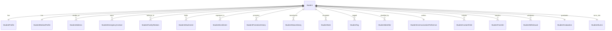

# موديول إدارة دورة حياة الطالب (Student Lifecycle Management)

يوفر هذا الموديول الكيانات والخدمات وواجهات البرمجة اللازمة لإدارة الطلاب، بدءاً من تسجيلهم بعد القبول وحتى التخرج أو الانسحاب.

## 1. قواعد العمل والتحقق (Business Rules)
1. **مصدر التسجيل**: يجب أن تبدأ عملية تسجيل الطالب من طلب قبول معتمد في نظام القبول والتسجيل (`Admissions`).
2. **تفرد رقم الطالب**: يجب أن يكون رقم الطالب (`student_number`) فريداً ومولداً تلقائياً بناءً على إعدادات الترقيم النشطة.
3. **التسجيل الأكاديمي السنوي**: يسمح بتسجيل نشط واحد فقط للطالب في كل سنة دراسية (`StudentEnrollment`).
4. **تغيير الحالة**: تتم جميع انتقالات حالة الطالب عبر محرك مسارات العمل (`Workflow Engine`).
5. **التدقيق والأمان**: يتم تدقيق جميع العمليات وتسجيلها، مع عزل تام للبيانات لكل مستأجر (`Multi-Tenant Isolation`).

## 2. مخطط العلاقات (ER Diagram)

```mermaid
erDiagram
    Student ||--|| StudentProfile : has
    Student ||--|| StudentMedicalProfile : has
    Student ||--o{ StudentAddress : resides_at
    Student ||--o{ StudentEmergencyContact : alerts
    Student ||--o{ StudentFamilyRelation : belongs_to
    Student ||--o{ StudentAttachment : holds
    Student ||--o{ StudentEnrollment : registered_in
    Student ||--o{ StudentPromotionHistory : promoted
    Student ||--o{ StudentStatusHistory : transitioned
    Student ||--o{ StudentNote : annotated
    Student ||--o{ StudentTag : tagged
    Student ||--o{ StudentIdentifier : identified_by
    Student ||--|| StudentCommunicationPreference : prefers
    Student ||--o{ StudentCustomField : extends
    Student ||--o{ StudentTransfer : transfers
    Student ||--o{ StudentWithdrawal : withdraws
    Student ||--|| StudentGraduation : graduates
    Student ||--|| StudentAlumni : turns_into
```

## 3. مسار العمل وحالات الطالب (Workflow)
تتم إدارة الحالات التالية للطالب عبر مسار العمل:
- `registered` (مسجل): الطالب تم إنشاؤه بنجاح من Admissions.
- `enrolled` (موزع دراسياً): تم تسكين الطالب وتوزيعه في صف دراسي.
- `active` (نشط): بدأ الطالب الحضور والدراسة الفعلية.
- `suspended` (موقوف): موقوف إدارياً أو تأديبياً.
- `transferred` (منقول): تم نقله لمدرسة أخرى.
- `graduated` (متخرج): أنهى متطلبات التخرج بنجاح.
- `withdrawn` (منسحب): انسحب من المدرسة بناءً على طلب ولي أمره.
- `archived` (مؤرشف): مؤرشف للبيانات التاريخية.

## 4. مصفوفة الصلاحيات (Permissions Matrix)
- `students.view`: استعراض قائمة وتفاصيل الطلاب.
- `students.create`: تسجيل طالب جديد.
- `students.update`: تعديل بيانات الطلاب.
- `students.delete`: حذف طالب لطيفاً.
- `students.archive`: أرشفة ملف طالب.
- `students.restore`: استعادة طالب مؤرشف.
- `students.promote`: ترقية وترفيع الطلاب.
- `students.transfer`: إدارة عمليات النقل والتحويل.
- `students.graduate`: تخريج الطلاب.
- `students.withdraw`: إدارة انسحابات الطلاب.
- `students.medical`: الاطلاع على السجلات الطبية.
- `students.attachments`: إدارة ورفع الوثائق.

## 5. واجهات البرمجة (API Documentation)
- **قائمة واستعلام الطلاب**: `GET /api/v1/students/students/`
  - المعلمات المدعومة:
    * `search`: بحث نصي فوري في (الاسم بالعربية والإنجليزية، رقم القيد، الهوية الوطنية، اسم ولي الأمر، ورقم هاتفه).
    * `status`: تصفية بحسب حالة القيد (`active`, `registered`, `suspended`, `graduated`, `withdrawn`).
    * `gender`: تصفية حسب الجنس (`male` للبنين، `female` للبنات).
    * `grade_id`: تصفية حسب المعرف الفريد للصف الدراسي.
    * `section_id`: تصفية حسب المعرف الفريد للفصل الدراسي.
    * `branch_id`: تصفية حسب المدرسة / الفرع.
    * `ordering`: ترتيب النتائج حسب (`name`, `-name`, `created_at`, `-created_at`, `student_number`, `-student_number`).
- **التسجيل من طلب القبول**: `POST /api/v1/students/students/create-from-applicant/`
- **التسكين والتسجيل الأكاديمي**: `POST /api/v1/students/students/{id}/enroll/`
- **الترفيع الأكاديمي**: `POST /api/v1/students/students/{id}/promote/`
- **الخط الزمني الشامل للأحداث**: `GET /api/v1/students/students/{id}/timeline/`
  - يدمج التسكين الأكاديمي، سجلات رفع الوثائق مع روابطها وأحجامها، وتاريخ تغيير الحالات، وتاريخ الترفيع مرتبة زمنياً تنازلياً.
- **وثائق ومرفقات الطالب**:
  - `GET /api/v1/students/students/{id}/attachments/`: استرجاع كافة وثائق الطالب مع الحجم ونوع المرفق ورابط المعاينة والتنزيل.
  - `POST /api/v1/students/students/{id}/upload-attachment/`: رفع وثيقة جديدة مباشرة (Multipart Form) مع تخزينها في مسار المستأجر المعزول وتوليد أصل ملف (`FileAsset`) ومرفق طالب (`StudentAttachment`) مع سجل تدقيق كامل.
  - `DELETE /api/v1/students/students/{id}/delete-attachment/{attachment_id}/`: الحذف المنطقي للوثيقة.

## 6. محرك الضغط الفائق للمستندات والملفات (Client-Side Ultra Compression)
- **الموقع البرمجي**: `frontend/src/app/core/utils/file-compressor.util.ts`
- **آلية العمل**:
  1. اعتراض الملفات والصور فور اختيارها أو إسقاطها في المتصفح قبل إرسال أي بايت عبر الشبكة.
  2. معالجة الصور عبر HTML5 Canvas، وضبط الأبعاد القصوى (Max 1600px) مع الحفاظ التام على نسبة الأبعاد ومحاذاة النصوص.
  3. تفعيل تنعيم الصور عالي الجودة (`ctx.imageSmoothingQuality = 'high'`) وتوليد خلفية بيضاء تمنع تشوه النصوص الممسوحة ضوئياً.
  4. التصدير الفائق بصيغة `image/webp` (أو `image/jpeg`) بمعدل جودة مدروس (0.78).
  5. تخفيض حجم الصور الملتقطة بالهواتف من 3-8 ميجابايت إلى 100-250 كيلوبايت (توفير 90%-96% من استهلاك الباندويث) بما يناسب بيئة الإنترنت في السودان تماماً.
  6. تمرير ملفات PDF التلقائي مع استخراج حجمها بدقة.

## 7. واجهة المستخدم وميزات الفرز والإحصائيات والوثائق (UI/UX Features)
- **قائمة وسجل الطلاب (`/students/list`)**:
  1. **الفرز السريع للبنين والبنات (Segmented Control)**: أزرار سريعة بلمسة واحدة `[الكل 👥]`، `[البنين 👦]`، و `[البنات 👧]` مع عدّادات رقمية لكل فئة وتحديث فوري للشاشة بدون أي تأخير.
  2. **تصفية الصف والفصل الدراسي**: جلب الصفوف من النظام، ومع اختيار الصف يتم تحميل الفصول المعتمدة له تلقائياً.
  3. **بطاقات الإحصاء اللحظية (Real-Time Stats Cards)**: 4 بطاقات تفاعلية مبنية على `computed signals` تتحدث لحظياً وفق ما هو معروض على الشاشة:
     - إجمالي المعروضين ونسبتهم من إجمالي طلاب المنظومة.
     - عدد البنين ونسبتهم المئوية من المعروضين مع شريط تقدم متدرج.
     - عدد البنات ونسبتهن المئوية من المعروضين مع شريط تقدم متدرج.
     - عدد الطلاب النشطين ونسبتهم مع شريط تقدم زمردي.
  4. **زر تحديث البيانات (`🔄 تحديث البيانات`)**: زر مخصص في ترويسة الصفحة وشريط الأدوات يُلزم النظام بجلب كافة السجلات الحديثة قسرياً من الخادم مع إظهار مؤشر المعالجة.
  5. **مسح الفلاتر الفوري (`↺ مسح الفلاتر`)**: إعادة ضبط كافة معايير الفلترة وإظهار كافة الطلاب فورياً وتصفير كافة الحقول ومزامنة البيانات.
  6. **العرض المزدوج**: التبديل الفوري بين عرض جدول البيانات (Table View) مع أفاتارات ملونة للجنس، والعرض الشبكي (Smart Cards Grid View).
- **بطاقة وتفاصيل الطالب (`/students/details/:id`)**:
  - عرض الصف واسم الفصل أسفل الاسم مباشرة وفي بطاقة التسكين الأكاديمي.
  - زر تفاعلي `✏️ تعديل الصف والفصل` ينقل مباشرة لنموذج التعديل مع فتح التبويب الأكاديمي تلقائياً (`?tab=academic`).
  - **تبويب الوثائق والخط الزمني المطور**:
    * زر `➕ رفع وثيقة جديدة مباشرة` يفتح نافذة رفع مخصصة فورية بنظام Nebras OS دون الحاجة للدخول في نموذج التعديل.
    * منطقة سحب وإفلات مع مؤشر الضغط اللحظي وإبراز نسبة التوفير في البيانات (📉 وفرت 90%+).
    * معرض شبكي لبطاقات الوثائق مع أزرار معاينة سريعة، تنزيل مباشر، وحذف آمن.
    * خط زمني تفاعلي للمحطات الأكاديمية مع أيقونات ملونة ومعاينة مباشرة للمستندات المرفقة.

## 8. القاموس والمصطلحات المعتمدة (Terminology Governance)
- **الفصل بدلاً من الشعبة**: تم اعتماد مصطلح **"الفصل"** (Section) حصراً في كافة جداول وشاشات ونوافذ ومطبوعات النظام بدلاً من مصطلح "الشعبة".
