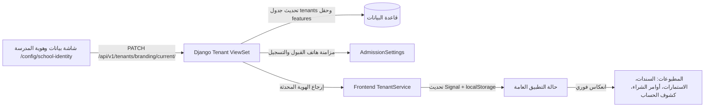

# توثيق موديول: بيانات المدرسة وهوية المطبوعات للمستأجر (Tenant School Identity & Print Branding)

تتيح هذه الوحدة لإدارة المدرسة (المستأجر) التحكم الكامل والمرن في بيانات المؤسسة التعليمية، الهوية البصرية، العناوين المعتمدة، وأرقام التواصل الرسمية، وتطبيق هذه التعديلات لحظياً على كافة مخرجات النظام الورقية والإلكترونية بدون تدخل برمجي.

---

## 1. المعمارية ودورة تحديث الهوية (Branding Lifecycle)

---

## 2. عناصر البيانات وقاموس الهوية (Data Dictionary)

تعتمد وحدة الهوية على نموذج `Tenant` مع توسعة الخصائص `features` لتخزين البيانات متعددة القيم:
* **الشعار الرسمي للمدرسة (`logo` / `logo_url`):** ملف الشعار الرسمي للمدرسة (يقبل PNG بخلفية شفافة، JPG، WebP، SVG) ويُعرض في منتصف الترويسة الرئيسية لكافة الأوراق الرسمية والمطبوعات.
* **الختم الرسمي للمؤسسة والاعتماد (`stamp` / `stamp_url`):** صورة الختم المعتمد للمدرسة (PNG بخلفية مفرغة شفافة، JPG، WebP، SVG) يُعرض مائلاً في منطقة التوقيعات والاعتماد الرسمي بأسفل سندات القبض، الفواتير، الشهادات، وكشوف الدرجات.
* **الاسم الرسمي بالعربية (`name_ar` / `name`):** الاسم المعتمد للمدرسة (مثل: مدارس المورد النموذجية الخاصة / مدارس المورد الجديدة للتعليم الخاص).
* **الاسم بالإنجليزية (`name_en`):** الاسم المعتمد في الترويسات الإنجليزية للمطبوعات.
* **العنوان التفصيلي (`address`):** السطر النصي الكامل المطبوع في ترويسة وفوتر جميع المخرجات الرسمية (ولاية، مدينة، شارع، مربع).
* **أرقام الهواتف المتعددة (`features.phones`):** قائمة مرنة من أرقام الهواتف الثابتة والجوالة المعتمدة للتواصل.
* **رقم الواتساب (`features.whatsapp`):** رقم الخدمة والمراسلات السريعة لأولياء الأمور والطلاب.
* **العنوان المختصر (`features.address_short`):** الحي والشارع والمربع للعرض السريع.
* **البريد الإلكتروني الرسمي (`email`):** البريد المعتمد للمراسلات الرسمية والشؤون المالية.

---

## 3. معمارية التخزين السحابي (Amazon S3 Integration)

* يدعم النظام التخزين السحابي المباشر عبر **Amazon S3** (الحاوية: `nebras-erp`، المنطقة: `eu-north-1` Stockholm).
* يتم حفظ الشعار الرسمي (`tenants/logos/`) والختم الرسمي (`tenants/stamps/`)، وكذلك وثائق ومستندات الطلاب (`{tenant}/students/{id}/attachments/`) مباشرة على S3 عند تفعيل متغير `USE_S3=true`.
* يتراجع النظام تلقائياً وبسلاسة إلى التخزين المحلي `FileSystemStorage` في بيئة التطوير في حال عدم توفر مفاتيح AWS، مما يضمن أمان واستمرارية عمل النظام دون أخطاء.

---

## 3. مسارات واجهات البرمجة (REST API Endpoints)

| الطريقة | المسار | الوصف |
| :--- | :--- | :--- |
| `GET` | `/api/v1/tenants/branding/current/` | جلب هوية وبيانات المستأجر الحالي متضمنة الهواتف والواتساب والعنوان المعتمد. |
| `PATCH` / `PUT` | `/api/v1/tenants/branding/current/` | تحديث بيانات وهوية المستأجر الحالي وحفظها في قاعدة البيانات وتحديث إعدادات القبول. |

---

## 4. واجهات ومسارات Angular

* **المسار الرئيسي:** `/config/school-identity`
* **المسار السريع:** `/settings` (إعادة توجيه تلقائي لمسار هوية المدرسة للمستأجر).
* **المكون:** `SchoolIdentitySettingsComponent`
* **الموقع بالقائمة الجانبية:**
  `النظام والإدارة ⚙️` ⬅️ `تكوين وإعدادات النظام 🛠️` ⬅️ `بيانات المدرسة وهوية المطبوعات 🏫`.

---

## 5. تكامل وانعكاس المطبوعات التلقائي

تستدعي كافة موديولات النظام المساعد الموحد:
`getTenantPrintBranding()` في `frontend/src/app/core/helpers/tenant-print-branding.ts`
مما يضمن ظهور التعديلات فور حفظها في:
1. **المالية والمحاسبة:** سندات القبض المالي، سندات الصرف، وقيود اليومية.
2. **القبول والتسجيل:** استمارة التقديم والقبول الورقية وبوابة التسجيل.
3. **المشتريات:** أوامر الشراء وطلبات عروض الأسعار.
4. **شؤون الطلاب:** كشوفات الحساب المالية وجدول الأقساط والرسوم الدراسية.
