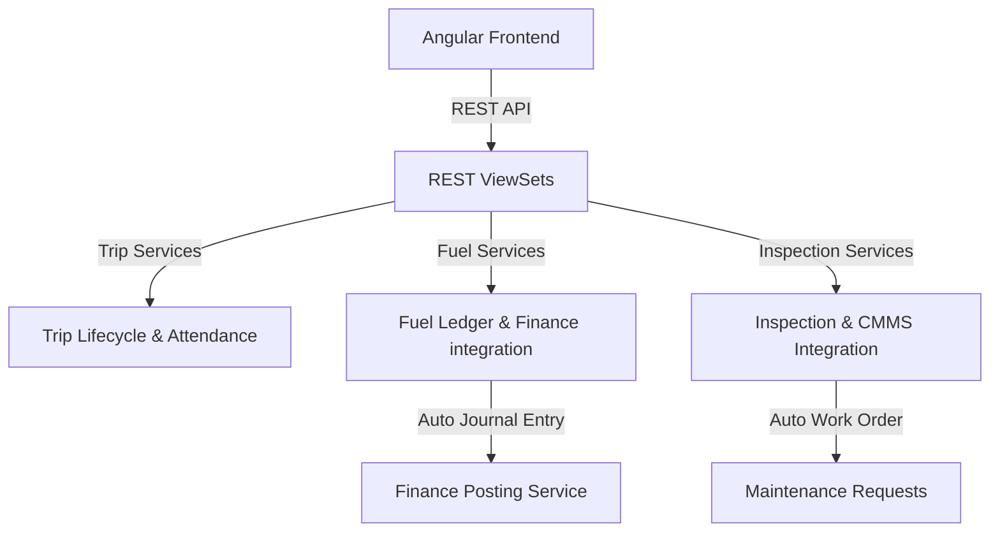

# توثيق منصة إدارة النقل المدرسي وأسطول المركبات (Transport & Fleet Module)

يقدم هذا المستند دليلاً شاملاً للنظام المعماري لموديول إدارة النقل وأسطول الحافلات (`transport`) في نظام **Nebras ERP**، وكيفية ارتباطه بالعمليات المالية وعمليات الصيانة وإدارة الأصول.

---

## 1. الهيكل المعماري (Architecture)

تم تصميم موديول النقل والأسطول وفق مبادئ التصميم ثلاثي الطبقات (DDD) ويدعم عزل المستأجرين (Multi-Tenancy) بالكامل:
* **طبقة النماذج (Domain Models):** تحتوي على 30 نموذجاً بيانياً يغطي فئات الحافلات، السائقين، الرخص، المسارات ونقاط التوقف، اشتراكات الركاب (الطلاب والمعلمين)، الرحلات اليومية، الفحوصات الفنية، تموين الوقود، والتأمين والاستمارات.
* **طبقة الخدمات (Application Services):** تدير دورة حياة الرحلات (انطلاق، تحضير الركاب، وصول)، عمليات تموين الوقود والقيود المالية التلقائية، وعمليات الفحص اليومي للسلامة وتكاملها مع نظام الصيانة.
* **طبقة الواجهات (REST APIs):** توفر واجهات كاملة للتحكم في الأسطول وجلب إحصائيات لوحة التحكم اللحظية.

---

## 2. قواعد الأعمال (Business Rules)

* **ربط الحافلات كأصول:** ترتبط كل مركبة (Vehicle) في الأسطول بـ `Asset` في موديول الأصول الثابتة لتتبع القيمة الدفترية والإهلاك وتكاليف الصيانة الشاملة عليها.
* **تكامل الوقود والمالية:** عند تسجيل عملية تموين وقود باللتر والقيمة، يتم تحديث قراءة العداد (Odometer) وتوليد قيد يومية فوري بالمالية (مدين حساب مصروفات وقود السيارات، دائن حساب الصندوق أو المورد).
* **إلزامية فحص السلامة اليومي:** قبل انطلاق الحافلة، يلزم إجراء فحص فني وأمان. وإذا فشل الفحص الفني (Failed Status)، يتم تلقائياً فتح بلاغ صيانة طارئ (Maintenance Request) في نظام إدارة الصيانة وأوامر العمل (CMMS) لإصلاح الخلل.
* **حضور وغياب الركاب:** يتم تحضير الطلاب والمعلمين صعوداً وهبوطاً لكل رحلة لضمان سلامتهم وتوليد الإشعارات لأولياء الأمور.

---

## 3. تفاصيل الكيانات وقاعدة البيانات (Database Entities)

1. **VehicleCategory & VehicleType:** لتحديد طراز المركبات وسعاتها.
2. **Vehicle:** تمثيل الحافلة وتفاصيلها الفنية وربطها بالأصل المقابل.
3. **Driver & DriverLicense:** بيانات السائقين المهنية وتواريخ صلاحية رخص القيادة.
4. **Route & RouteStop:** تخطيط مسارات الرحلات ونقاط التجمع الصباحية والمسائية.
5. **Trip & TripSchedule:** إدارة الرحلات اليومية والتحركات وجدولة الحافلات.
6. **Passenger & PassengerAssignment:** المشتركون بالنقل وتخصيصهم للمسارات.
7. **TripAttendance:** تحضير الركاب وصعودهم أو غيابهم.
8. **VehicleInspection:** سجل فحص الأمان اليومي الميداني.
9. **FuelTransaction & FuelStation:** سجلات تموين الوقود والربط المحاسبي بالمالية.

---

## 4. تكامل الفرونت إند (Frontend Integration)

* **الخدمة (`TransportService`):** تدير طلبات الشبكة عبر الـ API وتستخدم Angular Signals للمتابعة الفورية للعمليات.
* **لوحة التحكم (`TransportDashboardComponent`):** لوحة معلومات متكاملة تعرض إحصائيات الأسطول، وتسمح بالبدء الفوري للرحلات، وإجراء فحوصات السلامة، ومتابعة التحركات بنقرة زر في واجهة تدعم الـ RTL وجمالية الويب الحديثة.

---
## ملاحظة معمارية أوصي بإضافتها

إذا كان الهدف أن ينافس Nebras ERP أنظمة مثل Blackbaud أو PowerSchool SIS أو الحلول المؤسسية، فأوصي بإضافة القدرات التالية منذ البداية:

Parent Live Bus Tracking (تهيئة فقط)

لا تنفذ GPS الآن، ولكن صمم واجهات التكامل (Interfaces) بحيث تدعم لاحقًا:

تتبع الحافلة لحظيًا.
وقت الوصول المتوقع (ETA).
إشعار ولي الأمر عند اقتراب الحافلة.
إشعار صعود الطالب.
إشعار نزول الطالب.
إشعار عند تغيير المسار أو التأخير.

## Geofencing (تهيئة فقط)

تصميم نماذج وواجهات تدعم مستقبلًا:

المناطق الجغرافية الآمنة.
نقاط الالتقاط والإسقاط.
تنبيه عند خروج الحافلة عن المسار.
تنبيه عند تجاوز السرعة.
Driver Safety Analytics (تهيئة فقط)

إعداد نقاط التوسع لتحليل:

السرعة.
التسارع والكبح.
استهلاك الوقود.
عدد الرحلات.
تقييم السائق.

لا تنفذ هذه الميزات الآن، وإنما أنشئ نماذج الامتداد (Extension Points) وواجهات التكامل حتى يمكن إضافتها مستقبلًا دون الحاجة إلى إعادة تصميم الموديول.
