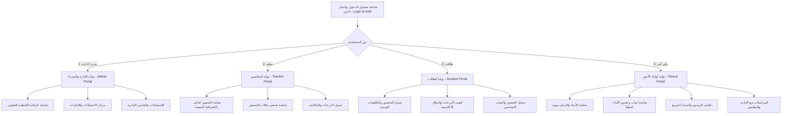

# خطة المعمارية المعدلة: الفصل التام لبوابات تطبيق الجوال حسب الدور (Role-Based Isolated Portals)

بناءً على التوجيهات، تم إعادة تصحيح وهيكلة معمارية التطبيق ليكون **نظاماً مفصولاً بالكامل حسب دور المستخدم (Role-Based Multi-Portal Architecture)** بدلاً من دمج جميع الواجهات في شريط واحد. 

لكل فئة من المستخدمين **بوابتها الخاصة المستقلة بواجهاتها ووظائفها وتجربة المستخدم المخصصة لها (UX/UI)** دون تداخل مع الفئات الأخرى.

---

## 🎯 الهيكلية المعمارية الجديدة للبوابات المستقلة

---

## 📋 تفاصيل البوابات والشاشات المخصصة لكل دور

| البوابة / الدور | الشاشات المخصصة والوظائف المستقلة | شريط التنقل الخاص بالبوابة |
| :--- | :--- | :--- |
| **0. المصادقة والورود (Auth & Role Selector)** | شاشة الدخول الموحدة، تسجيل الدخول بالرقم الوظيفي/السجل/الهاتف، اختيار المنشأة، وحفظ الجلسة. | لا يوجد (شاشة دخول مدخلية) |
| **1. بوابة الإدارة والمدراء (Admin Portal)** | - الرقابة اللحظية لحضور المعلمين والموظفين. - مركز اعتماد طلبات الإجازات والاستئذانات. - لوحة المؤشرات المالية والإدارية الشاملة. | (الرئيسية، الحضور، الاعتمادات، الإشعارات، الحساب) |
| **2. بوابة المعلمين (Teacher Portal)** | - الحضور والانصراف الذكي للموظف (GPS & Biometric - جسر). - رصد وتثبيت حضور الطلاب لكل حصة. - جدول الحصص ورصد الدرجات والواجبات. | (الرئيسية، البصمة، تحضير الطلاب، الجدول، الحساب) |
| **3. بوابة الطلاب (Student Portal)** | - الجدول الدراسي التفاعلي والتكاليف اليومية. - كشف الدرجات واختبارات المنتصف والنهائي. - سجل الغياب والتأخير الشخصي والأنشطة الأكاديمية. | (الرئيسية، الجدول، الدرجات، الواجبات، الحساب) |
| **4. بوابة أولياء الأمور (Parent Portal)** | - شاشة اختيار الابن/الابنة (Multi-Child Selector). - الإشعارات الفورية لغياب وتأخر الأبناء. - كشف الرسوم الدراسية والأقساط والسداد السريع. - المراسلات المباشرة مع المعلمين والإدارة. | (الأبناء، متابعة الغياب، الرسوم، المراسلات، الحساب) |

---

## ⚠️ مراجعة وإقرارات (User Review Required)

> [!IMPORTANT]
> **الفصل الصارم وتخصيص التجربة:**
> - يُلغى التبديل السهل من الشريط السفلي بين أدوار مختلفة.
> - يمر كل مستخدم بعمود مصادقة يتحقق من صفتيه (Role) ويوجهه حكراً إلى بوابته المخصصة.
> - يتاح لولي الأمر التحكم بأبنائه المتعددين ضمن بوابة أولياء الأمور فقط.

> [!NOTE]
> **التطوير على الكود الحالي:**
> تم العمل على بناء الشاشات الأربع المفصلة بالكامل في مجلدات مستقيل داخل Flutter:
> - `lib/features/auth/presentation/pages/login_page.dart`
> - `lib/features/admin/presentation/pages/admin_portal_shell.dart`
> - `lib/features/attendance/presentation/pages/teacher_portal_shell.dart`
> - `lib/features/student/presentation/pages/student_portal_shell.dart`
> - `lib/features/parent/presentation/pages/parent_portal_shell.dart`

